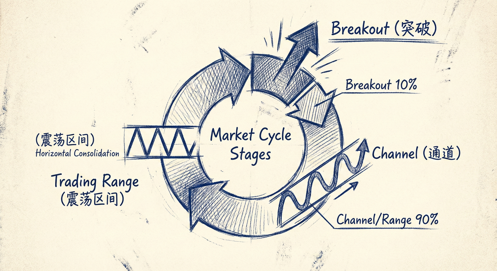

# 市场周期与数学期望 (Market Cycles and Mathematical Expectation)

## 市场周期阶段 (Market Cycle Stages)

### 定义与识别
-   **周期的循环**：市场处于永不停息的循环中：**突破 (Breakout) -> 通道 (Channel) -> 震荡区间 (Trading Range)**。
-   **识别的重要性**：每张K线图及其组成部分都处于这三个阶段之一。识别当前所处阶段决定了交易方式。
-   **机构行为**：任何时间周期、任何K线的成交量都很大，说明机构认为任何时间都是交易机会。只要正确构建交易（正的数学期望），几乎可以在任何K线入场。

### 三种状态的特征
-   **突破 (Breakout)**：
    -   **占比**：仅占K线图的 **10%** 左右（强势趋势）。
    -   **策略**：只能顺势交易。多头突破只能买入，空头突破只能卖出。
-   **通道 (Channel)**：
    -   **窄通道**：回调很小（1-3根K线），行为类似突破。策略：最好只顺势交易，做波段。
    -   **宽通道**：类似于倾斜的震荡区间。策略：可以双向交易（顺势波段，逆势剥头皮），但逆势需要极高技巧。
-   **震荡区间 (Trading Range)**：
    -   **特征**：市场在区间内波动，缺乏明确趋势。
    -   **策略**：低买高卖，剥头皮（赚快钱）。在底部1/3买入，顶部1/3卖出。如果区间太窄，停止交易。

## 40-60 法则与数学期望

### 40-60 法则
-   **适用范围**：适用于图表中 **90%** 的时间（通道和震荡区间）。
-   **核心概念**：在这些阶段，市场上涨或下跌的概率都在 **40% ~ 60%** 之间。
-   **交易含义**：
    -   无论做多还是做空，只要管理得当，都有可能赚钱。
    -   多空双方处于相对平衡状态，没有一方拥有压倒性优势（如突破期那样）。

### 数学期望 (Mathematical Expectation)
-   **公式**：**[胜率 × 利润] > [亏损概率 × 风险]**。
-   **胜率与盈亏比的权衡**：
    -   **高胜率交易**（如强势突破后入场）：通常伴随较差的盈亏比（止损远，潜在利润空间被压缩）。
    -   **高盈亏比交易**（如反转交易）：通常伴随较低的胜率（约40%）。
-   **补偿机制**：如果胜率较低（40%），则需要至少 **2倍** 于风险的利润目标，以保持正的数学期望。

## 交易策略与执行

### 二元决策 (Binary Decisions)
-   **决策流程**：
    1.  是趋势还是震荡？
    2.  如果是趋势，是突破还是通道？
-   **应对方案**：
    -   **强势突破**：市价入场，或在K线收盘入场，不要等待回调。
    -   **窄通道**：只做顺势，尽量不做逆势。
    -   **宽通道/震荡**：使用限价单逢低买入、逢高卖出。

### 入场与管理
-   **逆势交易警示**：在强趋势（如窄通道）中，不要试图抓顶猜底。只有当反弹幅度足够大、通道足够宽时，才考虑逆势剥头皮。
-   **顺势交易**：在趋势中，利用回调（H1/H2, L1/L2）作为入场点。
-   **止损移动**：随着趋势发展（创新高/新低），将止损移动到新的关键低点/高点外侧。

## 默认止盈与风险管理

### 默认目标位规则
-   **何时使用**：当你无法决定何时离场，或不确定市场具体目标时。
-   **规则**：**2倍初始风险 (2x Initial Risk)**。
    -   如果入场时的风险是X点，则在获利2X点处止盈。
    -   **逻辑**：即使胜率只有40%（低胜率交易），2倍盈亏比也能保证数学上的盈利。
-   **分批止盈**：可以在2倍风险处止盈一半，剩余仓位在3倍风险处或跟随趋势离场。

### 测量目标 (Measured Moves - MM)
-   **基于突破K线**：将强势突破K线的高度向趋势方向翻一倍，作为潜在目标位。
-   **胜率考量**：强势突破后达到MM目标的概率通常在60%以上。

## 总结原则
-   **识别环境**：首先判断市场处于突破、通道还是震荡区间。
-   **顺势为王**：在10%的强势突破期，必须顺势；在窄通道中，当作突破处理。
-   **概率思维**：在90%的时间里（40-60法则），多空皆可为，关键在于合理的风险回报比管理。
-   **默认止盈**：不确定时，追求2倍初始风险的利润是数学上永远合理的策略。
