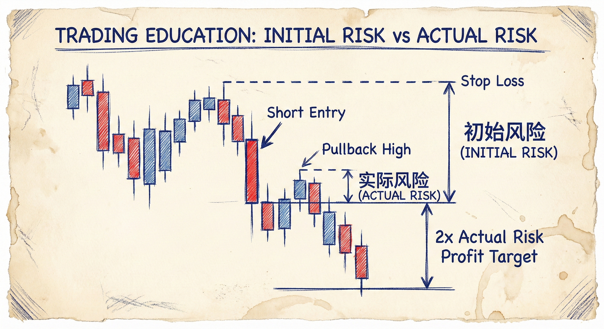
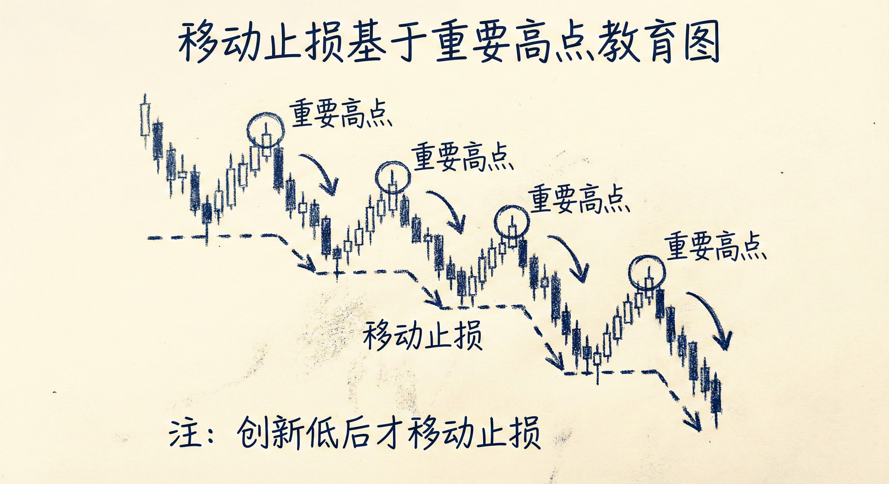

# 顶部大反转结构（第四部分）

## 入场时机：概率与盈亏比的权衡

### 早期入场 vs. 晚期入场
-   **早期入场（激进）**：
    -   **时机**：在反转形态初步形成（如高点降低、窄震荡区间）时入场。
    -   **特征**：胜率较低（约40%），但止损距离近，潜在盈亏比极佳。
    -   **心理**：适合能接受较低胜率以换取高额回报的交易者。
-   **晚期入场（保守）**：
    -   **时机**：等待强势突破（如连续大阴线、跌破关键点）确认趋势确立后入场。
    -   **特征**：胜率较高（60%以上），但止损距离远，剩余利润空间相对减少。
    -   **心理**：适合追求高胜率确定性的交易者。

### 并没有“最好”的入场点
-   **权衡**：所有入场点都是在“胜率”与“盈亏比”之间做数学权衡。
-   **结论**：只要利润至少是实际风险的两倍，数学期望即为正，两种入场方式均合理。

## 交易管理与数学期望

### 风险的定义
-   **初始风险 (Initial Risk)**：入场价与初始止损价之间的距离。
-   **实际风险 (Actual Risk)**：价格向有利方向移动后，入场价与回调极值（如信号K线高点）之间的距离。通常小于初始风险。

### 止盈策略
-   **最低目标**：两倍实际风险。这是保证数学期望为正的最低要求。
-   **优化策略**：当实际风险很小或趋势很强时，两倍风险的目标往往太小。更好的策略是持有仓位让利润奔腾，直到趋势结构被破坏。
-   **初始风险止盈**：也可以使用两倍"初始风险"作为目标，这通常比两倍实际风险更远，是合理的止盈位。

### 盈利加仓 (Scaling In)
-   **逻辑**：如果错过了第一次入场，或希望扩大战果，可在后续的顺势信号（如低2、双顶熊旗）处加仓。
-   **前提**：市场已证明处于单边趋势中。

## 移动止损 (Trailing Stops)

### 移动原则
-   **关键高点 (Major Lower High)**：只有当市场**强势跌破前低并创出新低**后，产生的高点才被视为重要高点。
-   **操作方法**：随着趋势发展，将止损下移至最新的"重要高点"上方。
-   **逻辑**：如果下降趋势仍然有效，价格不应反弹突破这些重要高点。如果突破，说明趋势前提不再成立（转为震荡或反转）。
-   **注意**：不要在没有创新低的情况下随意收紧止损，以免被正常回调扫出。

## 特殊情境与总结

### 尾盘交易 (End of Day)
-   **时间因素**：临近收盘时，时间是最大的敌人。
-   **快速离场**：如果行情没有迅速如预期发展（如出现反向K线或突破失败），应立即离场，不要纠结。

### 应对失败的信号
-   **识别失败**：如果你做空，但随后出现了强力的反转信号（如大阳线、双底牛旗），必须立即止损离场。
-   **反手交易**：虽然离场后立即反手很难，但至少要停止做空。可以等待1-2根K线确认后，再寻找反向入场机会。

### 市场演变
-   **趋势转震荡**：大反转成功后，市场不一定直接进入相反的趋势，更有可能演变为大的震荡区间。
-   **预期管理**：即使是成功的MTR（大趋势反转），也要警惕市场在几个波段后进入横盘。
