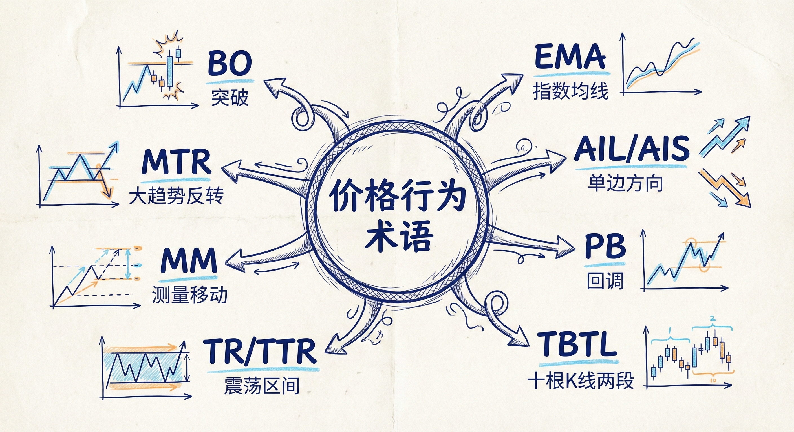
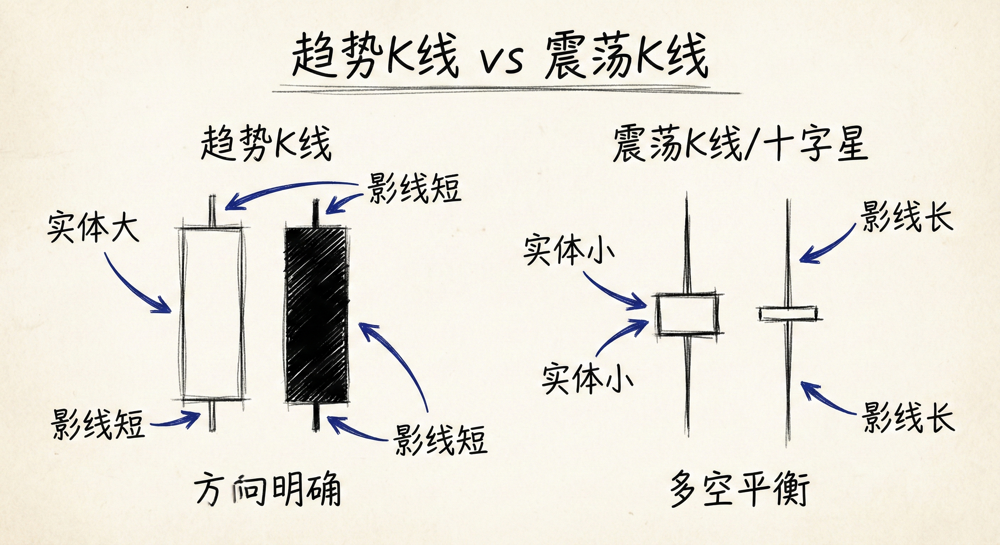
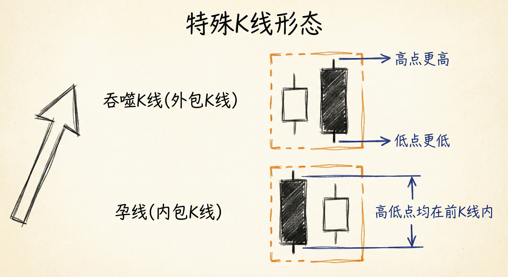
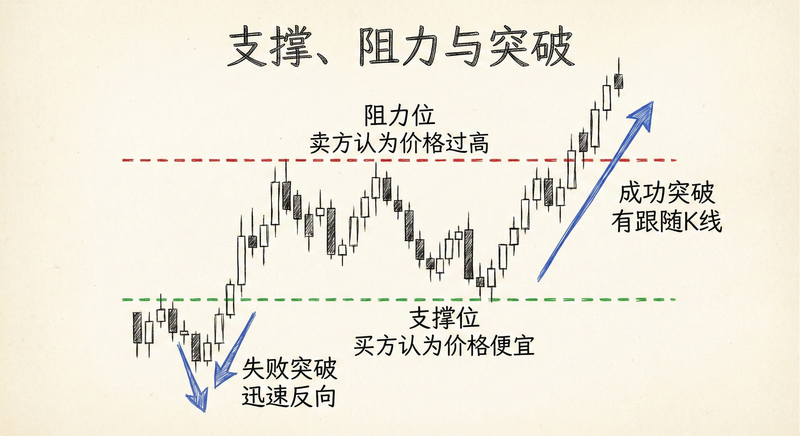
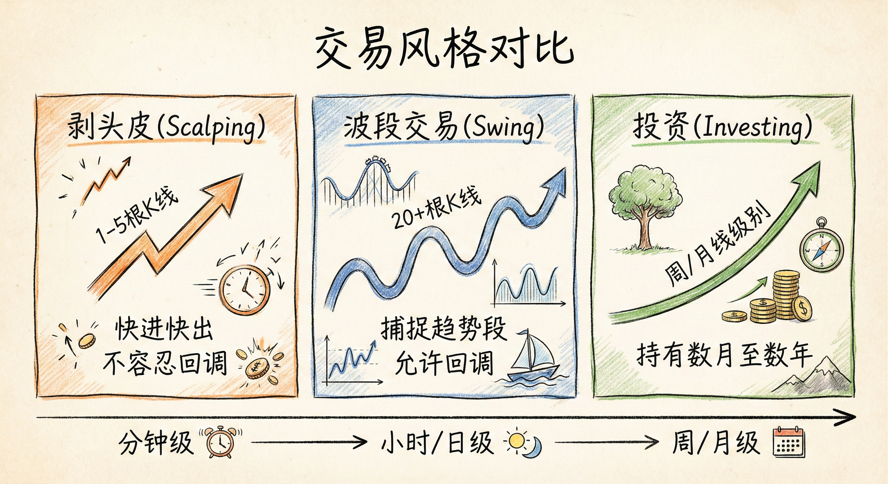

# 基础术语与市场结构 (第一部分)

## 核心缩写与定义 (Abbreviations & Definitions)

### 常用缩写
-   **EMA**：指数移动平均线，特指 **20周期** EMA。除非特别说明，不使用简单移动平均线 (MA)。
-   **AIL / AIS**：单边上涨 (Always In Long) / 单边下跌 (Always In Short)。指当前市场的主要趋势方向。
-   **PB**：回调或反弹 (Pullback)。趋势中的暂时逆向运动。
-   **TBTL**：十根K线，两段走势 (Ten Bars, Two Legs)。指一种常见的复杂调整形态。
-   **TR / TTR**：震荡区间 (Trading Range) / 窄震荡区间 (Tight Trading Range)。
-   **MM**：测量移动 (Measured Move)。
-   **MTR**：大趋势反转 (Major Trend Reversals)。
-   **BO**：突破 (Breakout)。

### 价格单位
-   **Tick**：价格变动的最小单位。
-   **Pip**：外汇中的最小变动单位（通常等同于Tick）。
-   **Point**：点。不同品种定义不同（例如 ES 中 1个点 = 4个 ticks）。

## K线形态与市场状态 (Candlesticks & Market States)

### K线分类
-   **趋势K线 (Trend Bars)**：
    -   **特征**：实体大，影线（尾巴）短。
    -   **含义**：代表市场有明确方向（阳线/白色为涨，阴线/黑色为跌）。
-   **震荡K线 (Doji/Trading Range Bars)**：
    -   **特征**：实体小，影线显著。
    -   **含义**：单根K线级别的震荡区间，代表多空平衡或犹豫。
-   **信号K线 (Signal Bar)**：给出交易理由的K线（如反转K线）。
-   **入场K线 (Entry Bar)**：信号K线之后，订单成交的那根K线。

### 特殊形态
-   **吞噬K线 (Engulfing Bar/Outside Bar)**：高点更高（或相等），低点更低（或相等）的K线。
-   **孕线 (Inside Bar)**：高低点均在前一根K线范围内的K线。

## 支撑、阻力与突破 (Support, Resistance & Breakouts)

### 定义与识别
-   **支撑 (Support)**：低于当前价格的区域，买方认为价格便宜，导致下跌暂停或反转。
-   **阻力 (Resistance)**：高于当前价格的区域，卖方认为价格过高，导致上涨暂停或回落。
-   **突破 (Breakout)**：价格穿越支撑或阻力位。
    -   **成功突破**：有良好的跟随K线，趋势延续。
    -   **失败突破**：突破后迅速反向运动，常引发反转。

## 回调计数系统：H1/H2 与 L1/L2 (Counting Bars)

### 概念与逻辑
-   **定义**：在趋势回调中，计数市场尝试恢复原趋势的次数。
-   **高1/高2 (H1/H2)**：上涨趋势中，回调后的第一次和第二次尝试上涨（买入点）。
    -   **H1**：回调中第一根高点突破前一根高点的K线。
    -   **H2**：H1失败后，第二次尝试突破前一根高点。通常对应 **ABC回调** 或 **双底牛旗**。
-   **低1/低2 (L1/L2)**：下跌趋势中，反弹后的第一次和第二次尝试下跌（卖出点）。
    -   **L2**：通常对应 **双顶熊旗**。

### 交易含义
-   **高2/低2 的重要性**：通常比高1/低1更可靠，因为是对趋势恢复的第二次确认，且常伴随ABC（两段式）调整结构的结束。

## 交易风格与背景分析 (Styles & Context)

### 交易风格分类
-   **剥头皮 (Scalping)**：
    -   **目标**：赚快钱，通常持仓1-5根K线。
    -   **策略**：不容忍回调，利润回撤即离场。
-   **波段交易 (Swing Trading)**：
    -   **目标**：捕捉趋势段。
    -   **策略**：持仓时间长（20+根K线），允许回调，直到趋势反转。
-   **投资 (Investing)**：在极大周期（周/月线）上持有数月至数年。

### 市场背景 (Context)
-   **左侧原则**：总是关注左边的K线（历史走势）。
-   **单边趋势 (Always In)**：如果必须在当前时刻入场，会选择做多还是做空？这决定了当前的市场偏见。
-   **机构主导**：市场由机构算法控制，个人交易者需跟随机构留下的K线足迹。

## 总结原则
-   **理解术语是基础**：熟悉 EMA20、H1/H2、PB 等术语是理解后续课程的前提。
-   **顺势与计数**：利用 H2/L2 等计数形态寻找顺势入场的高概率机会。
-   **区分环境**：识别市场是处于趋势（寻找趋势K线）还是震荡（寻找十字星/双向交易），并据此调整交易风格（波段或剥头皮）。
