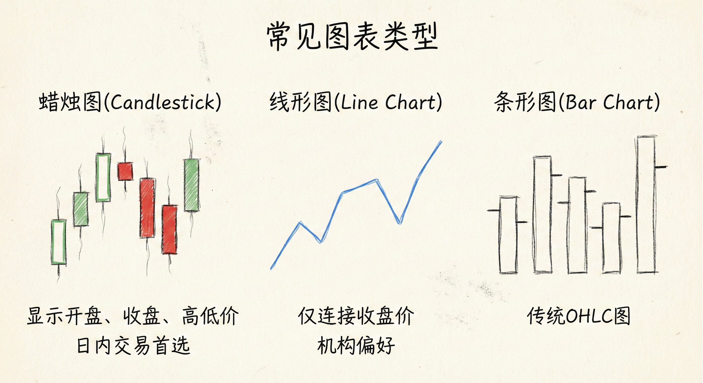
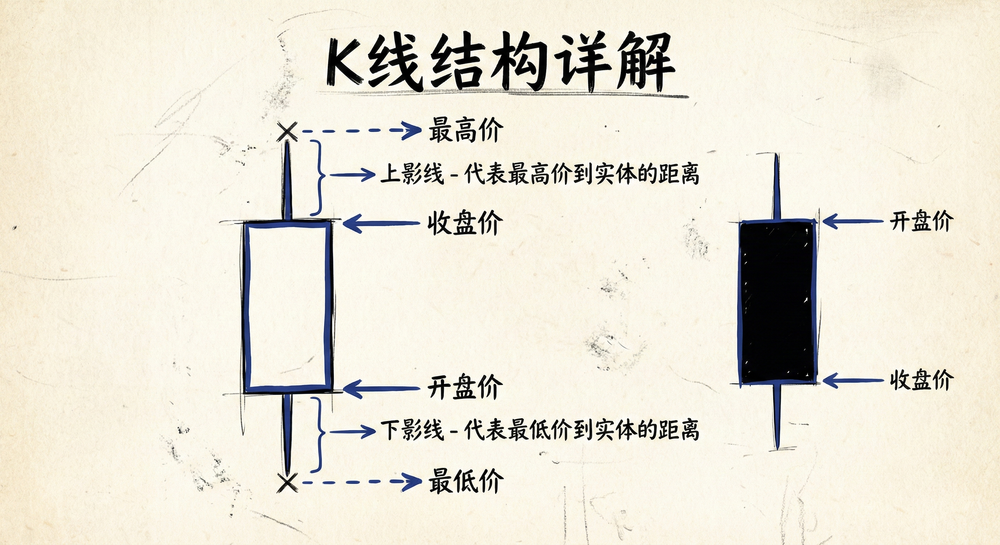
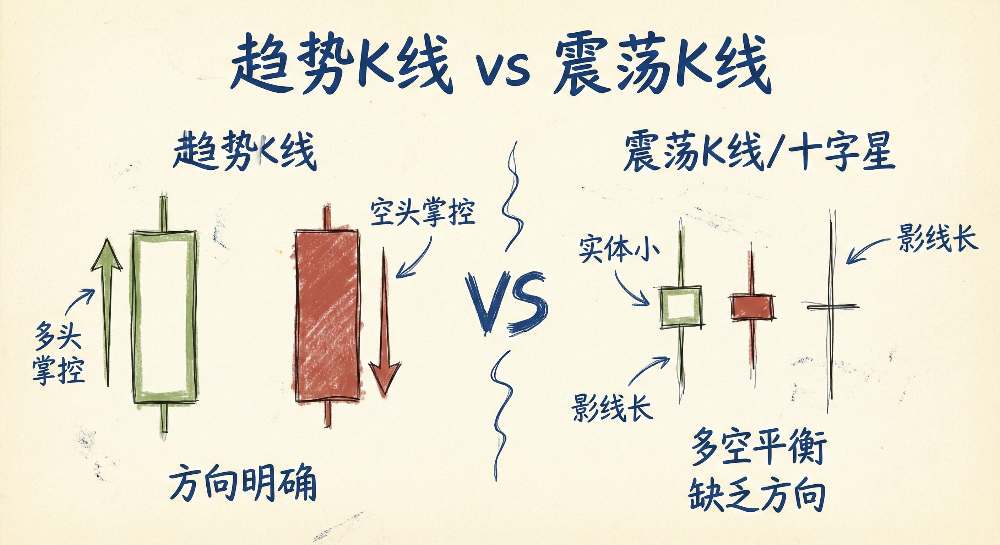
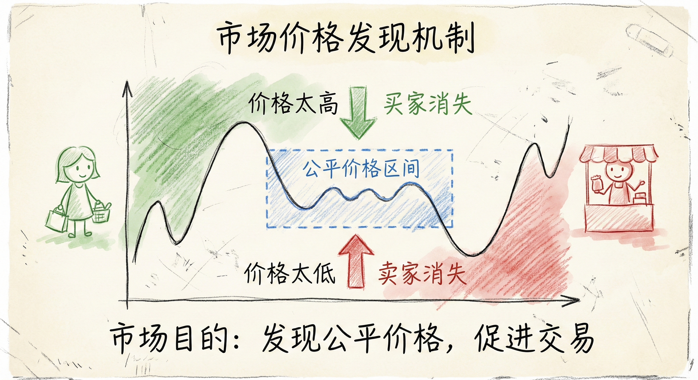
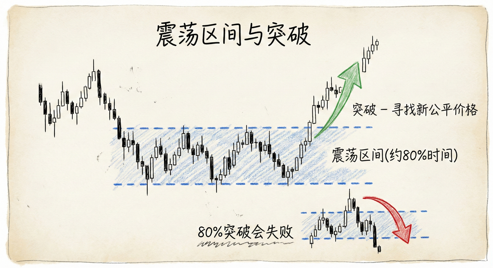

# 图表基础与价格行为 (Chart Basics and Price Action)

## 课程结构简介

### 两个版本
-   **通用版 (General Version)**：涵盖股票、ETF、股指期货、商品期货和外汇。适用于所有市场的交易者。
-   **外汇版 (Forex Version)**：专为外汇交易者设计，99%的案例和图表来自外汇市场。
-   **共同点**：两个版本的第一部分（价格行为基础）是完全相同的，讲解通用的价格行为理论。

## 图表的类型与目的

### 交易者为何看图
-   **目的**：通过观察当前和最近的交易价格，形成对未来走势的看法，从而决定做多或做空。
-   **维度**：通常纵轴代表**价格**，横轴代表**时间**。

### 常见图表类型
-   **蜡烛图 (Candlestick Charts)**：
    -   **日内交易者首选**：能快速直观地显示多空双方谁在掌控局面。
    -   **构成**：显示开盘价、收盘价、最高价（上影线）和最低价（下影线）。
-   **线形图 (Line Charts)**：
    -   **机构偏好**：通常只连接收盘价。
    -   **特点**：过滤掉日内高低点的噪音，显示主要趋势。
-   **条形图 (Bar Charts)**：传统的OHLC图，显示开盘、最高、最低和收盘价。
-   **其他类型**：
    -   **成交量图 (Volume Charts)**：K线宽度代表成交量（较少使用）。
    -   **Tick图**：基于交易笔数（如每5000笔交易形成一根K线）。

## K线（蜡烛图）形态解析

### 趋势K线 (Trend Bars)
-   **定义**：实体部分占K线总高度的一半或以上，表示一方明显获胜。
-   **阳线 (Bullish Bar)**：
    -   收盘价高于开盘价（通常为白色或绿色）。
    -   含义：**多头**掌控了该时段。
-   **阴线 (Bearish Bar)**：
    -   收盘价低于开盘价（通常为黑色或红色）。
    -   含义：**空头**掌控了该时段。

### 震荡K线 / 十字星 (Trading Range Bars / Dojis)
-   **定义**：实体部分很小（小于总高度的一半），或开盘价与收盘价接近。
-   **含义**：**市场平衡**，多空力量相当，缺乏明确方向。
-   **Al Brooks的定义**：不需要完美的十字星（开盘=收盘），任何非趋势K线都可视为十字星（震荡K线）。

### 影线 (Shadows/Wicks)
-   **上影线**：K线实体上方的线，代表该时段的最高价。
-   **下影线**：K线实体下方的线，代表该时段的最低价。
-   **无影线**：表示极强的趋势（如光头光脚阳线）。

## 市场运作机制

### 市场的本质
-   **目的**：将买家和卖家聚集在一起，通过竞争发现**公平价格**。
-   **流动性**：市场存在的意义是**促进交易**（Maximize Trading）。
-   **价格发现**：
    -   如果价格太高：买家消失，价格必须下跌以寻找买家。
    -   如果价格太低：卖家消失，价格必须上涨以寻找卖家。

### 价格波动的逻辑
-   **寻找平衡**：市场不断上下试探，寻找买卖双方都认可的公平价格区间。
-   **震荡区间 (Trading Range)**：
    -   当买卖双方认为价格公平时，市场横盘。
    -   市场大部分时间（约80%）处于震荡状态。
    -   突破尝试大多会失败（80%的突破失败）。
-   **趋势与重估**：
    -   当基本面或信息发生变化，旧的公平价格不再适用。
    -   市场会迅速移动（突破），寻找新的公平价格区间。

### 交易心理
-   **迫使交易**：价格波动会迫使交易者在不想交易时采取行动（如止损或追涨）。
-   **效率**：在流动性充足的市场（如股市、外汇），买卖价差（Spread）极小，交易者能以接近公平价值的价格立即成交。
