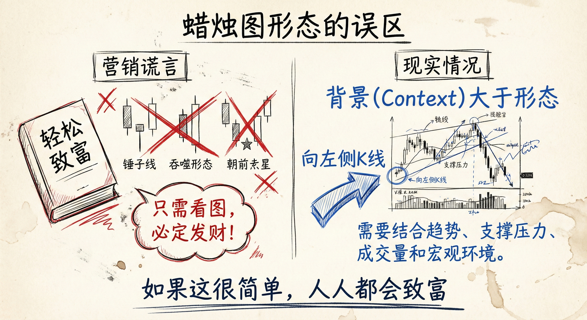
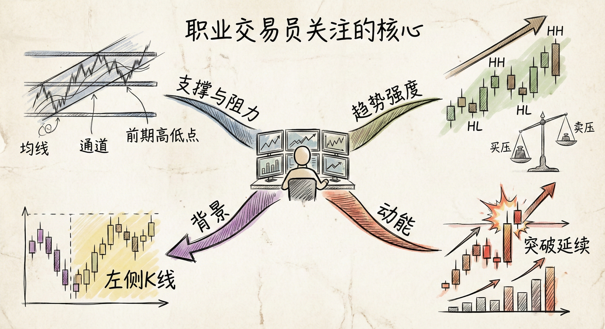
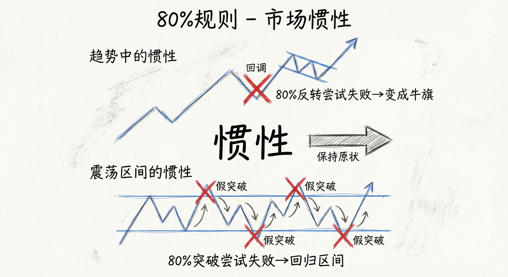
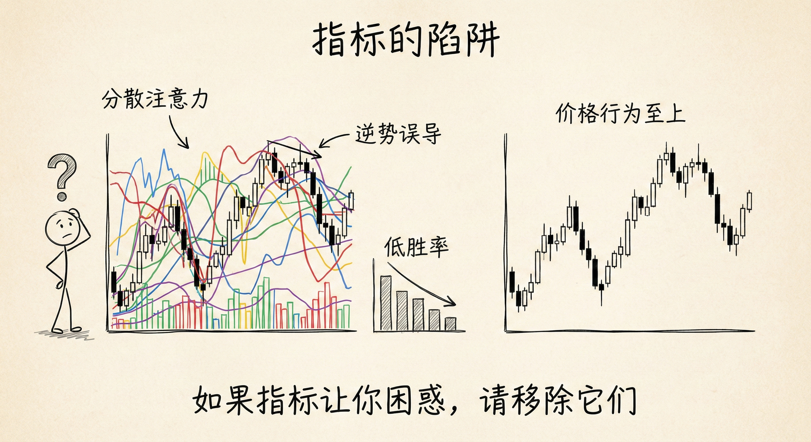

# 图表基础与价格行为总结

## 蜡烛图形态的局限性 (Limitations of Candlestick Patterns)

### 误区与真相
-   **营销谎言**：新手常被误导，认为只需记住简单的蜡烛图形态（如乌云盖顶、射击之星）就能轻松致富。
-   **现实情况**：
    -   如果这很简单，人人都会致富。
    -   机构和职业交易员并不依赖单一的蜡烛图形态进行交易。
    -   **背景 (Context) 大于形态**：单独的形态没有意义，必须结合左侧的K线（市场背景）来看。

### 交易含义
-   **逆势形态的陷阱**：
    -   在强下降趋势中出现“看涨吞噬”或“底部形态”，大概率会失败并演变为熊旗（Bear Flag）。
    -   **策略**：不要在下降趋势中试图摸底买入。相反，应等待多头反转失败、止损离场时，寻找做空机会。
-   **顺势思维**：如果市场处于下降趋势，应押注反转失败，顺势做空。

## 职业交易员关注的核心要素 (Core Elements for Pros)

### 真正的市场语言
职业交易员不谈论蜡烛图形态名称，而是关注以下内容：
-   **支撑与阻力 (Support & Resistance)**：
    -   **均线**：价格回归均值时的反应。
    -   **通道**：通道线及趋势线。
    -   **前期高低点**：前高是阻力，突破后变支撑；前低是支撑，跌破后变阻力。
-   **趋势强度 (Momentum/Strength)**：
    -   **上涨趋势**：关注低点抬高 (Higher Lows) 和高点抬高 (Higher Highs)。
    -   **买压/卖压**：连续的强阳线代表买压，连续的强阴线代表卖压。
    -   **动能**：强劲的突破K线意味着趋势可能延续。

### 80% 规则 (惯性)
-   **趋势惯性**：市场具有惯性，抗拒改变。
-   **反转失败率**：在趋势行情中，**80% 的反转尝试都会失败**，并成为原有趋势的中继形态（如牛旗或熊旗）。
-   **区间突破失败率**：在震荡区间中，80% 的突破尝试都会失败，价格倾向于回归区间内部。

## 指标的陷阱 (The Trap of Indicators)

### 为何指标可能有害
-   **分散注意力**：过多的指标会遮挡价格行为本身，导致交易者忽略K线图的真实走势。
-   **逆势误导**：
    -   指标（如震荡指标）常在强趋势中显示“背离”信号（如双重背离）。
    -   **风险**：新手看到背离就试图抄底，但在强趋势（窄通道）中，背离往往失效，导致连续亏损。
-   **盈亏比与胜率的权衡**：依靠指标逆势交易可能盈亏比高（止损小），但胜率极低。

### 交易启示
-   **价格行为至上**：最清晰的信号来自裸K线图（Price Action）。
-   **顺势而为**：在强趋势中，忽略指标的背离信号，顺应动能交易比逆势抄底更容易赚钱。

## 总结原则
-   **没有捷径**：交易是与世界上最聪明的人竞争，没有简单的致富公式（无论是蜡烛图还是指标）。
-   **分形结构 (Fractals)**：所有时间周期（月线、日线、5分钟）的市场结构和价格行为原则是通用的。
-   **管理预期**：成功的交易需要理解背景、动能和概率，而不仅仅是寻找入场形态。
-   **建议**：如果使用指标让你感到困惑或亏损，请移除它们，专注于学习价格行为、支撑阻力及市场结构。
