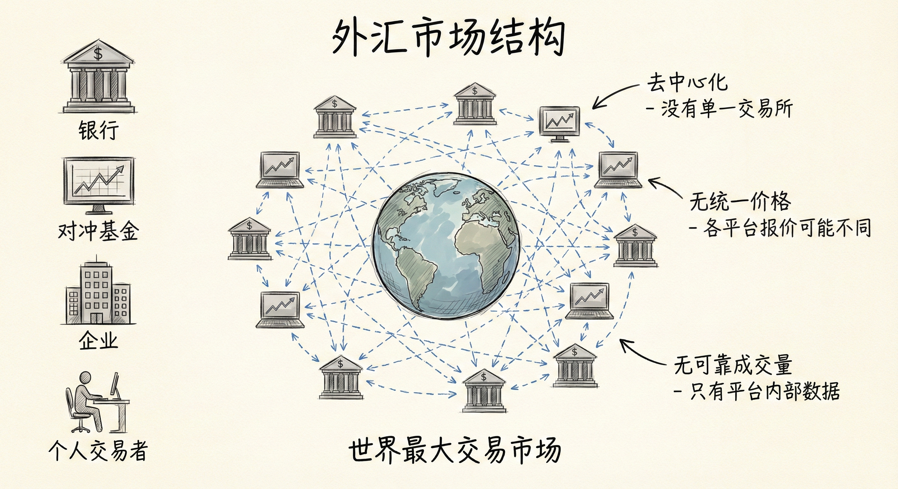
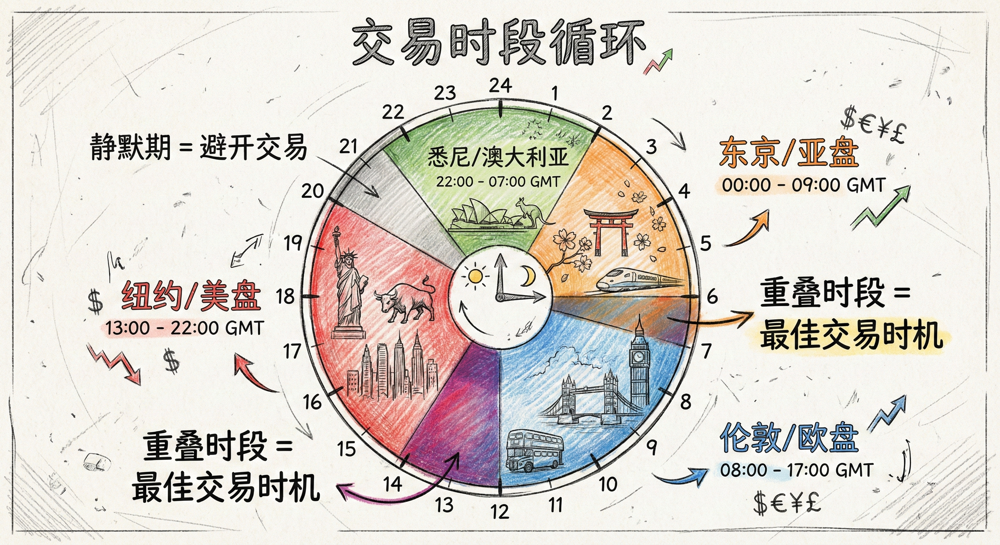
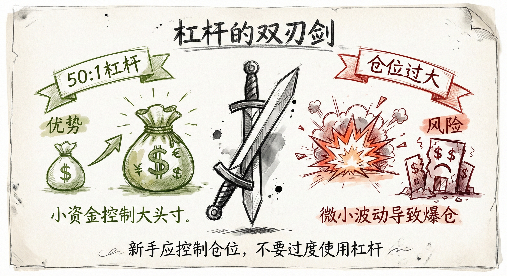
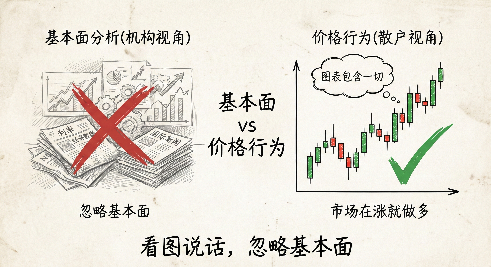

# 外汇交易基础 (Forex Basics)

## 什么是外汇市场 (What is Forex)

### 定义与特征
-   **概念**：外汇（Forex）是“Foreign Exchange”的缩写，即兑换外国货币。
-   **去中心化**：与纽交所或纳斯达克不同，外汇没有中心交易所，不受单一机构监管。
-   **市场结构**：由全球成千上万家银行、平台和兑换点组成的网络。
    -   **无统一价格/最后一笔交易**：不同银行/平台报价可能略有不同，不存在全市场统一的“收盘价”。
    -   **无可靠成交量**：由于没有中心市场，K线图上的成交量仅代表该特定平台的数据，无法反映全市场情况。
-   **规模**：世界上最大的交易市场，超过股票和债券市场。

### 参与者与交易优势
-   **参与者**：投机者（如索罗斯）、对冲基金、跨国企业（如苹果公司）、个人交易者。
-   **成本优势**：机构和平台交易的点差通常小于1%，而机场等实体兑换店成本高达10%。
-   **低门槛**：允许极小资金开设账户（如$30），适合新手练习。

## 交易时段 (Trading Sessions)

### 时间循环
-   **24小时市场**：从周日下午（美国时间）开盘，至周五下午收盘。
-   **主要时段**：澳大利亚（悉尼） -> 东京（亚盘） -> 伦敦（欧盘） -> 纽约（美盘）。
-   **循环**：一个时段结束，另一个开始，周而复始。

### 交易策略与时机
-   **寻找重叠**：最佳交易时机通常在时段重叠期（如欧盘与美盘重叠），此时流动性最好，波动活跃。
-   **避开静默期**：美盘结束到亚盘开始之间通常是窄幅震荡，难以获利，应避免交易。
-   **流动性**：活跃时段流动性巨大，个人交易者的单量对市场价格无影响，无需担心滑点。

## 杠杆与分析方法 (Leverage & Analysis)

### 杠杆的双刃剑
-   **优势**：外汇提供高杠杆（通常50:1），小资金（如$2,000）可控制大头寸（如$100,000）。
-   **风险**：虽然资金利用率高，但若仓位过大，微小的反向波动即可导致爆仓。
-   **建议**：新手应控制仓位，不要过度使用杠杆。

### 基本面 vs. 价格行为
-   **机构视角**：关注利率、经济指标、国际新闻（基本面）。
-   **散户视角**：**忽略基本面**。
    -   **看图说话**：K线图（Price Action）已经包含了所有基本面信息。
    -   **交易逻辑**：如果市场在涨，就做多，无需知道背后的新闻原因。
-   **风险提示**：基本面新闻可能导致瞬间剧烈波动，需警惕。

## 总结原则
-   **理解市场性质**：外汇是去中心化的，无可靠成交量数据。
-   **专注活跃时段**：选择流动性好的重叠时段交易，避开窄幅震荡。
-   **图表至上**：作为个人交易者，依靠K线图而非新闻进行决策。
-   **平台选择**：选择信誉好、点差低的纯外汇平台（如FXCM等），注意综合券商（如IB、TradeStation）因监管原因对外汇杠杆的限制。
