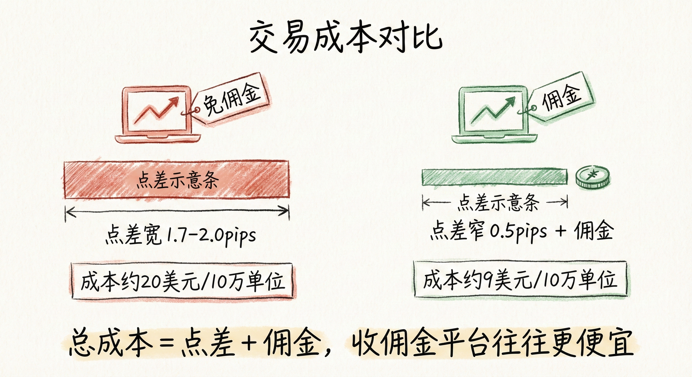
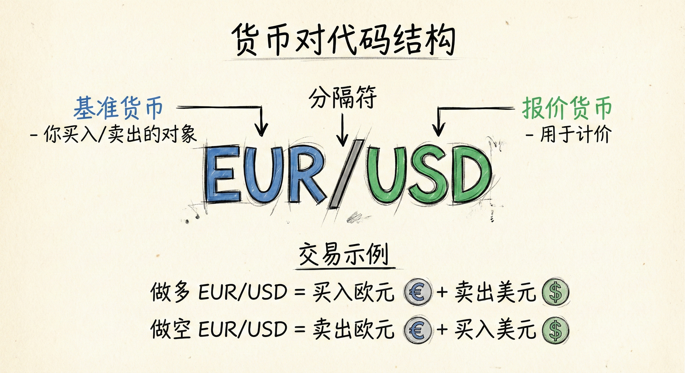
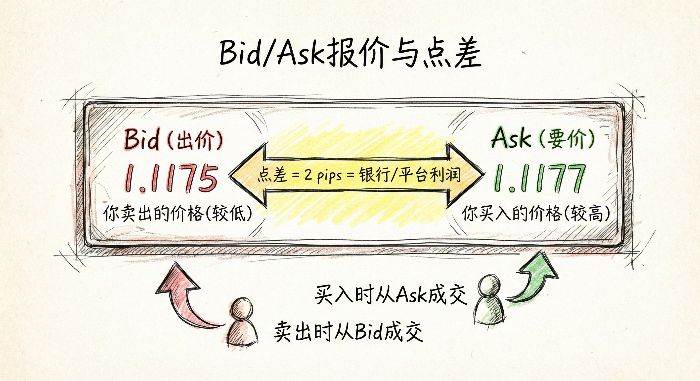

# 外汇基础：成本、代码与报价 (Forex Basics: Costs, Codes, and Quotes)

## 交易成本与平台选择 (Transaction Costs & Broker Selection)

### 成本构成
-   **点差 (Spread)**：买入价 (Ask) 与卖出价 (Bid) 之间的差额。
-   **佣金 (Commission)**：部分平台按交易量收取的固定费用。
-   **总成本计算**：总成本 = 点差费用 + 佣金。

### 平台类型对比
-   **免佣金平台**：通常通过**加宽点差**获利。
    -   *案例*：某平台 EUR/USD 点差高达 1.7 - 2.0 pips，交易 10 万单位成本约 20 美元。
-   **收佣金平台 (如 IB)**：收取佣金但提供**极窄点差**。
    -   *案例*：点差约 0.5 pips + 佣金，总成本约 1 pip (约 9 美元/10万单位)。
    -   *结论*：收佣金的平台往往总交易成本更低。

### 交易启示
-   **选择大平台**：务必在信誉良好、流动性强的大型券商交易，以获得更窄的点差。
-   **关注隐形通过**：不要被"免佣金"误导，需计算包含点差在内的实际总成本。

## 货币代码与交易机制 (Currency Codes & Mechanics)

### 代码结构
-   **组成**：由两个货币代码组成 (如 EUR/USD)。
    -   **基准货币 (Base Currency)**：第一个货币 (EUR)。这是你实际买入或卖出的对象。
    -   **报价货币 (Quote Currency)**：第二个货币 (USD)。用于计价。
-   **交易含义**：
    -   **做多 EUR/USD**：买入欧元，同时卖出美元。
    -   **做空 EUR/USD**：卖出欧元，同时买入美元。

### 术语习惯
-   **外号**：如 "Cable" (英镑/美元)、"Gopher" (美元/日元)。
-   **专业态度**：专业交易者通常直接使用货币名称，认为使用外号是不专业的表现。

## 报价与点 (Quotes & Pips)

### 报价方式
-   **Bid (出价)**：你卖出的价格 (较低)。
-   **Ask (要价)**：你买入的价格 (较高)。
-   **银行利润**：银行和平台通过 Bid 和 Ask 之间的价差获利。

### 点 (Pip) 的定义与识别
-   **定义**：外汇市场中价格变动的标准单位 (Percentage in Point)。
-   **位置识别**：
    -   **大多数货币对**：小数点后**第 4 位** (如 EUR/USD 1.117**9**)。
    -   **日元货币对**：小数点后**第 2 位** (如 USD/JPY 123.0**3**)。
-   **分数点 (Pipettes)**：
    -   许多平台提供额外的小数位 (第 5 位或日元的第 3 位)。
    -   **处理方式**：变化太快且微不足道，交易时通常忽略，只关注标准点。

### 绩效衡量
-   **以"点"为单位**：交易者通常讨论赚了多少"点" (Pips)，而不是美元金额。
-   **原因**：
    -   **隐私保护**：避免暴露账户资金规模。
    -   **标准化比较**：无论交易 1 万单位还是 100 万单位，赚取的点数可以衡量技术水平。

## 市场诚信 (Market Integrity)

### 历史与现状
-   **过去的问题**：曾存在“伦敦定盘价 (London Fix)”操纵，银行利用大单在特定时间窗口 (4:00 PM) 影响价格。
-   **当前状态**：监管加强，市场变得更加诚实可靠。
-   **交易者心态**：无需过分担心内幕交易或操纵，专注于图表本身。

## 总结原则
-   **成本意识**：低佣金不等于低成本，紧窄的点差对盈利至关重要。
-   **理解标的**：清楚买卖的是基准货币，忽略花哨的行话。
-   **关注标准点**：忽略分数点的噪音，用标准点 (Pip) 来计算盈亏和衡量绩效。
