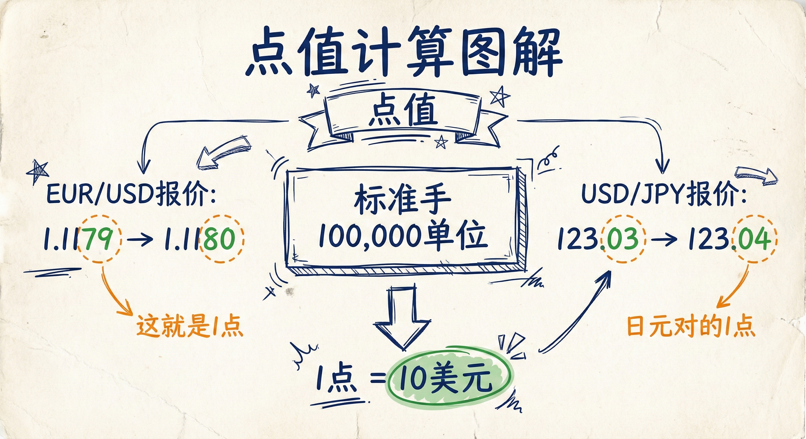
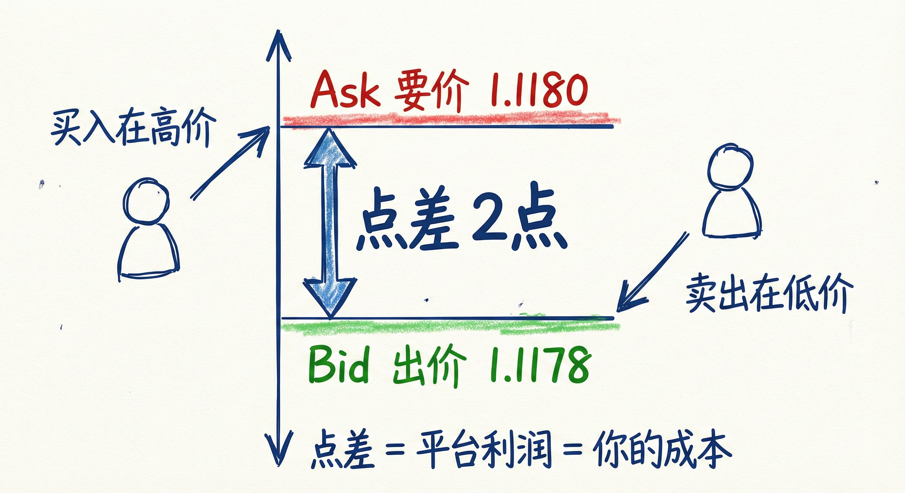
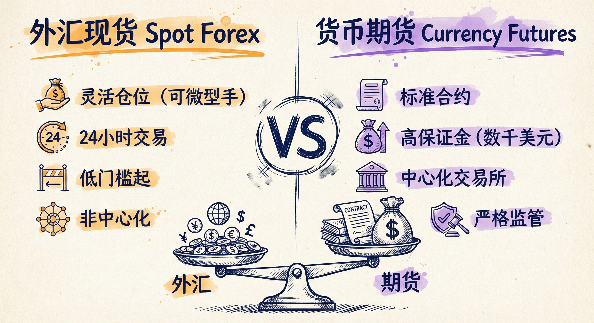

# 外汇基础第三讲：点值、平台与期货对比

## 点值的计算 (Calculating Pip Value)

### 定义与标准
-   **标准手 (Standard Lot)**：通常指交易 100,000 个单位的货币。
-   **点值估算**：
    -   **美元在后（如 EUR/USD）**：1 点通常等于 0.0001 美元。交易 10 万单位时，1 点价值为 10 美元。
    -   **美元在前（如 USD/JPY）**：报价以第二种货币（如日元）表示，最终需转换回美元。
    -   **通用法则**：对于标准手（10万单位）交易，无论货币对如何，1 点的价值通常约为 **10 美元**。

### 计算工具
-   **在线计算器**：大多数交易网站提供免费的点值计算器，输入仓位大小、开平仓价格即可自动计算盈亏。
-   **美国交易者视角**：通常更关注美元盈亏而非点数，利用计算器可简化流程。

## 交易平台与报价机制 (Platforms & Quotes)

### 平台界面与功能
-   **常见软件**：如 TradeStation, Interactive Brokers (IB) 等。
-   **界面构成**：通常包含报价流（左侧）和 K 线图（右侧）。
-   **下单方式**：支持在报价流上点击价格下单，或直接在 K 线图上点击下单。

### 做市商与对手盘
-   **市场创造者**：平台或银行充当做市商，为你创造市场。
-   **对手盘机制**：无论你想做多还是做空，平台总是你的对手盘（你买入时平台卖出，你卖出时平台买入）。

### 出价、要价与点差 (Bid, Ask & Spread)
-   **Ask (出价/卖价)**：较高的价格。这是平台愿意卖出的价格，也是你**买入 (做多)** 的成交价。
-   **Bid (要价/买价)**：较低的价格。这是平台愿意买入的价格，也是你**卖出 (做空)** 的成交价。
-   **点差 (Spread)**：Ask 与 Bid 之间的差额。
    -   **交易成本**：点差是平台的利润来源，也是交易者的成本。
    -   **即时亏损**：由于点差存在，交易一经成交通常即处于微亏状态（买入价高于卖出价）。
    -   **主要货币对**：如 EUR/USD，点差通常较小（约 1-1.5 点）。
    -   **交叉货币对**：如 GBP/NZD，点差可能很大（10 点或更多），交易成本显著增加。

## 外汇现货 vs. 货币期货 (Spot Forex vs. Currency Futures)

### 相似之处
-   **图表形态**：外汇现货（如 EUR/USD）与对应的货币期货（如 6E 欧元期货）图表几乎完全相同。
-   **交易成本**：对于大资金（如 10 万单位 vs 1 手期货合约），两者的交易成本（点差 vs 跳动点+佣金）非常接近。

### 关键区别
-   **仓位灵活性**：
    -   **外汇**：允许极小的仓位（如微型手），适合小账户。
    -   **期货**：合约标准化，保证金要求较高（通常数千美元），适合较大账户。
-   **监管与隐私**：
    -   **机构偏好**：机构更倾向于外汇市场，因为其具有非中心化交易所的特性，能提供更好的隐私保护，避免被过度监控。
    -   **期货**：在中心化交易所交易，受到严格监管。
-   **市场趋势**：越来越多的交易者从期货市场转向外汇市场，因其灵活性和全天候交易优势。

## 总结原则
-   **记住点值**：交易标准手（10万单位）时，心中默认 1 点约为 10 美元，便于快速估算风险。
-   **关注点差成本**：点差是隐性成本，交易冷门交叉盘时务必计算高昂的点差费用。
-   **灵活选择市场**：小资金首选外汇现货以便控制仓位；大资金两者皆可，视乎对隐私和监管的需求。
