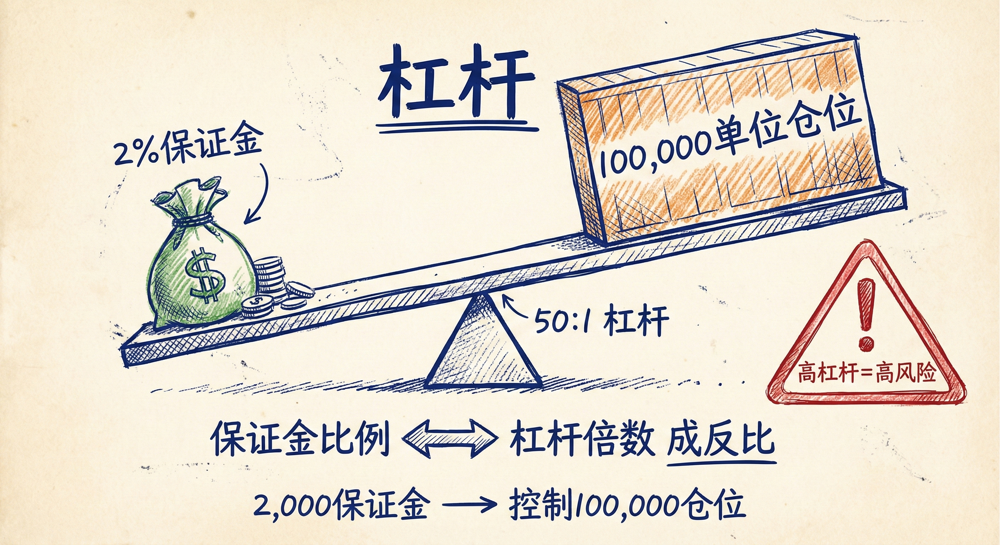
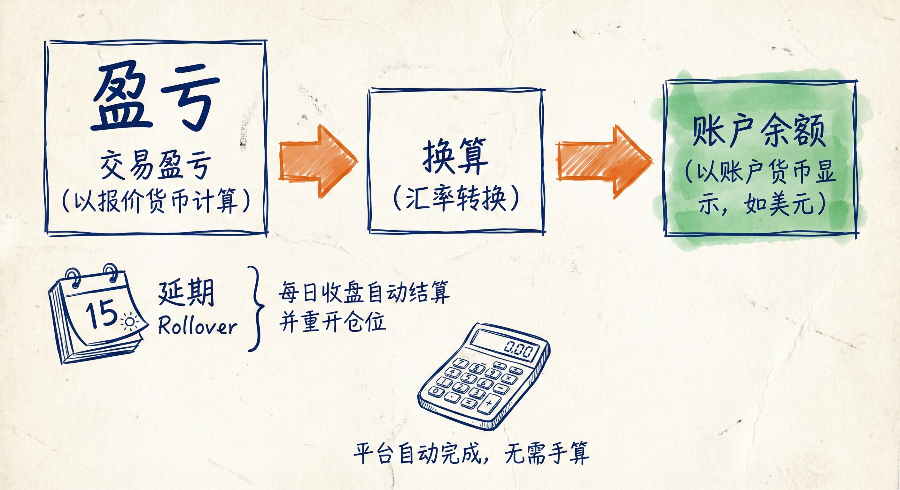
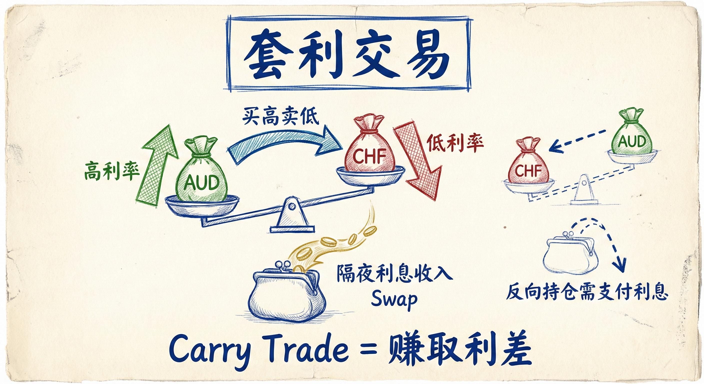

# 外汇基础（第五部分）

## 保证金与杠杆 (Margin and Leverage)

### 定义与机制
-   **概念**：保证金是允许开仓的信用抵押，并非费用或佣金。它是根据**基础货币**（货币对中的第一个货币）计算的。
-   **杠杆关系**：保证金与杠杆成反比。例如，2% 的保证金要求意味着 50:1 的杠杆（即账户中每 1 单位货币可控制 50 单位的仓位）。
-   **波动性因素**：外汇市场提供高杠杆的原因在于，相比股票市场，外汇的百分比波动幅度非常小。

### 实际应用与风险
-   **计算示例**：若交易 10 万单位欧元兑美元（EUR/USD），价格为 1.31275，保证金要求为 2%。则需账户中有约 2600 美元（131,275 美元的 2%）。
-   **动态调整**：当市场波动剧烈时，经纪商可能会降低杠杆（提高保证金要求，如从 2% 提至 4%）以控制风险。
-   **风险警示**：虽然平台允许高杠杆（如账户仅有 200 美元却交易 1 万美元仓位），但交易者**不应**仅仅因为允许就将杠杆加满。

## 盈亏计算 (Profit and Loss)

### 计算逻辑
-   **计价基础**：交易盈亏基于**报价货币**（货币对中的第二个货币）。
-   **货币转换**：在交易时段结束时，盈亏会被换算成账户的基础货币（如美元）。
-   **延期 (Rollover)**：大多数平台在交易日结束时会自动关闭仓位并立即重新开仓，将其延续到下一个交易日。

### 套利交易 (Carry Trade)
-   **定义**：买入高利率货币并卖出低利率货币，旨在赚取利率差。
-   **对散户的影响**：这通常是机构的长期策略，与日内交易者关系不大，但它会影响**隔夜利息（Swap）**。
-   **隔夜利息**：根据持仓方向（做多或做空）和货币对的利率差，交易者在延期时可能会获得利息收入或支付利息费用（例如做多澳元兑瑞郎可能获利，做空则需支付利息）。

## 总结原则
-   **无需精通数学**：虽然了解背后的数学原理（点值、盈亏换算）有益，但这并非交易获利的必要条件。
-   **利用工具**：交易平台和在线计算器会自动处理所有复杂的换算和计算。
-   **专注交易本身**：交易者应将精力集中在图表分析和交易决策上，而不是分心去进行手动计算。
