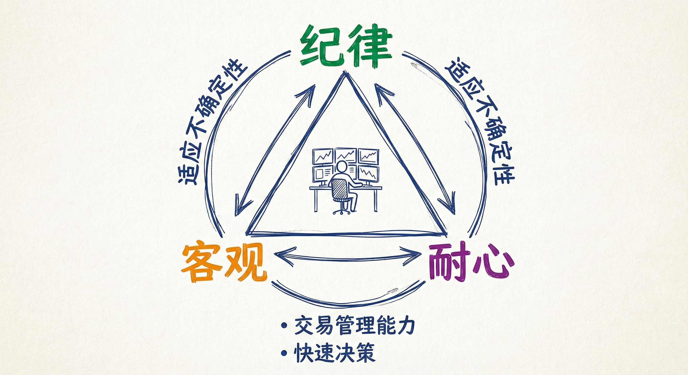
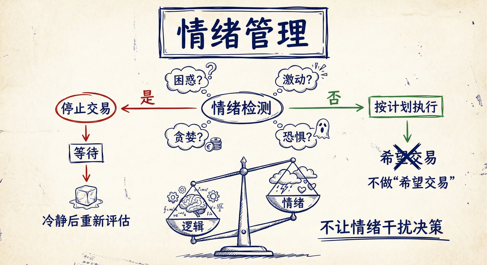
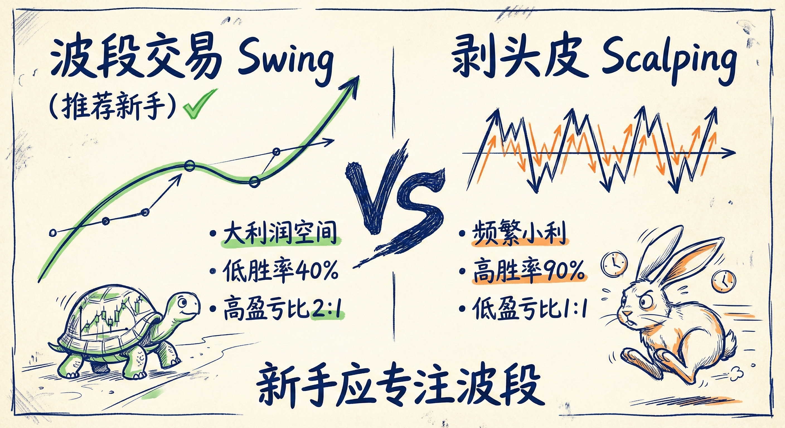

# 成功交易员的性格特征

## 核心品质与纪律 (Core Traits & Discipline)

### 优秀交易员的特质
-   **基本素质**：有纪律、客观、耐心。
-   **适应不确定性**：必须习惯市场的不确定性，接受没有100%确定的事情。
-   **交易管理能力**：一旦交易开始，必须能够做出正确的决策（比入场更重要）。

### 纪律的定义与执行
-   **做正确的事**：不论是否愿意，都要坚持做正确的事。
-   **拒绝“希望”交易**：
    -   严禁抱有“也许这次能成功”、“求求让我赚一次”的心态。
    -   每一笔交易必须符合逻辑，且与一贯的交易风格保持一致。
    -   不要因为盈亏比高就去尝试低胜率的“蠢事”（如在强趋势中逆势操作）。
-   **情绪管理**：
    -   如果感到困惑、激动、贪婪或恐惧，**停止交易**并等待。
    -   不要让情绪干扰决策，始终保持客观。

### 耐心的重要性
-   **等待机会**：好的交易机会可能需要数小时才能形成。
-   **宁缺毋滥**：如果没有看到符合策略的机会（如高胜率的突破或良好的跟随），就不要交易。
-   **机会永远存在**：机会也许会迟到，但永远不会缺席。

## 对待市场的态度：尊重与纠错

### 像尊敬长辈一样尊敬市场
-   **敬畏之心**：市场存在已久且高度进化，必须像对待父母或祖父母一样尊重市场。
-   **知错就改**：
    -   如果发现自己做了一笔愚蠢的交易（犯错），必须**立刻承认并纠正**。
    -   **行动**：立即止损离场，不要抱有侥幸心理期待市场回调。
    -   **心态**：不要自我惩罚，接受微小的损失，迅速调整心态准备下一笔交易。

### 避免“扛单”心理
-   **新手误区**：新手往往因为不愿意止损，试图寻找各种理由（如“可能是楔形顶”）来说服自己持有亏损仓位，最终导致巨额亏损。
-   **高手做法**：几秒钟或几个Tick内意识到错误并离场，甚至反手顺势交易。

## 适应不确定性与概率 (Uncertainty & Probability)

### 市场的概率结构
-   **90/10 法则**：
    -   **10%的时间**：市场处于强劲突破（高胜率，高确定性），此时应坚决顺势。
    -   **90%的时间**：市场处于通道或震荡区间（胜率在40%-60%之间波动），充满不确定性。
-   **接受亏损**：
    -   亏损是交易的一部分，即使是顶尖交易员也会亏损。
    -   必须控制仓位，确保亏损不会影响情绪。

### 交易管理的决定性作用
-   **管理优于入场**：在90%的非突破行情中，如果使用较宽的止损并合理管理仓位（如加仓），做多做空都有可能获利（注：不建议新手模仿）。
-   **不确定性常态**：交易时右侧K线永远是未知的，必须在只有40%-60%确定性的情况下从容交易。

## 交易风格的选择：波段 vs 剥头皮

### 寻找适合个性的风格
-   **舒适度**：必须找到一种让自己感到放松、快乐且能长期坚持的交易方式。
-   **时间成本**：通常需要数年时间才能真正了解自己的个性并找到匹配的风格。

### 波段交易 (Swing Trading) - 推荐新手
-   **特征**：追求大的利润空间。
-   **数学模型**：低胜率（约40%），高盈亏比（回报至少是风险的2倍）。
-   **心理要求**：必须能够忍受长时间的持仓，在回调和反转尝试中坚定持有，直到趋势被破坏。

### 剥头皮交易 (Scalping)
-   **特征**：追求频繁的小额利润。
-   **数学模型**：高胜率（需达到90%），低盈亏比（风险与回报通常为1:1）。
-   **难度**：极难长期维持，要求极快的反应速度和极高的准确率，大多数交易者不适合。

## 总结原则
-   **客观与纪律**：避免情绪化交易，不做低概率的“蠢事”。
-   **快速认错**：尊重市场信号，一旦发现错误立即止损，绝不侥幸。
-   **拥抱不确定性**：习惯在40%-60%的胜率环境中生存，依靠资金管理和概率取胜。
-   **定位自我**：新手应专注于高盈亏比的波段交易，而非高难度的剥头皮。
