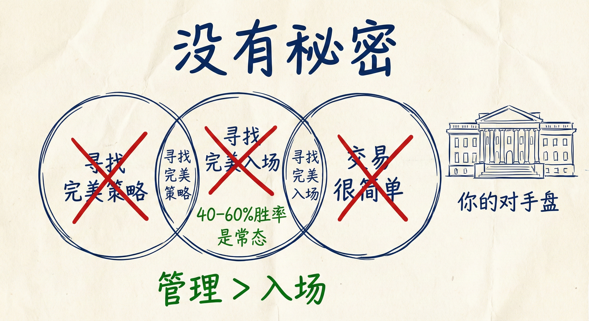
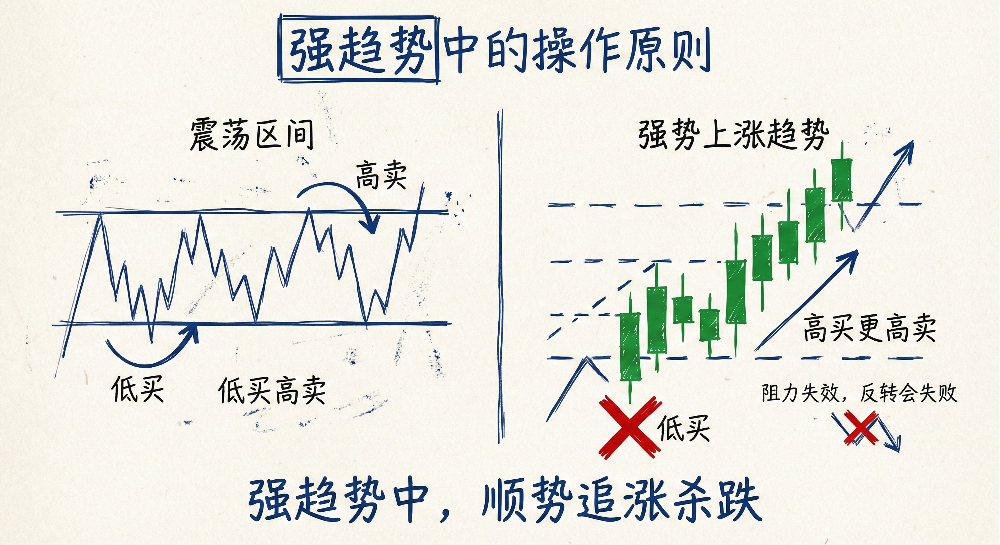
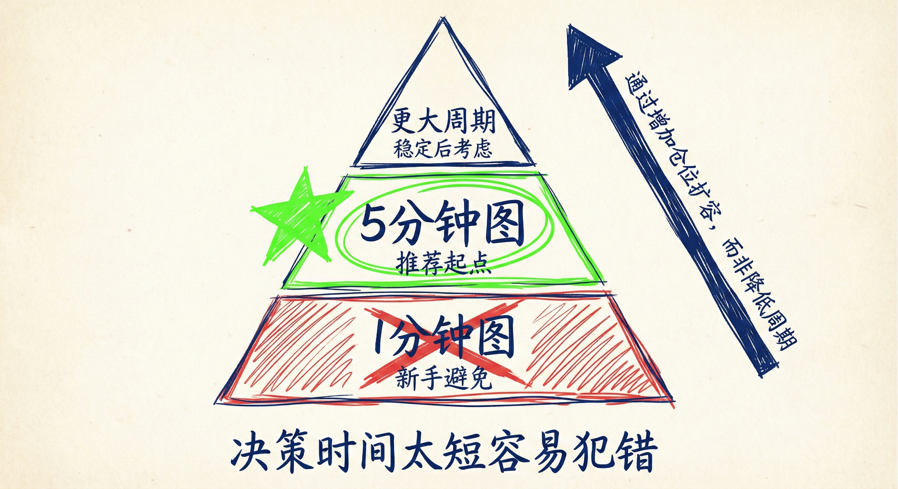
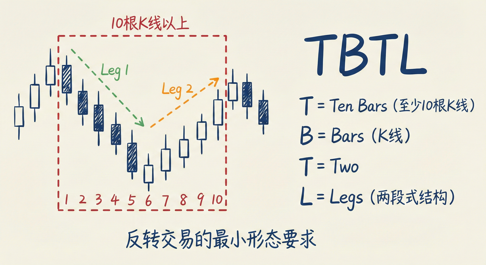

# 步入交易生涯（第一部分）

## 新手的错误观念 (False Beliefs)

### 寻找完美的策略
-   **误区**：许多新手认为存在某种秘密策略或“下金蛋的鹅”，能带来低风险、高胜率和快速致富。
-   **现实**：
    -   **没有秘密**：交易是公开的竞争，你的对手盘通常是机构。
    -   **胜率现实**：大多数交易机会的胜率仅在 40% 到 60% 之间。即使是 50% 的胜率也意味着有一半可能赚不到钱。
    -   **机构博弈**：每一笔交易背后都有机构在买入和卖出，双方都有合理的理由。

### 寻找完美的入场点
-   **误区**：认为必须等待完美的蜡烛图形态才能入场。
-   **现实**：
    -   **随时可入场**：没有绝对的最佳入场时间。只要正确管理交易（止损、仓位、目标），任何时间都可以入场。
    -   **管理重于入场**：交易的成败更多取决于入场后的管理（如加仓、止损设置），而非入场点本身。
    -   **错失恐惧**：如果错过了突破入场，总会有后续的入场机会（如回调、收盘价入场）。

### 交易很简单
-   **误区**：认为只需背诵十几个 K 线形态就能赚钱。
-   **现实**：交易非常困难，因为你在与世界上最聪明的人和机构竞争。单纯依赖形态而忽略背景和管理是无法盈利的。

## 交易的大局观 (The Big Picture)

### 核心原则：低买高卖 vs. 顺势而为
-   **一般原则**：在支撑位买入（低买），在阻力位卖出（高卖）。
-   **关键例外（强趋势）**：
    -   **阻力失效**：在强势上涨趋势（如大阳线突破）中，市场会无视阻力位（双顶、楔形顶等）。此时不能“高卖”，而应“高买”（追涨）。
    -   **支撑失效**：在强势下跌趋势中，市场会无视支撑位（双底、楔形底等）。此时不能“低买”，而应“低卖”（追空）。
-   **操作建议**：
    -   **强趋势中**：假设所有反转尝试都会失败，将反转形态视为顺势的旗形（牛旗/熊旗），继续顺势交易。
    -   **震荡/弱趋势中**：才适用"低买高卖"的原则。

## 图表类型与时间周期 (Charts & Timeframes)

### 市场的普遍性
-   **价格行为一致性**：无论是股票、外汇、期货还是债券，所有金融市场都基于理性的人类行为，因此价格行为技术是通用的。
-   **图表类型**：时间图（5分钟）、Tick图、成交量图等，其价格行为形态本质上是相同的。Al Brooks 偏好时间图，因为能确切知道 K 线收盘时间。

### 时间周期的选择
-   **避免极小周期**：
    -   **1分钟图陷阱**：新手应避免交易小于 3 分钟的图表（如 1 分钟图）。
    -   **原因**：决策时间太短，容易犯错；虽然单笔风险看似小（止损点数少），但由于胜率和盈亏比的限制，长期手动交易极难盈利。
-   **推荐起点**：**5分钟图**是日内交易的最佳起点。
-   **扩容而非降频**：如果在 5 分钟图上能稳定盈利，应通过**增加仓位**来扩大收益，而不是转去做 1 分钟图。

### TBTL 原则 (Ten Bars, Two Legs)
-   **定义**：在寻找反转交易时，应寻找至少包含 **10根 K 线** 和 **两段式结构** (Two Legs) 的形态。
-   **多周期应用**：如果在当前周期（如5分钟）形态过于庞大（如300根K线），应切换到更大的时间周期（如60分钟），在该周期上寻找符合 TBTL 原则的结构进行交易。

## 总结原则
-   **接受不确定性**：放弃寻找完美交易，接受 40-60% 的胜率常态。
-   **区分环境**：在强趋势中，放弃“低买高卖”，转为顺势追涨杀跌；无视逆势反转信号。
-   **坚守合适周期**：新手从 5 分钟图开始，避免手动高频交易（1分钟图）。
-   **专注管理**：入场点不是决定性因素，止损、仓位和交易管理才是盈利关键。
