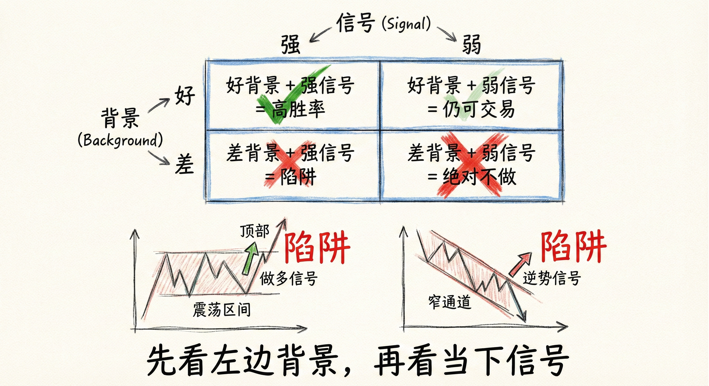
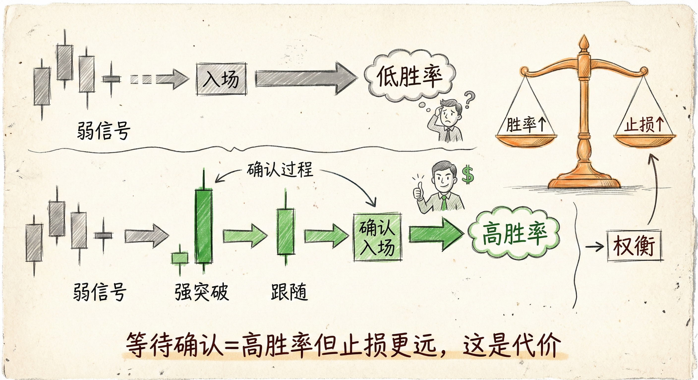
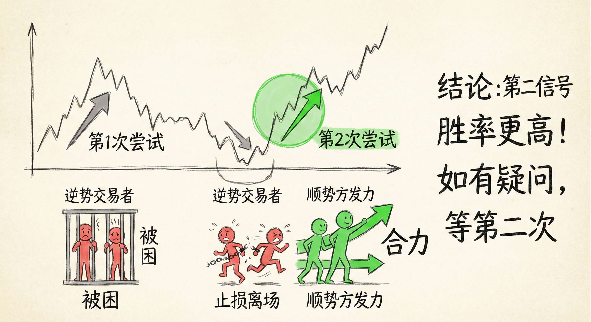

# 好的交易机会与信号K线（第四部分）

## 交易背景与信号强度 (Context & Signal Strength)

### 信号K线与背景的关系
-   **背景至上**：单独一根漂亮的信号K线不足以构成交易理由。必须“看左边”，分析市场背景。
-   **震荡区间陷阱**：
    -   **特征**：在震荡区间顶部出现漂亮的做多信号K线，或在底部出现漂亮的做空信号K线，通常是低胜率交易。
    -   **策略**：震荡区间应“逢低买入，逢高卖出”。区间内的突破80%会失败。
    -   **惯性**：市场具有惯性，横盘往往会继续横盘，直到出现明确的强力突破。
-   **窄通道陷阱**：
    -   在强劲的窄通道趋势中，逆势的反转信号（即使形态很好）大概率会失败，演变为旗形，随后趋势恢复。

### 强趋势中的弱信号
-   **顺势交易**：在强劲的趋势（如窄通道）中，即使信号K线很弱（如十字星、小实体），也可以顺势入场。
    -   **原因**：强趋势中，反转尝试通常会失败，动能会延续。
    -   **入场方式**：市价买入/卖出，或在K线收盘价入场，或使用限价单。
-   **逆势交易**：在强趋势中，绝对不要利用弱信号进行逆势交易。

## 提高胜率：等待更多信息 (Waiting for Confirmation)

### 弱交易机会的处理
-   **定义**：当信号K线较弱且背景也不强时，直接入场胜率极低。
-   **策略**：耐心等待更多信息，即“确认信号”。
    -   **突破与跟随**：等待一根强力突破K线，并紧接着出现一根同向的强势跟随K线（Follow-through）。
    -   **胜率与盈亏比的权衡**：等待确认信号（如跟随K线收盘）入场，胜率会显著提高，但止损距离变远，导致盈亏比（Risk/Reward）变差。这是交易中必须接受的代价。

### 确认信号的特征
-   **强突破**：大实体K线，收盘价接近极值。
-   **好跟随**：突破后的下一根K线继续同向运动，且非反向K线（如阳线突破后接阳线，而非阴线）。

## 第二信号 (Second Signals / Second Entries)

### 定义与逻辑
-   **概念**：当第一个入场信号不理想或失败后，市场再次发出同向信号。
-   **重要性**：第二信号（Second Entry）通常比第一信号胜率更高。
-   **心理博弈**：
    -   第一信号失败往往困住了一部分交易者。
    -   第二信号出现时，逆势方通常会放弃抵抗或止损离场，顺势方再次发力，形成合力。

### 应用场景
-   **复杂回调**：如三推楔形回调，通常等待第二次反转信号再入场。
-   **窄通道修正**：窄通道后的第一次反转通常失败，等待第二次尝试（Double Top/Bottom Lower High/Higher Low）。
-   **不确定时**：如果对第一信号有疑问（如背景不好或信号K线弱），最好的策略是等待第二信号。

## 逆势交易与反转 (Counter-Trend & Reversals)

### 逆势交易的高要求
-   **强信号K线**：逆势交易必须依赖非常强势的信号K线（大实体、收盘在极值）。
-   **强背景**：需要配合形态（如双顶/双底、楔形、末端旗形）。
-   **禁忌**：
    -   不要在强趋势（窄通道）中，仅凭一根普通的K线做逆势。
    -   不要在连续的大阳线/大阴线后立即逆势操作。

### 交易策略
-   **等待强反转**：看到连续的强力反向K线（如大阴线突破牛旗）后再入场。
-   **利用第二入场**：逆势交易失败率高，利用第二入场点（L2/H2）可以过滤掉很多失败的交易。

## 总结原则
-   **背景 > 信号**：永远先看左边的价格行为（背景），再看当下的信号K线。
-   **胜率与风险互换**：想要高胜率，就要接受更宽的止损（等待突破和跟随）；想要小止损（狙击入场），就要接受较低的胜率。
-   **善用第二信号**：当第一信号不完美时，耐心等待第二信号是提高胜率的最佳捷径。
-   **顺势而为**：强趋势中，弱信号可顺势做；逆势交易则必须等待强信号。
