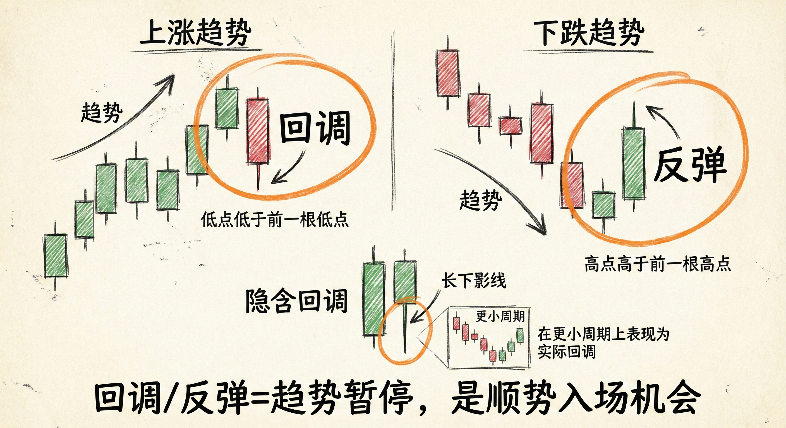
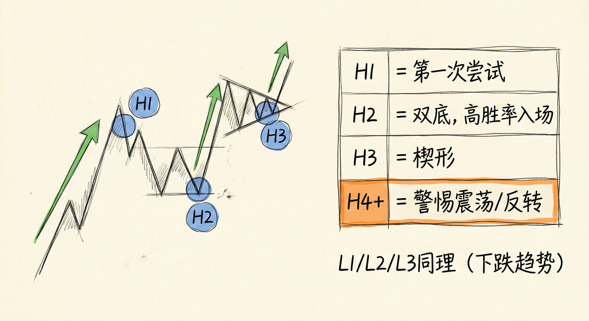
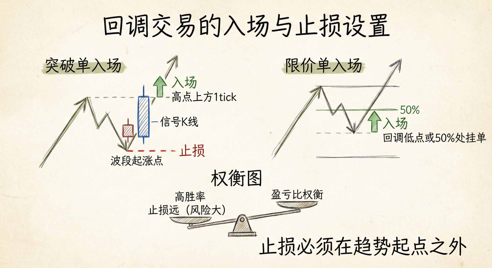

# 回调与数 K 线（第一部分）

## 回调与反弹的定义 (Definitions)

### 基础概念
-   **上涨趋势中的回调 (Pullback)**：当前K线的最低点低于前一根K线的最低点。
-   **下降趋势中的反弹 (Rally)**：当前K线的最高点高于前一根K线的最高点。
-   **意义**：回调/反弹是趋势中的暂时停顿或小幅反转，预示着趋势大概率将继续，提供了顺势入场的机会。

### 隐含回调 (Implied Pullbacks)
-   **识别**：在当前时间周期（如5分钟图）上未跌破前一根K线低点，但K线具有长影线或逆势的小实体。
-   **本质**：在更小的时间周期（如1分钟图）上，这些形态表现为实际的回调结构。
-   **交易含义**：交易者应像对待标准回调一样对待隐含回调，寻找入场机会（如在隐含回调K线收盘或突破时入场）。

## 50% 回调的数学原理 (The 50% Retracement)

### 为何重要？
-   **盈亏比平衡点**：在波段的50%位置，多空双方的风险与潜在回报距离相等（盈亏比均为1:1）。
-   **概率优势**：虽然盈亏比相同，但顺势一方拥有更高的胜率（例如60%对40%）。
-   **机构行为**：许多职业交易员和算法会在50%回调处挂限价单，因为这是基于数学期望的合理入场点，而非斐波那契数列的巧合。

## 数 K 线基础 (Bar Counting Basics)

### 定义与逻辑
-   **目的**：计算顺势一方尝试恢复趋势的次数，以此寻找高概率的入场时机。
-   **信号K线 (Signal Bar)**：
    -   **做多信号**：上涨趋势回调中，一旦某根K线的高点超过前一根K线的高点，该K线即为做多信号K线。
    -   **做空信号**：下降趋势反弹中，一旦某根K线的低点跌破前一根K线的低点，该K线即为做空信号K线。

### 计数方法 (H1/H2/H3 & L1/L2/L3)
-   **高1 (H1) / 低1 (L1)**：趋势中的第一次尝试恢复。
    -   *注意*：在强趋势中，H1/L1可能就是唯一的回调；但在震荡或弱趋势中，H1/L1往往会导致进一步的回调。
-   **高2 (H2) / 低2 (L2)**：第二次尝试恢复趋势。
    -   **ABC调整**：通常对应ABC回调结构（两段式调整），是胜率较高的入场点。
    -   **双底/双顶**：所有的双底本质上是H2，所有的双顶本质上是L2。
-   **高3 (H3) / 低3 (L3)**：第三次尝试恢复趋势。
    -   **形态对应**：通常对应楔形（Wedge）或三角形（Triangle）调整形态。
-   **高4 (H4) 及以上**：如果回调延伸至H4、H5，市场可能已演变为宽幅震荡区间或反转，需谨慎对待顺势交易。

## 交易策略与风险管理

### 入场与止损
-   **入场方式**：
    -   **突破单**：在信号K线高点上方1个tick（做多）或低点下方1个tick（做空）挂单。
    -   **限价单**：在强趋势的低点或50%回调处挂单。
-   **止损设置**：
    -   **初始止损**：必须放在趋势波段的起涨点下方（做多）或起跌点上方（做空）。
    -   **移动止损**：随着趋势强势突破创新高，止损可上移至新的突破点或主要低点下方。

### 胜率与盈亏比的权衡
-   **高胜率的代价**：顺势买入回调通常是高胜率交易，但止损距离较远（风险大），因此盈亏比可能较差。
-   **机构操作**：机构通过仓位管理（如分批止盈）来降低风险，这种止盈行为本身往往导致了回调的发生。

## 总结原则
-   **寻找入场理由**：数K线不是为了追求完美模式，而是为了提供合乎逻辑的入场理由。
-   **顺势而为**：在强趋势中，每一次回调（无论是H1, H2还是隐含回调）都是潜在的买入/卖出机会。
-   **灵活应对**：如果回调演变成复杂的震荡（如超过20根K线），则需调整策略，警惕反转风险。
