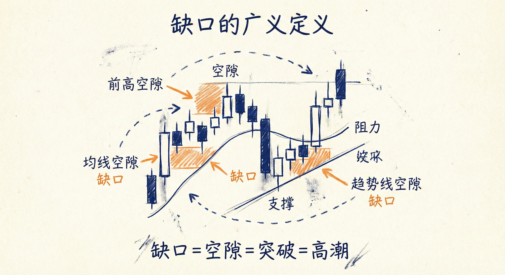
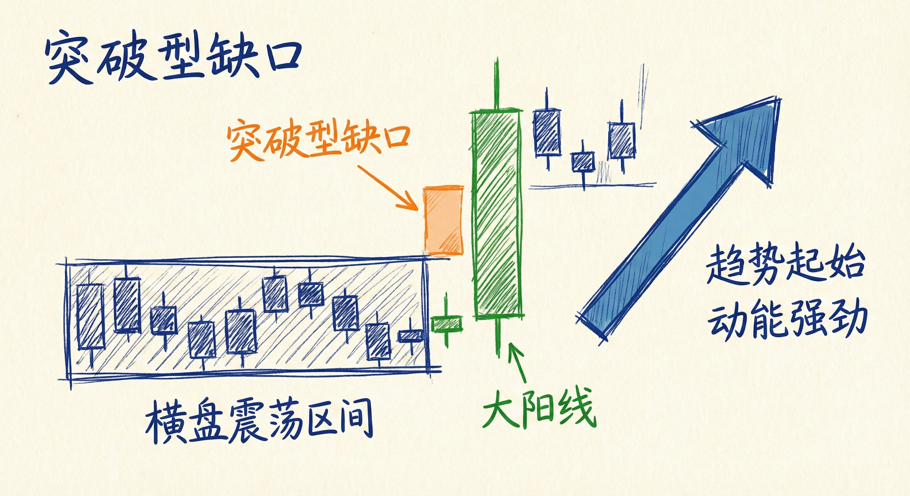
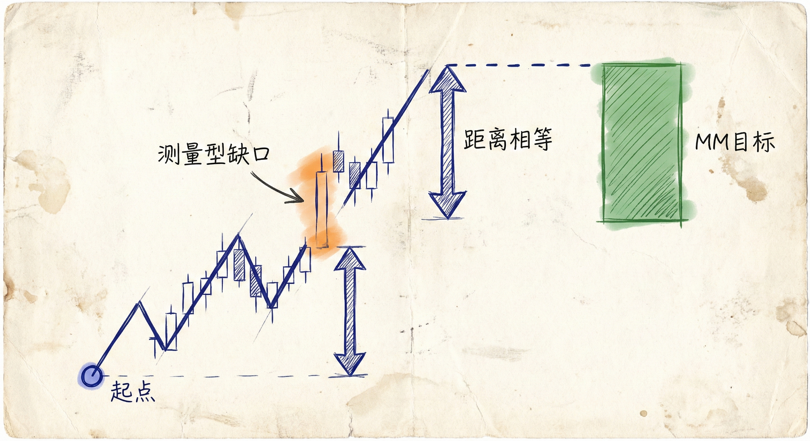
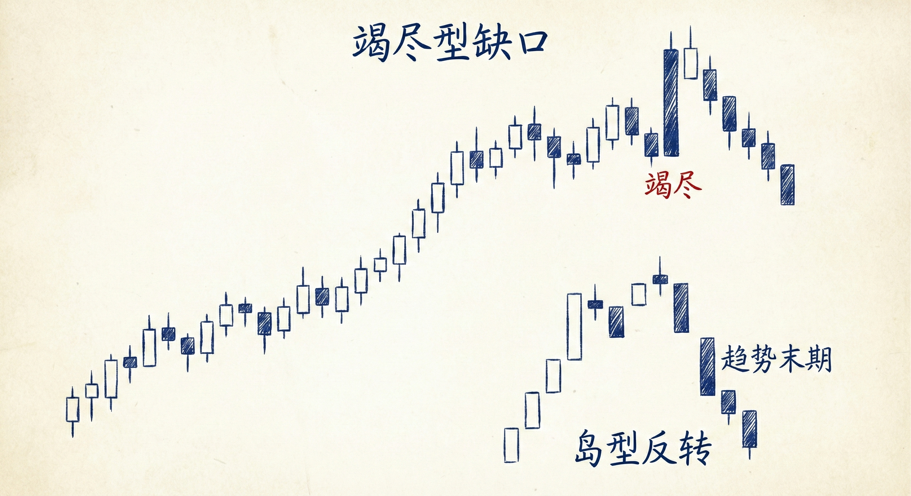

# 缺口（第一部分）

## 缺口的广义定义 (Broad Definition of Gaps)

### 定义与识别
-   **核心概念**：缺口即“空隙”。指当前价格与任何支撑或阻力位之间的空间。
-   **支撑/阻力的形式**：
    -   前期的高点或低点。
    -   K线的开盘价或收盘价。
    -   移动平均线 (Moving Average)。
    -   趋势线或趋势通道线。
-   **Al Brooks 的独特视角**：
    -   **普遍性**：每一根趋势K线本质上都是一个缺口，都是一次突破，也是一次高潮。
    -   **形态等价**：期货图表上的跳空缺口（Gap），在现货/现金指数图表上往往表现为一根巨大的趋势K线。两者的市场含义完全相同：价格定价错误，需要快速移动。
    -   **微观缺口**：例如一根K线的收盘价与前一根K线高点之间的空隙，或者K线低点与均线之间的空隙，都视为缺口。

### 传统缺口 vs. 广义缺口
-   **传统定义**：指K线之间没有重叠部分（如今日低点高于昨日高点）。
    -   **出现频率**：在日线图、股票图表中常见；在流动性高、成交量大的日内图表（如5分钟图）或外汇图表中较少见。
-   **震荡区间中的缺口**：
    -   **无意义**：在震荡区间（Trading Range）中，缺口非常常见（如开盘跳空），但通常没有预测价值。
    -   **必被填补**：震荡区间中的缺口大多会被迅速填补（反转）。

## 缺口的分类与交易含义

### 1. 突破型缺口 (Breakout Gaps)
-   **位置**：出现在趋势的起始阶段。
-   **特征**：
    -   通常伴随巨大的趋势K线。
    -   收盘价远高于/低于过去的支撑阻力位。
    -   缺口（空隙）保持不被回补。
-   **含义**：标志着趋势的开始，市场动能强劲。

### 2. 测量型缺口 (Measuring Gaps)
-   **位置**：出现在趋势的中继阶段。
-   **特征**：
    -   趋势中途出现的强力K线或跳空。
    -   回调不触及突破点（缺口未被填补）。
-   **交易策略**：
    -   **测量目标 (MM)**：利用缺口进行测量移动（Measured Move）测算。通常从趋势起点到缺口中间的距离，向后翻一倍作为止盈目标位。

### 3. 竭尽型缺口 (Exhaustion Gaps)
-   **位置**：出现在趋势的末期（通常是已有20-40根K线后的趋势）。
-   **特征**：
    -   往往是趋势中体积最大的一根K线（极度高潮）。
    -   **快速填补**：缺口出现后很快被反向运动填补。
-   **含义**：
    -   标志着趋势动能的耗尽（多头/空头筋疲力尽）。
    -   **后续走势**：通常预示市场将进入震荡区间，甚至反转，而不一定立即反转趋势。

## 特殊形态：岛型反转 (Island Reversals)

### 定义与识别
-   **形态**：价格先向一个方向跳空（如向上），交易一段时间后，再向相反方向跳空（如向下），中间的K线形成“孤岛”。
-   **Al Brooks 的观点**：
    -   **不必完美**：两个缺口不需要在完全相同的水平位，中间可以是单根K线也可以是几十根K线。
    -   **本质**：它只是一种反转形态，并不比其他反转形态更特殊或更重要。
    -   **关注点**：重要的是市场动能的转换（由涨转跌或由跌转涨），而不是缺口本身的形式。

## 总结原则
-   **动能至上**：不要纠结于是否看到物理上的“空隙”，大阳线/大阴线本身就是缺口，代表强劲的动能。
-   **背景决定意义**：
    -   趋势初期的缺口 = 动力（突破）。
    -   趋势中期的缺口 = 目标（测量）。
    -   趋势末期的缺口 = 衰竭（尤其是被迅速填补时）。
-   **缺口即信息**：即使是微小的缺口（如收盘价未触及前高），也提供了买压/卖压强弱的重要线索。
