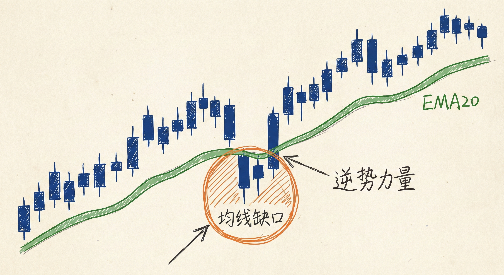
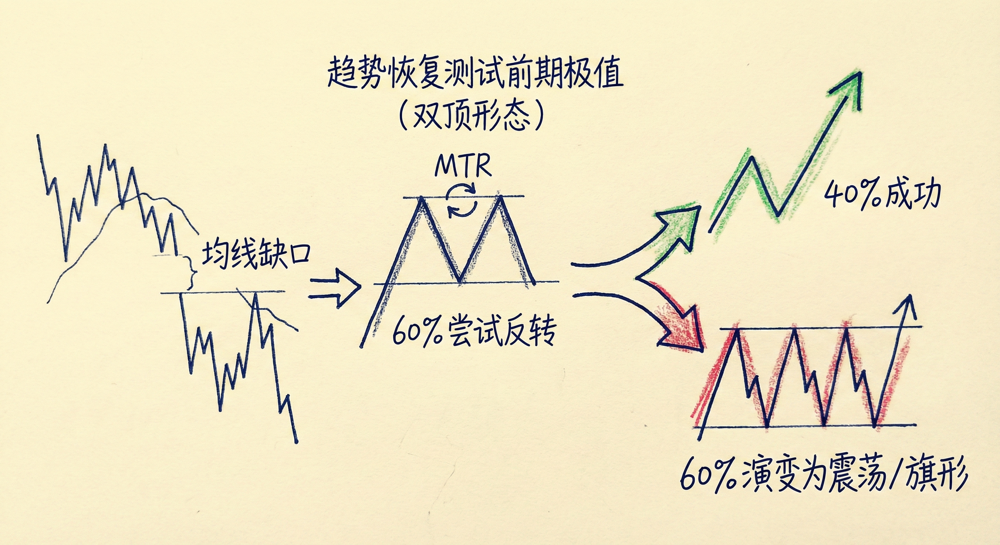
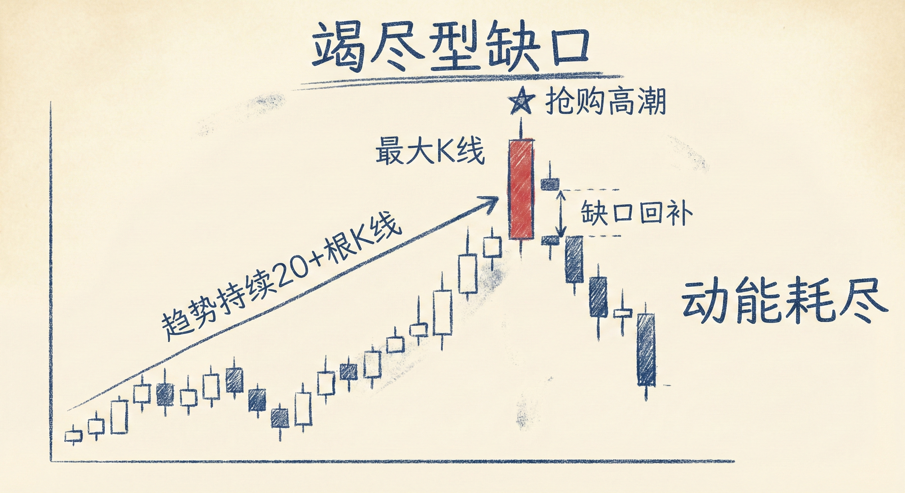
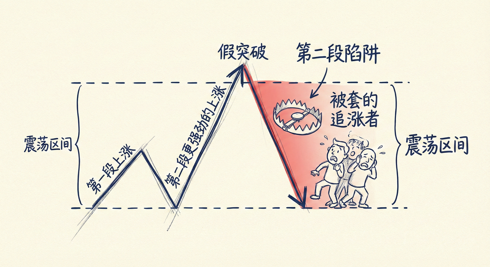

# 缺口（第二部分）：均线缺口与竭尽型缺口

## 均线缺口 (Moving Average Gaps)

### 定义与识别
-   **基本概念**：指K线与均线（通常指EMA20）之间产生的空间分离。
-   **形态特征**：
    -   **上涨趋势中**：趋势持续20根K线或更久后，出现一根或几根K线完全位于均线下方（即K线最高价低于均线）。
    -   **下降趋势中**：趋势持续20根K线或更久后，出现一根或几根K线完全位于均线上方（即K线最低价高于均线）。
-   **市场含义**：标志着逆势力量（空头在上涨中，多头在下跌中）首次展现出足够强大的力量，能将价格完全推离均线。

### 交易含义与概率
-   **短期反应（趋势恢复）**：
    -   均线缺口出现后，原趋势通常会暂时恢复。
    -   剥头皮交易者倾向于在价格回踩均线时顺势进场（如上涨中回踩均线买入），期待价格测试前期极值。
-   **中期演变（大反转 MTR）**：
    -   **60% 概率尝试反转**：当原趋势恢复并测试前期极值（如双顶或高点抬高）后，有60%的概率会出现大反转（Major Trend Reversal）的尝试。
    -   **40% 反转成功率**：一旦大反转形态确立（如高点降低的大反转），有40%的概率成功反转并形成反向的波段趋势。
    -   **60% 演变为震荡/旗形**：剩余60%的情况，反转尝试会失败，市场转为震荡区间或延续原趋势的旗形。

### 交易启示
-   **警示信号**：均线缺口是趋势可能即将结束或进入震荡的强烈警告。
-   **结构观察**：出现均线缺口后，不要急于逆势，等待原趋势恢复并测试极值后的“第二次机会”（即大反转形态）。

## 竭尽型缺口 (Exhaustion Gaps)

### 定义与识别
-   **背景**：趋势已经持续较长时间（通常10-20根K线以上）。
-   **形态特征**：
    -   **巨型趋势K线**：在趋势后期，出现该趋势中体积最大的一根或一组趋势K线（抢购高潮/抛售高潮）。
    -   **缺口位置**：突破点与该大K线的收盘价或极值之间存在缺口。
-   **区别测量型缺口**：如果在趋势初期出现大阳线，可能是测量型缺口（动力）；但在趋势后期出现最大阳线，更可能是竭尽（恐慌/贪婪）。

### 交易含义
-   **趋势衰竭**：这通常代表最后的一波情绪化交易（多头追高或空头杀跌），而非新一轮强趋势的开始。
-   **缺口回补**：
    -   竭尽型缺口大概率会被填补。
    -   一旦价格回撤并封闭了缺口（回到突破点内），该大K线即被确认为“竭尽型缺口K线”。
-   **后续走势**：
    -   **震荡或反转**：缺口回补后，市场通常进入震荡区间或反转。
    -   **两段式调整**：市场往往会寻求两段式的调整（TBTL，即持续约10根K线、包含两个波段的调整）。

### 陷阱警示
-   **第二段陷阱 (Second Leg Trap)**：在震荡区间中，第二段强劲的上涨/下跌往往看起来像突破，但实际上是竭尽型缺口，容易套住追涨杀跌的交易者。

## 总结原则
-   **均线缺口是力量变化的标志**：它打破了原趋势的惯性，预示着随后出现大反转（MTR）的概率显著增加。
-   **趋势后期的巨量K线需警惕**：在趋势末端出现的“最强”K线往往是陷阱（竭尽），而非机会。
-   **缺口回补的意义**：竭尽型缺口的回补确认了趋势的暂停，交易者应预期市场将进入震荡或反转，而非继续顺势加仓。
