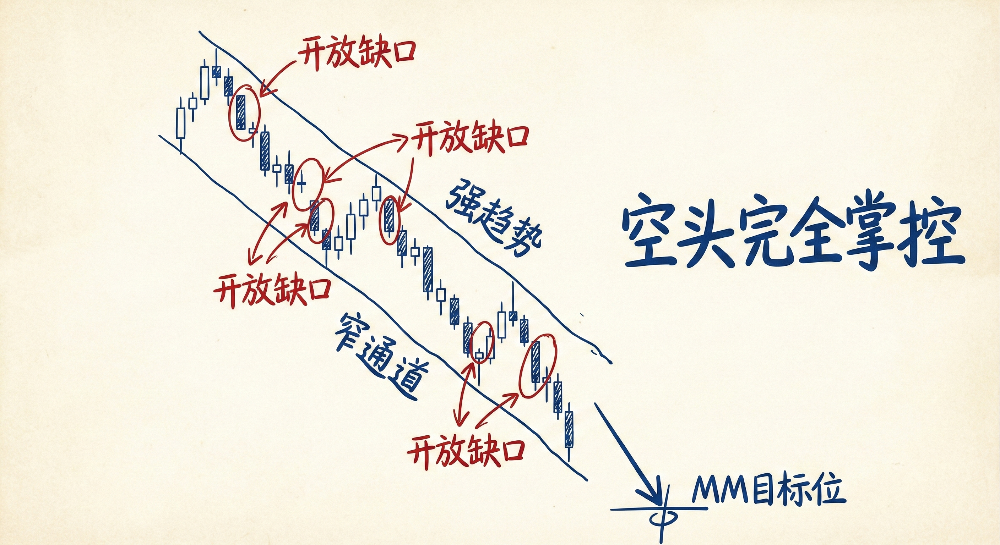
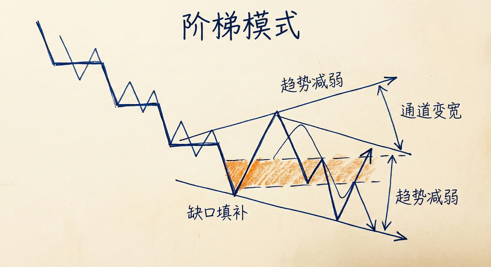
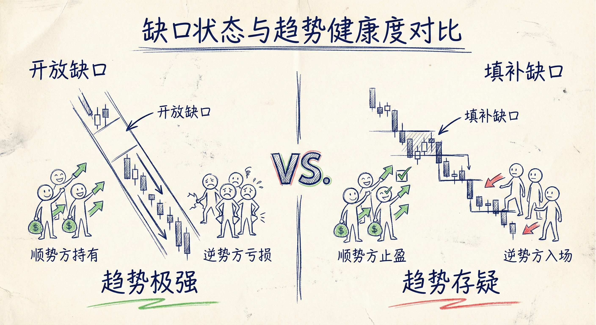
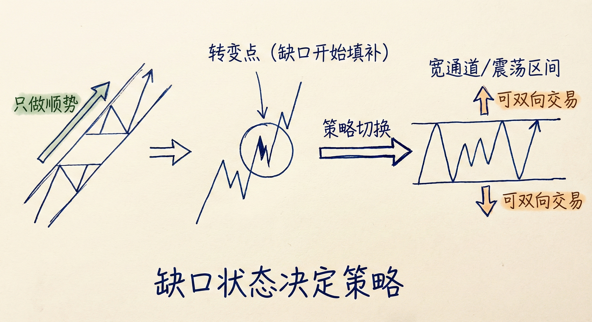

# 缺口与市场结构（第四部分）

## 开放缺口与几乎没有反弹的趋势 (Open Gaps & Small Pullback Trends)

### 定义与识别
-   **概念**：在趋势中，突破K线之后的反弹未能触及突破点（即前一根K线的低点或高点），导致缺口保持“开放”状态。
-   **特征**：
    -   **连续缺口**：市场形成一系列未被填补的缺口。
    -   **窄通道**：通常表现为非常窄的通道，反弹幅度极小（往往只有1-3根K线）且短暂。
    -   **看似疲弱实则强劲**：即使没有连续的大实体K线，只要缺口保持开放，就代表极强的趋势力量。

### 交易含义
-   **强趋势信号**：一系列开放缺口表明一方（如空头）完全掌控局面，市场处于“几乎没有反弹的趋势”中。
-   **测量型缺口 (Measuring Gap)**：在窄通道中，缺口往往充当测量型缺口，价格常会被吸向测量目标位（MM目标）。
-   **交易策略**：
    -   **顺势而为**：只能顺势交易（如在下降趋势中只做空）。
    -   **避免逆势**：不要试图寻找竭尽型缺口（Exhaustion Gap）进行反转交易，因为在窄通道中，反转尝试通常只会演变为顺势旗形。
    -   **持有仓位**：这种趋势往往持续时间比预期的更长，直到达到MM目标位。

## 阶梯模式与被填补的缺口 (Stair Pattern & Filled Gaps)

### 定义与识别
-   **概念**：原本存在的突破缺口被随后的回调填补（例如，下降趋势中，反弹价格回升至前一个低点之上）。
-   **特征**：
    -   **重叠结构**：价格呈现“阶梯状”运行，上涨和下跌波段出现重叠。
    -   **多空均衡**：表明逆势方（如下降趋势中的多头）开始变强，能够推动价格回到突破点。
    -   **通道变宽**：窄通道演变为宽通道或震荡区间。

### 交易含义
-   **趋势减弱**：缺口被填补是趋势力量减弱的信号，市场从强趋势模式转变为“阶梯模式”。
-   **市场心理变化**：
    -   **顺势方**：不再激进追涨杀跌，开始在突破新低/新高时止盈离场。
    -   **逆势方**：开始在低点挂单买入（或高点卖出），并能通过剥头皮获利。
-   **交易策略调整**：
    -   **双向交易**：市场进入震荡区间或宽通道后，逆势剥头皮交易变得可行。
    -   **限价单交易**：顺势方倾向于在回调高点做空（下降趋势），逆势方倾向于在低点买入，而不是追单。

### 为什么缺口状态如此重要？
-   **判断趋势健康度**：
    -   **开放缺口** = 趋势极强，顺势方持有，逆势方亏损放弃。
    -   **填补缺口** = 趋势存疑，顺势方止盈，逆势方入场获利。
-   **逆势交易者的试金石**：如果在下降趋势中，多头能通过逢低买入并加仓获利（填补了缺口），说明下降趋势有问题，可能即将演变为震荡区间或反转。

## 总结原则
-   **缺口即力量**：在看似平缓的趋势中，如果缺口一直保持开放，这是最持久、最强的趋势形态之一。
-   **填补即转折**：一旦缺口开始被填补（进入阶梯模式），意味着市场结构从单边趋势向震荡区间转变。
-   **顺势与逆势的切换**：看到连续缺口时，死拿顺势仓位；看到缺口被填补时，可考虑区间交易策略（高抛低吸）。

