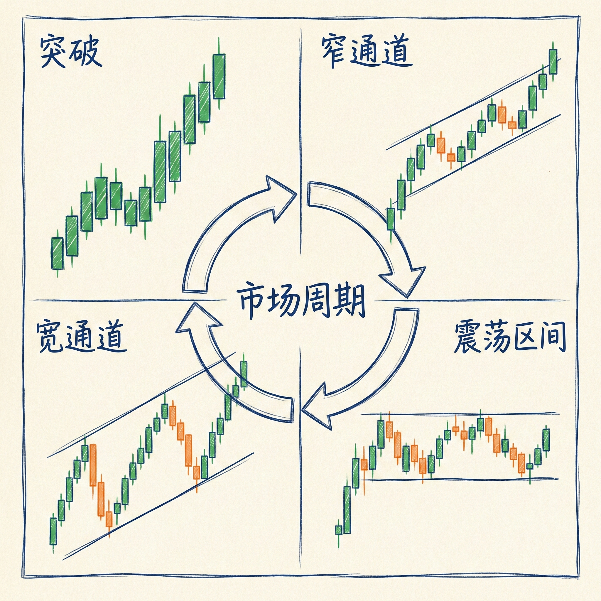
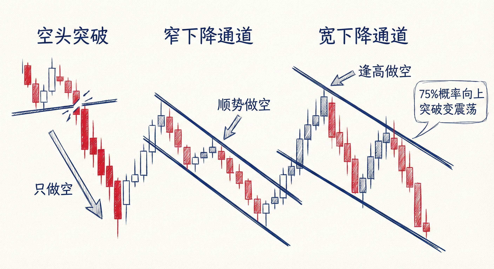
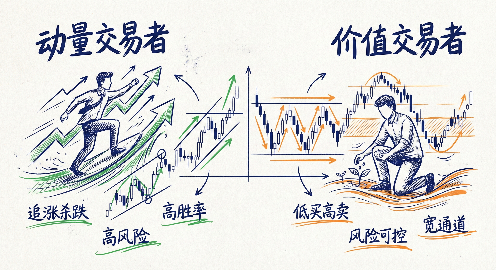

# 市场周期与四种基本结构（第一部分）

## 市场周期的四个阶段 (The Four Parts of Market Cycle)

### 定义与通用性
-   **基本构成**：任何上涨或下跌的图表，无论时间周期或品种，都由四种结构的一种或多种组合而成。
-   **分形性质**：
    -   **突破**：在更小周期上可能包含回调和通道。
    -   **窄通道**：在更高周期上通常表现为突破（强趋势）。
    -   **震荡区间**：在更小周期上可能包含宽通道或趋势。

### 四种结构概览
1.  **突破 (Breakout)**：最强的趋势阶段，K线几乎无重叠，无明显回调。
2.  **窄通道 (Tight Channel)**：强趋势，回调短暂（1-3根K线），通道线紧贴价格。
3.  **宽通道 (Broad Channel)**：趋势仍在延续（高低点不断抬高或降低），但回调幅度深，允许双向交易。
4.  **震荡区间 (Trading Range)**：市场横向移动，多空突破概率各为50%。

## 上涨趋势中的结构特征

### 1. 强势突破 (Strong Breakout)
-   **特征**：连续的大阳线，收盘在最高点附近，K线间无重叠。
-   **交易策略**：
    -   **只做多**：胜率极高，但止损距离远（风险大）。
    -   **动量交易**：多头会以任何理由买入（市价、突破单），不等待回调。
    -   **机构行为**：机构利用高胜率弥补较差的盈亏比。

### 2. 窄上涨通道 (Tight Bull Channel)
-   **特征**：有回调，但非常短暂（1-3根K线）。在更高时间周期看就是突破。
-   **交易策略**：
    -   **单边做多 (Always In Long)**：市场显然处于单边上涨，只找买入机会。
    -   **买入逻辑**：可以买收盘、买回调、买突破。
    -   **避免做空**：做空很难赚钱，逆势交易风险极大。

### 3. 宽上涨通道 (Broad Bull Channel)
-   **特征**：回调较深（可能持续5-20根K线），有时看似小级别的下降趋势。
-   **概率变化**：
    -   只要回调幅度不超过50%-66%，趋势延续概率大。
    -   **75%的概率**：上涨通道最终会向下突破，演变为震荡区间。
    -   **25%的概率**：向上突破加速成为更强的趋势。
-   **交易策略**：
    -   **价值交易**：多头倾向于在回调低点买入（低买），而不是追高。
    -   **双向交易**：有经验的交易者可以在高点做空剥头皮，但新手应坚持逢低买入。

### 4. 震荡区间 (Trading Range)
-   **特征**：回调持续时间过长（通常20根K线以上），多空突破概率接近50/50。
-   **交易策略**：
    -   **低买高卖**：在底部三分之一买入，顶部三分之一卖出。
    -   **剥头皮**：利用市场惯性（80%的突破尝试会失败）赚取快钱。

## 下降趋势中的结构特征

### 1. 空头突破 (Bear Breakout)
-   **特征**：连续大阴线，收盘在低位。
-   **交易策略**：
    -   **只做空**：不要试图做多抓反弹。
    -   **追空**：动量交易者愿意在低位卖出，因为预期价格会更低。

### 2. 窄下降通道 (Tight Bear Channel)
-   **特征**：反弹微弱且短暂。
-   **交易策略**：
    -   **顺势做空**：以任何理由做空（卖阴线收盘、卖反弹高点）。
    -   **止损管理**：止损通常在前期高点或突破点上方。

### 3. 宽下降通道 (Broad Bear Channel)
-   **特征**：反弹幅度大，可能形成复杂的调整形态（如三角形、楔形）。
-   **演变信号**：
    -   **关注多头盈利能力**：如果在下降趋势中，**限价单多头（Limit Order Bulls）** 开始在前期低点买入并能赚钱（剥头皮成功），说明空头力量减弱，市场即将转为震荡区间。
-   **交易策略**：
    -   **逢高做空**：空头转变为价值交易者，等待反弹再入场以减小风险。

## 周期演变与交易逻辑

### 市场循环模型
-   **循环过程**：趋势（突破） -> 通道（窄 -> 宽） -> 震荡区间 -> 新的突破（趋势）。
-   **突破的结束**：一旦出现明显的回调（K线高点高于前一根高点），突破阶段通常结束，进入通道阶段。

### 动量 vs 价值
-   **动量交易者 (Momentum Traders)**：
    -   活跃于**突破**和**窄通道**阶段。
    -   特点：高胜率，高风险（止损远），愿意追涨杀跌。
-   **价值交易者 (Value Traders)**：
    -   活跃于**宽通道**和**震荡区间**阶段。
    -   特点：追求更好的价格（低买高卖），胜率相对较低但风险可控（止损近）。

## 总结原则
-   **识别当前阶段**：判断市场处于周期的哪个部分（突破、通道还是震荡）是选择策略的前提。
-   **顺势而为**：在突破和窄通道阶段，严禁逆势交易。
-   **关注逆势方表现**：在宽通道中，如果逆势交易者（如限价单逆势方）开始赚钱，预示着市场即将进入震荡区间。
