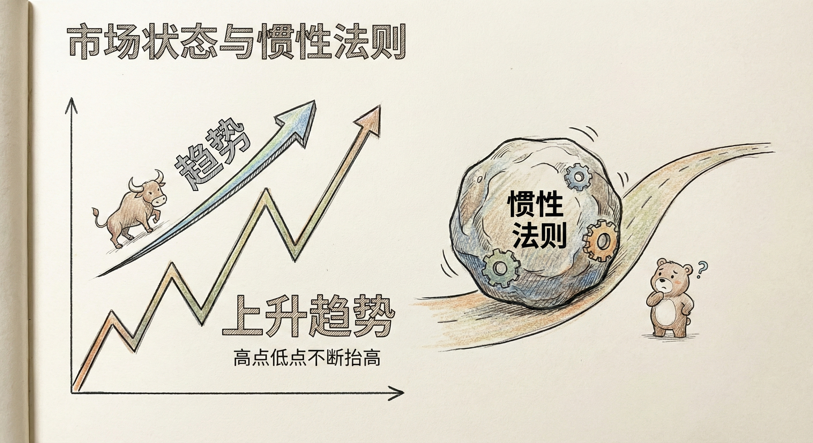
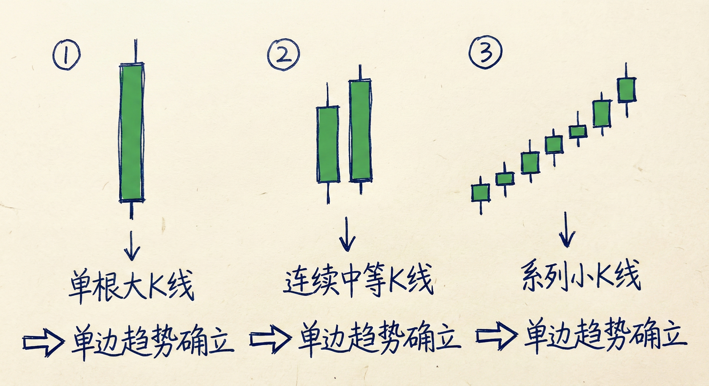
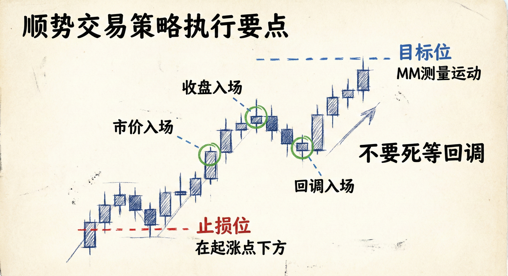
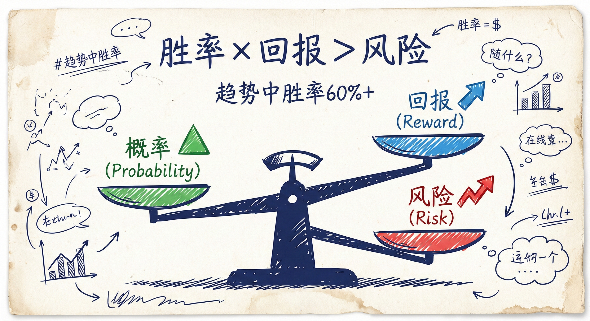

# 单边趋势 (Always In) - 第一部分

## 市场状态与惯性 (Market States & Inertia)

### 市场分类
-   **两种状态**：市场要么处于**趋势**中，要么处于**震荡区间**中。
-   **循环特性**：趋势之后会进入震荡区间，震荡久了会爆发新的趋势。

### 惯性法则 (The 80% Rule)
-   **趋势中**：市场倾向于继续之前的走势。80% 的反转尝试会失败，价格会延续原趋势。
-   **震荡区间中**：80% 的突破尝试会失败，价格倾向于回到区间内。
-   **背景重要性**：通过观察左侧的K线背景，可以预测右侧K线的大致走势。

## 单边趋势 (Always In) 的定义与识别

### 核心概念
-   **强迫选边**：假设你必须整天在市场中持有仓位（必须做多或做空），你会选择哪个方向？
-   **清晰度**：
    -   **趋势市场**：选择是显而易见的（例如强下降趋势中，只能做空）。
    -   **震荡市场**：选择困难，通常意味着要在底部买入、顶部卖出，或者暂时观望。

### 趋势确立的信号模式
市场进入"单边趋势"模式通常由以下几种形态触发，足以让交易者确信趋势已经形成：
1.  **单根大K线**：一根巨大的阳线或阴线，收盘价远超过去几十根K线的范围。
2.  **连续中等K线**：两根或更多收盘在极值附近的连续强力K线。
3.  **系列小K线**：连续4-6根向同一方向的小K线，虽然单根不强，但累积力量显示单边主导。

## 交易策略与执行

### 顺势交易 (Trend Trading)
-   **入场时机**：
    -   **不要死等回调**：在强劲的窄通道趋势中，回调往往很浅或不出现。如果等待回调，可能会错过大行情。
    -   **积极入场**：可以市价入场，或在强趋势K线的收盘价入场。
-   **止损设置**：
    -   **多头**：放在突破起涨点下方或前一个主要低点下方。
    -   **空头**：放在突破起跌点上方或前一个主要高点上方。
-   **止盈目标**：利用测量运动（Measured Move, MM），通常是突破幅度或震荡区间高度的1倍或2倍距离。

### 震荡区间交易 (Trading Range)
-   **策略**：低买高卖。
-   **识别**：如果看不懂市场在做什么，或者多空力量均衡，假设市场处于震荡区间。
-   **逆势思维**：在区间底部寻找买入机会，在区间顶部寻找卖出机会。

## 交易员方程 (The Trader's Equation)

### 数学基础
交易决策基于三个变量的综合评估：
1.  **概率 (Probability)**：价格达到目标位先于触及止损位的可能性。
2.  **风险 (Risk)**：入场点到止损点的距离。
3.  **回报 (Reward)**：入场点到目标位的距离。

### 趋势中的应用
-   **高胜率**：在明确的单边趋势中，顺势方向的胜率通常超过50%（甚至达到60%）。
-   **盈亏比**：由于胜率高，1倍风险的回报在数学上是合理的，但波段交易者通常追求2倍或更高的回报。
-   **缺口与动能**：强趋势中出现的缺口（Gap）和突破往往预示着更高的获利概率。

## 总结原则
-   **顺势而为**：如果市场处于单边趋势，顺势交易更容易获利。
-   **判断主导权**：寻找图表中“非同寻常”的强力K线或结构，它们往往决定了市场的主导方向。
-   **果断入场**：在强趋势确立时（Always In），不要因为等待完美回调而踏空，市场往往会直接奔向测量目标位。
