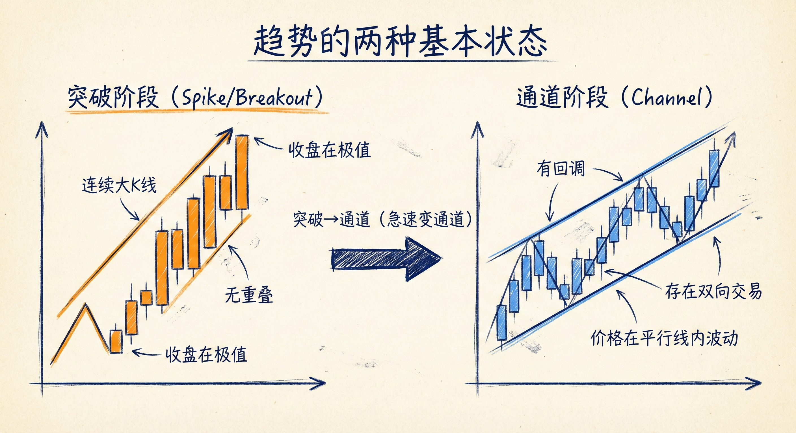
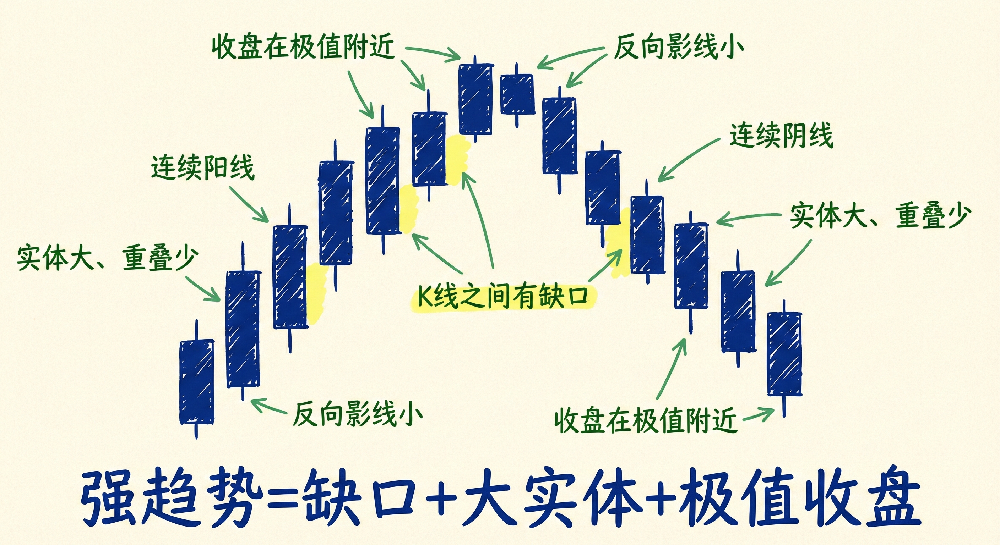
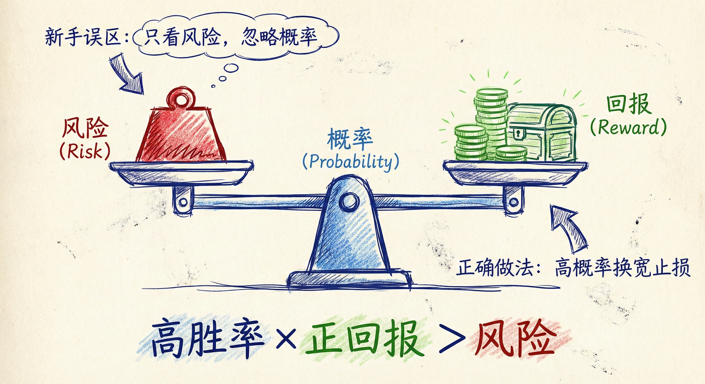
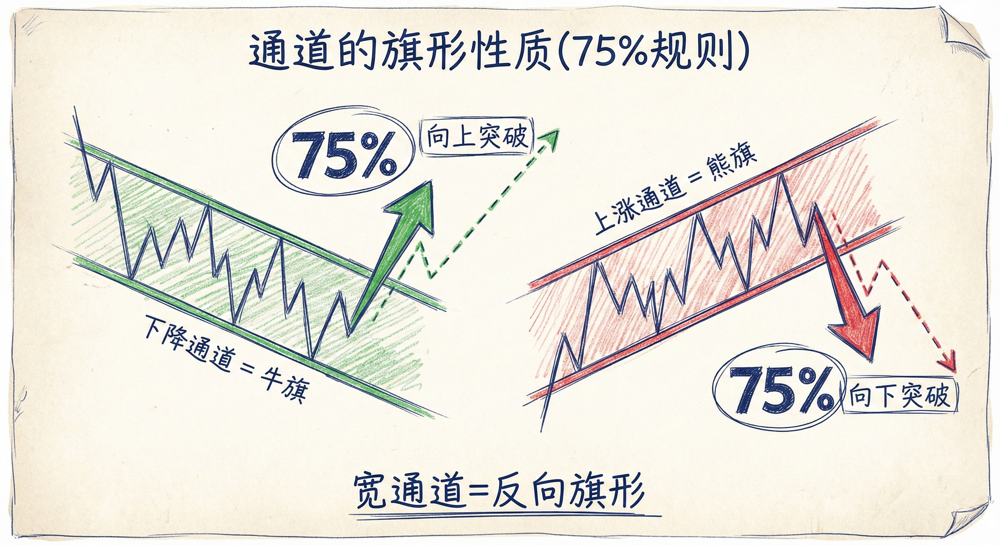

# 趋势类型与交易陷阱（第三部分）

## 趋势的本质与分类

### 定义与构成
-   **趋势即突破**：每一根趋势K线或每一组趋势K线本质上都是一次突破。
-   **两种基本状态**：趋势要么处于**突破阶段（Spike/Breakout）**，要么处于**通道阶段（Channel）**。
    -   **突破**：最强的趋势类型，表现为急速运动，K线实体大、重叠少、收盘在极值附近。
    -   **通道**：较弱的趋势类型，存在双向交易，多空双方在不同阶段掌控市场。
-   **演变规律**：几乎所有趋势都包含"急速变通道（Spike and Channel）"的过程，即先发生强力突破，随后转为通道式运动。

### 趋势强度的识别
-   **强趋势特征**：
    -   连续的阳线/阴线，实体较大。
    -   K线之间几乎没有重叠。
    -   收盘价位于K线的一半以上（上涨）或以下（下跌）。
    -   缺乏反向的影线。
    -   **缺口**：K线之间出现缺口（如前一根K线高点与后一根K线低点不重叠），代表极度急迫的单边力量。

## 常见趋势形态解析

### 主要形态
-   **开盘后趋势 (Trend from the Open)**：从开盘起即形成趋势，可能是窄通道或急速运动。
-   **急速变通道 (Spike and Channel)**：最常见的形态，市场经历一段急速运动后进入通道震荡上行/下行。
-   **几乎没有回调的趋势 (Small Pullback Trend)**：最强的趋势类型之一。
    -   回调幅度极小（仅持续1-3根K线）。
    -   在更高时间周期上表现为强劲的突破。
    -   **策略**：只能顺势交易，严禁逆势。
-   **宽通道 (Broad Channel)**：回调较深，震荡幅度大，容易演变为震荡区间。

## 交易陷阱与新手误区 (Traps & Psychology)

### 新手的典型错误
-   **只看风险，忽略概率**：
    -   新手倾向于在强趋势中逆势交易（如强涨中做空），因为止损很近（风险小）。
    -   **后果**：虽然单笔风险低，但胜率极低（概率低），导致连续亏损。
-   **不敢顺势入场**：
    -   在强趋势中，顺势信号K线往往不好看（如大阳线后的十字星），且止损距离较远（风险大）。
    -   新手因害怕大止损而错过高胜率的顺势交易机会。

### 高手的交易方程
-   **交易方程变量**：风险、回报、概率。
-   **顺势策略**：
    -   在强趋势中，即使信号K线不佳，也要寻找理由入场。
    -   **应对大止损**：通过缩小仓位来控制风险，但坚持使用正确的宽止损（通常在起涨点/起跌点之外）。
    -   **核心逻辑**：接受较高的风险（宽止损）以换取极高的胜率。

## 通道的旗形性质

### 概率法则 (75% 规则)
-   **下降通道 = 牛旗**：宽幅下降通道通常被视为牛旗，有75%的概率向上突破，演变为震荡区间或反转；仅25%概率加速下跌。
-   **上涨通道 = 熊旗**：宽幅上涨通道通常被视为熊旗，有75%的概率向下突破。

### 突破后的演变
-   **测试起点**：通道被反向突破后，市场通常会尝试测试通道的起点。
-   **震荡区间**：突破后市场往往进入震荡模式，随后再决定新的方向（双向可能）。

## 总结原则
-   **识别趋势阶段**：区分市场是处于急速突破阶段还是通道阶段，采用不同策略。
-   **警惕逆势陷阱**：在强趋势（尤其是几乎无回调的趋势）中，切勿因“止损小”而尝试逆势。
-   **拥抱高胜率**：克服对宽止损的恐惧，通过调整仓位顺势交易，关注概率而非单纯的点位风险。
-   **通道即旗形**：将宽通道视为反向的旗形结构，预期其最终会反向突破。
