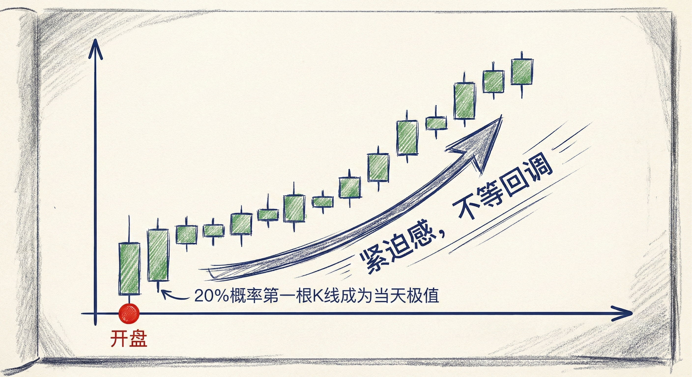
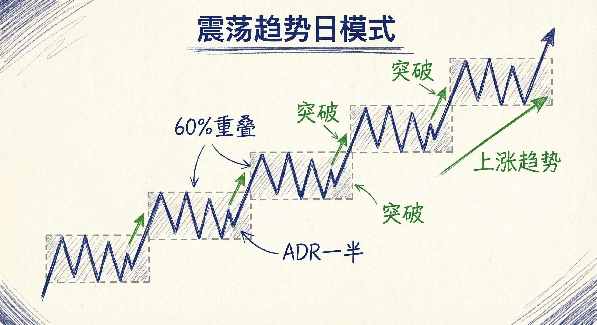
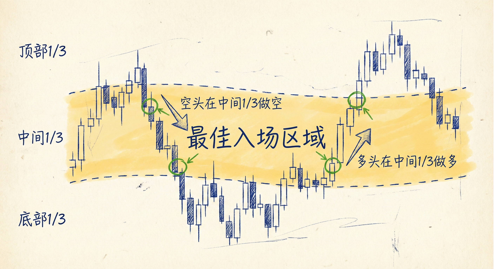

# 趋势类型（第四部分）

## 从开盘开始的趋势 (Trends From The Open)

### 定义与识别
-   **概念**：趋势从交易时段的第1根或前几根K线就开始，表现出极强的紧迫感。
-   **特征**：
    -   **K线形态**：通常伴随跳空，连续出现强阳线（或阴线），实体大，回调极小或无回调（如连续11根阳线）。
    -   **概率统计**：第1根K线有20%的概率成为当天的最高点或最低点。
    -   **紧迫感**：交易者急于市价入场，不等待回调，导致价格快速远离均线。

### 交易含义
-   **强趋势信号**：如果开盘出现连续强趋势K线，有60%以上的概率价格会达到某种测量目标位（Measured Move）。
-   **市场区分**：
    -   **股票/期货**：有明确开盘时间，适用"从开盘开始的趋势"这一术语。
    -   **外汇/24小时市场**：由于缺乏统一开盘时间，此类形态更常被称为**突破 (Breakout)** 或 **急速变通道 (Spike and Channel)**。

## 震荡趋势日 (Trending Trading Range Days)

### 定义与识别
-   **概念**：由一系列震荡区间组成的趋势日。
-   **特征**：
    -   **初始区间**：开盘形成一个震荡区间，其高度通常约为日内平均波动幅度（ADR）的一半。
    -   **运行模式**：震荡区间 -> 短暂突破 -> 形成新的震荡区间。
    -   **重叠倾向**：60%的情况下，新的震荡区间会回调并与前一个震荡区间重叠。

### 交易策略
-   **预期波动翻倍**：由于初始区间仅为ADR的一半，交易者应预期后续会有突破，使波动幅度翻倍。
-   **突破模式判断**：
    -   **缺口意义**：如果新区间与旧区间之间**没有重叠（留下缺口）**，表明趋势强劲，顺势突破概率大于50%。
    -   **20根K线规则**：一旦震荡区间持续超过20根K线，市场进入“突破模式”，向上或向下突破的概率变为50/50。
-   **回调预期**：在标准的震荡趋势日，预期价格会回调测试前一个区间的边界。

## 宽通道中的趋势 (Trends In Broad Channels)

### 定义与识别
-   **概念**：市场虽然有更高的高点和低点（或更低的高点和低点），但回调幅度很深，重叠严重。
-   **特征**：
    -   **阶梯模式**：价格呈阶梯式运行，反弹/回调经常重叠之前的突破点。
    -   **弱趋势信号**：深度重叠表明逆势交易者能通过挂单赚钱，趋势力量弱于强单边市。
    -   **缩小的阶梯 (Shrinking Stairs)**：如果连续突破的幅度越来越小，表明动能衰竭，可能演变为震荡区间或反转。

### 交易策略
-   **类震荡区间交易**：由于通道宽且重叠多，应采用**高抛低吸 (BLSHS)** 的剥头皮策略，而非死拿波段。
    -   **宽下降通道**：
        -   **空头**：在反弹至上一个下跌波段的**中间三分之一 (Middle Third)** 或通道上沿时做空。
        -   **多头**：在通道下沿或新低处买入，做短线剥头皮。
    -   **宽上涨通道**：
        -   **多头**：等待两段式回调，在上涨波段的**中间三分之一**买入。
        -   **空头**：在新高处做空，做短线剥头皮。
-   **止盈逻辑**：顺势交易者通常在前期极值点（前高或前低）附近止盈，导致价格经常在突破后立即回头。

## 总结原则
-   **识别紧迫感**：开盘无回调的连续大K线是强趋势的最早信号。
-   **震荡日的重叠**：震荡趋势日中，关注区间之间的重叠与缺口，以此判断趋势强弱。
-   **宽通道即震荡**：在宽通道中，虽然大方向明确，但操作上应更接近震荡区间的策略（利用中间三分之一法则，及时止盈）。
