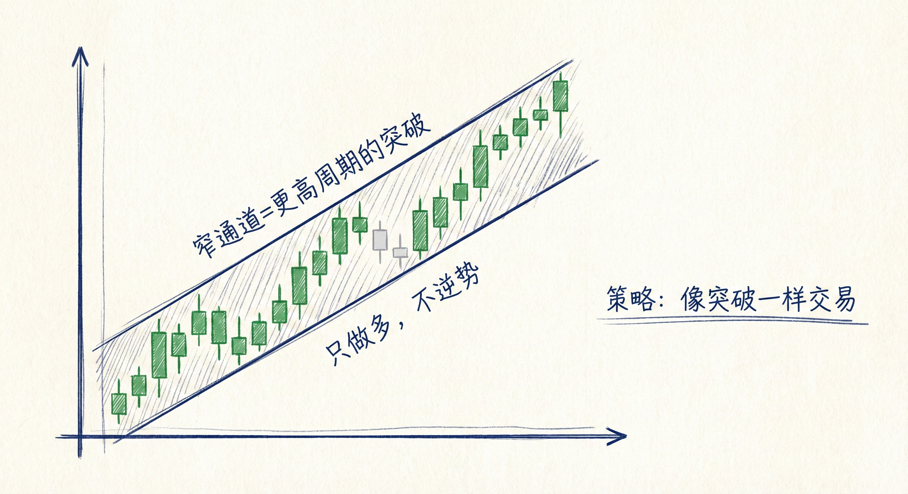
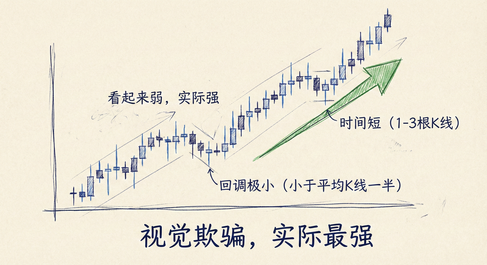
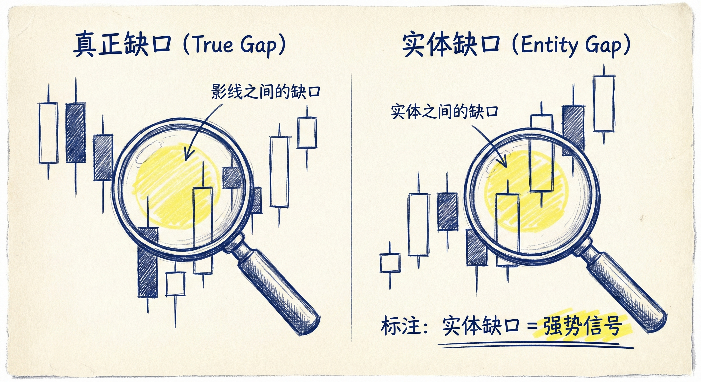
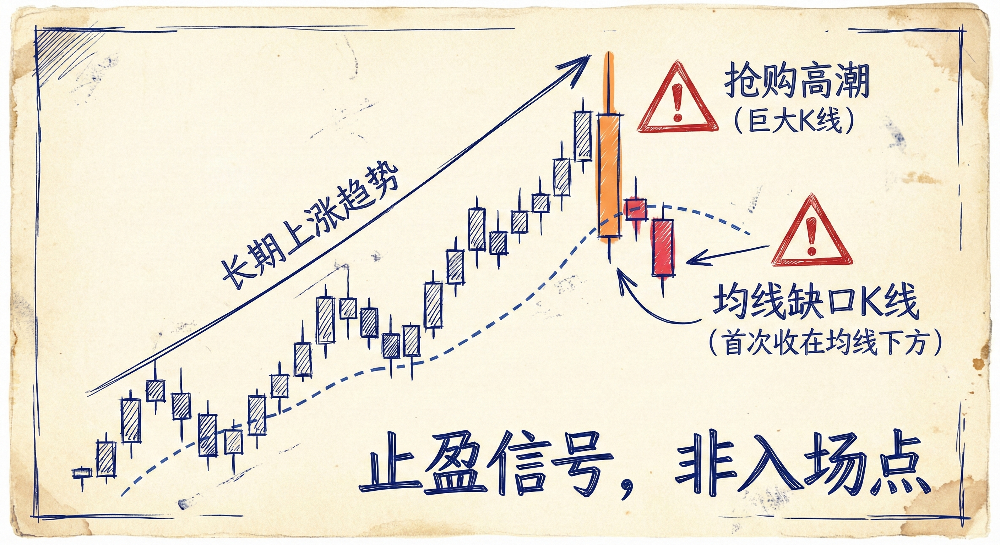

# 窄通道与几乎无回调的趋势 (第五部分)

## 窄通道 (Narrow Channels)

### 定义与识别
-   **概念**：一种非常强劲的趋势形态。在更高的时间周期（HTF）图表上，窄通道通常表现为**突破**。
-   **特征**：
    -   **回调极小**：回调通常只持续1根K线，或者根本没有回调。
    -   **难以区分**：有时很难判断是突破阶段还是已经进入窄通道阶段。
    -   **处理原则**：如果无法分辨是突破还是窄通道，**假设它是突破**。

### 交易含义
-   **单边交易**：
    -   **窄上涨通道**：只做多（Buy Only）。做空赚钱的概率极低。
    -   **窄下降通道**：只做空（Sell Only）。反弹幅度很小，通常无法突破前一根K线的高点。
-   **入场策略**：
    -   像交易突破一样交易窄通道。
    -   **做多**：在反转尝试失败并成为牛旗时，在前一根K线高点上方挂突破买单。
    -   **做空**：在反弹失败并成为熊旗时，在前一根K线低点下方挂突破卖单。

## 几乎无回调/反弹的趋势 (Trends with Almost No Pullbacks)

### 特征与伪装
-   **最强的趋势类型**：虽然它是最强的趋势，但往往**看起来不强**。
-   **视觉欺骗**：
    -   K线形态往往表现为犹豫：包含许多十字星、小实体K线、长影线。
    -   外观类似**震荡区间中的波段**，缺乏连续的大实体趋势K线。
-   **回调特征**：
    -   **幅度极小**：回调幅度通常小于K线平均大小的一半。
    -   **时间短**：通常只持续1-3根K线。
    -   **持续性**：这种趋势可以持续很长时间（"细水长流"）。

### 缺口的重要性 (The Importance of Gaps)
-   **识别关键**：当K线看起来很弱但趋势持续时，**缺口**是确认强趋势的关键证据。
-   **实体缺口 (Body Gaps/Negative Gaps)**：
    -   即使影线重叠，但K线的**实体部分**不重叠。
    -   这是多头/空头依然强势的迹象，表明逆势交易者的限价单被套住。
-   **交易启示**：只要看到缺口（包括实体缺口）保持开放，就必须假设趋势比看起来要强得多，不能逆势交易。

## 交易策略与风险管理

### 入场与止损
-   **克服心理障碍**：新手常因K线看起来弱或止损过远而不敢入场。
-   **宽止损策略**：
    -   在几乎无回调的趋势中，应使用**宽止损**。
    -   **原理**：宽止损换取高胜率。止损过窄会导致胜率大幅下降。
-   **移动止损**：随着趋势发展，将止损上移至新的重要低点（上涨趋势）或下移至重要高点（下降趋势）。

### 趋势的衰竭与反转
-   **抢购高潮 (Blow-off)**：在趋势后期（如30-50根K线后），出现比之前大50%-100%的巨大趋势K线，往往是**止盈离场**的信号，而非新的入场点。
-   **均线缺口 K 线 (EMA Gap Bar)**：
    -   **定义**：在长期趋势（如20+根K线在均线一侧）后，首次出现完全脱离均线（收盘在均线另一侧）的K线。
    -   **含义**：通常标志着趋势力量减弱，可能是大反转前的最后一次顺势尝试。
    -   **多头陷阱**：在长期上涨后，第一根收在EMA下方的阴线通常是空头陷阱，多头会买入。

## 总结原则
-   **更高周期的视角**：窄通道在更高周期就是突破，因此必须顺势交易。
-   **不要被外表迷惑**：充满十字星和影线的趋势，如果伴随微小回调和实体缺口，就是最强的趋势。
-   **禁止逆势**：在几乎无回调的趋势中，不要试图摸顶或抄底，直到看到明确的强力反转信号或长时间的震荡结构。
