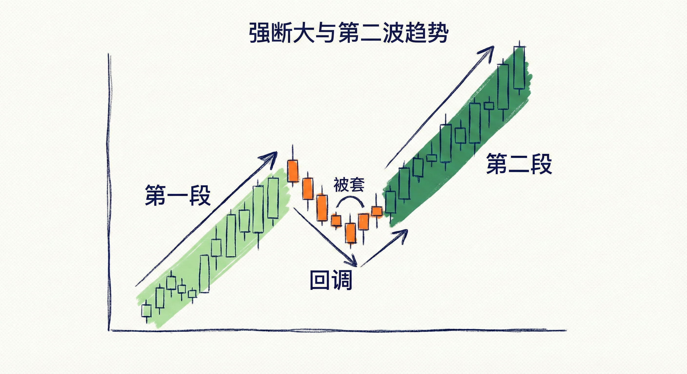
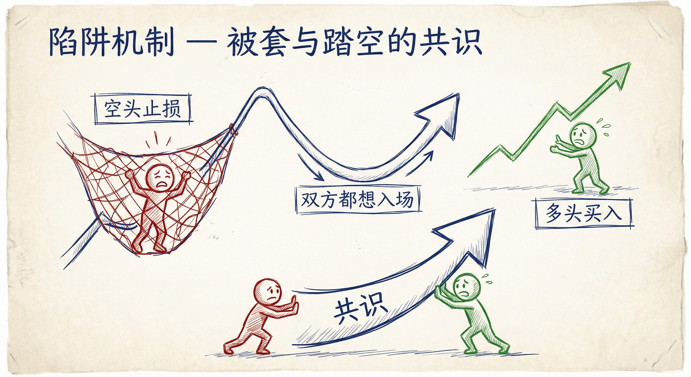
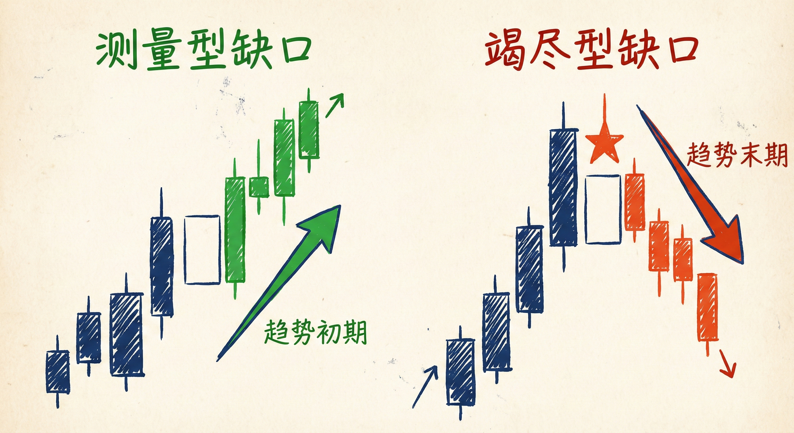
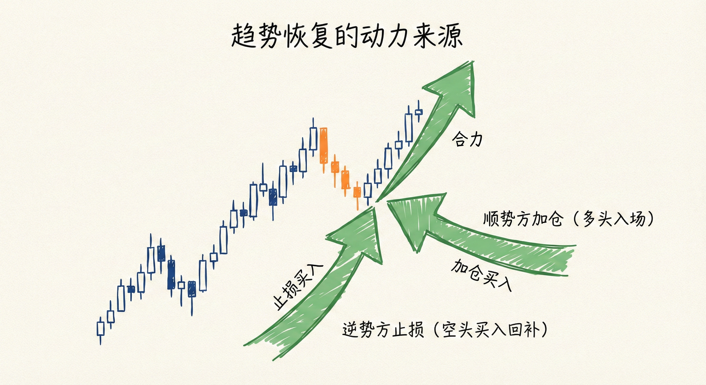

# 突破与第二段行情（第三部分）

## 强突破与第二段行情 (Strong Breakouts & Second Legs)

### 定义与识别
-   **核心特征**：强突破最重要的特征是**至少会有第二段行情 (Second Leg)**。
-   **陷阱机制**：
    -   **空头被套**：当一个看跌形态（如熊旗）被反向突破（多头突破）时，空头被困在亏损交易中。
    -   **多头踏空**：由于突破是意外事件（低概率），许多多头错过了第一波上涨。
    -   **共识形成**：被套的空头急于回补（买入），踏空的多头急于入场（买入）。双方都希望有回调，一旦回调出现，双方的买盘将推动市场形成第二段上涨。
-   **跟随K线 (Follow-through)**：
    -   突破K线之后需要跟随K线确认。
    -   即使跟随K线实体较小，只要是同向趋势K线，也能增加趋势延续的概率。

### 交易含义
-   **最小目标**：强突破后的回调，通常会带来至少第二段上涨（或下跌）。
-   **结构演变**：
    -   有时第二段行情非常强势，延续趋势。
    -   有时第二段行情较弱，随后市场进入震荡区间或反转。
    -   **第2段陷阱**：在震荡区间或宽通道中，如果第二段行情异常强势，可能是陷阱（竭尽），而非趋势的延续。

## 震荡区间的突破 (Breakouts from Trading Ranges)

### 80% 法则与 50/50 概率
-   **80% 法则**：在震荡区间内，80% 的突破尝试都会失败，市场倾向于反转。
-   **概率变化**：当震荡区间持续时间过长（通常超过20根K线），向上或向下突破的概率变得接近（50/50）。
-   **交易策略**：
    -   **区间内**：高抛低吸，剥头皮（Scalping），押注突破失败。
    -   **突破后**：等待明确的强突破信号再顺势交易。

### 成功突破的特征
-   **K线形态**：大实体趋势K线，收盘价远超区间边界。
-   **连续性**：出现连续的趋势K线，且有良好的跟随。
-   **缺口性质判断**：
    -   **测量型缺口 (Measuring Gap)**：发生在趋势初期或突破震荡区间时，预示着趋势将延续，目标位通常是区间高度的翻倍（MM目标）。
    -   **竭尽型缺口 (Exhaustion Gap)**：发生在趋势末期（如已持续50根K线以上）或出现超大K线时，预示着趋势可能结束，缺口大概率会被回补。

## 风险管理与回调心理 (Risk & Pullbacks)

### 回调的成因
-   **止损距离与风险**：当趋势延申过快，止损点（通常在起涨/起跌点）距离当前价格过远，导致风险过大。
-   **止盈减仓**：为了控制风险，电脑算法和交易者会选择减仓或止盈。这种获利了结的行为导致了趋势中的回调。

### 趋势恢复的动力
-   **逆势方放弃**：在回调中，如果逆势方（如上涨中的空头）无法制造强有力的反转（如5-10根K线后仍无法下跌），他们会最终放弃并止损离场。
-   **顺势方入场**：顺势方看到回调无法反转，会再次积极买入。
-   **合力**：逆势方的止损（买入）和顺势方的加仓（买入）共同推动了第二段行情的产生。

## 总结原则
-   **强突破必有二段**：看到强力突破和良好跟随，预期至少会有第二段同向行情。
-   **区分缺口类型**：根据趋势持续的时间和位置，判断大K线是测量型缺口（顺势）还是竭尽型缺口（逆势/回调）。
-   **理解市场情绪**：回调往往源于获利了结，而趋势的恢复源于逆势交易者的放弃和顺势交易者的再次入场。
