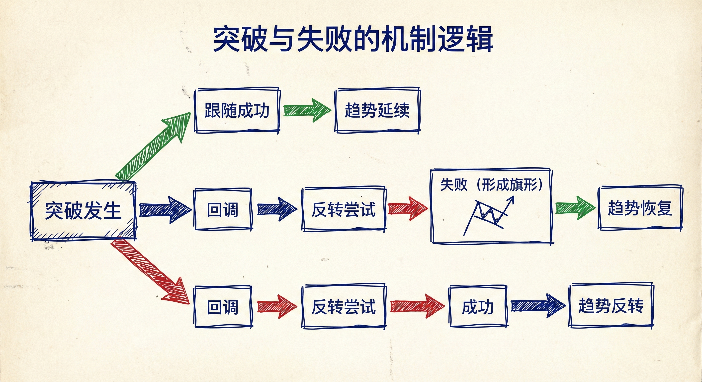
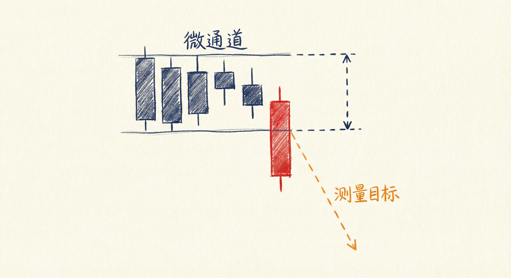
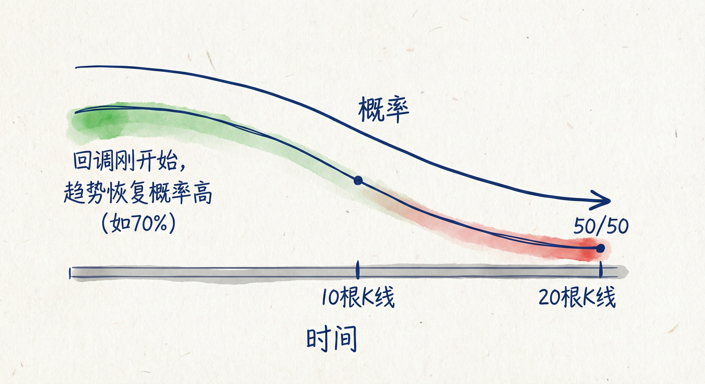
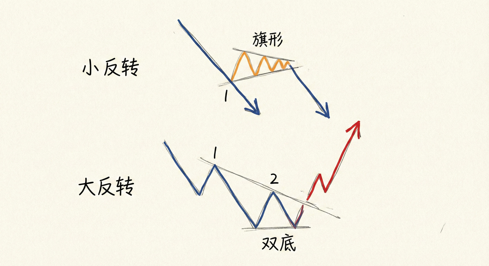

# 失败的突破 (Failed Breakouts) - 突破课程第6节

## 突破与失败的机制 (Mechanics of Breakouts & Failures)

### 定义与识别
-   **突破的构成**：突破可以是单根趋势K线，也可以是连续的2-3根甚至10根K线。只要有一根强趋势K线，即可视为突破。
-   **回调的本质**：回调是市场尝试让突破失败的行为。
    -   **多头突破后的回调**：空头尝试让多头突破失败，并反转下跌。
    -   **空头突破后的反弹**：多头尝试让空头突破失败，并反转上涨。

### 失败与成功的逻辑
-   **趋势恢复 (旗形)**：如果"尝试让突破失败"的行为本身失败了（负负得正），趋势就会恢复。
    -   *例子*：多头突破 -> 空头尝试反转 -> 空头失败 -> 形成牛旗 -> 上涨趋势恢复。
-   **趋势反转**：如果"尝试让突破失败"的行为成功了，原趋势结束，市场反转。
    -   *例子*：多头突破 -> 空头尝试反转 -> 空头成功 -> 市场下跌。

## 市场背景与信号强度

### 强突破特征
-   **形态**：连续的大实体K线（阳线或阴线），收盘价接近极值（最高或最低）。
-   **微通道**：连续多根K线没有反向重叠（如连续5根阴线），意味着一方完全控制局面。
-   **测量目标 (MM)**：强突破通常会达到基于突破幅度（第一根到最后一根突破K线）的测量目标位（翻倍）。

### 弱突破与震荡
-   **缺乏跟随 (Follow-through)**：突破K线后紧接着出现十字星、反向K线或深度重叠，表明突破很弱。
-   **窄幅震荡区间**：
    -   **特征**：大涨大跌交替出现（制造困惑），或K线实体小、影线长、频繁重叠。
    -   **含义**：市场处于"突破模式"，多空双方均无明显优势，概率为50/50。
    -   **策略**：在市场变得清晰之前，最好耐心等待，避免交易。

## 时间与反转类型 (Time & Reversal Types)

### 时间的影响
-   **中性化**：如果回调或震荡持续时间过长（通常超过20根K线），原趋势的动力会消退。
-   **概率变化**：超过20根K线的横盘后，趋势恢复（第2段下跌/上涨）的概率下降，市场变为中性（50%涨，50%跌）。

### 小反转 vs. 大反转
-   **小反转 (Minor Reversal)**：
    -   **场景**：强趋势或窄通道线被**第一次**突破。
    -   **结果**：通常不会走很远，往往演变成旗形或震荡区间，随后原趋势恢复。
    -   **策略**：逆势交易者应警惕，顺势交易者可寻找旗形入场。
-   **大反转 (Major Reversal)**：
    -   **场景**：趋势线被突破后，市场经过调整，进行**第二次**反转尝试（如双底、双顶、低点抬高的双底）。
    -   **结果**：更有可能导致趋势的完全改变（从跌转涨，或从涨转跌）。
    -   **逻辑**：第一次突破打破了惯性，第二次尝试确认了反转力量。

## 交易启示
-   **评估跟随**：看到突破后，必须观察下一根K线（跟随K线）。强跟随确认趋势，弱跟随暗示震荡或陷阱。
-   **利用陷阱**：
    -   **空头陷阱**：震荡区间底部的强阴线突破，若无跟随且迅速反转，是买入机会。
    -   **多头陷阱**：震荡区间顶部的强阳线突破，若失败，是卖出机会。
-   **区分反转级别**：不要在窄通道的第一次突破时急于押注大反转，等待双重底/顶结构（第二次信号）胜率更高。

## 总结原则
-   **失败的失败即成功**：回调是反转的尝试，若此尝试失败，则确认为旗形，趋势将恢复。
-   **时间就是概率**：回调时间越长（>20根K线），原趋势延续的确定性越低。
-   **结构重于单K线**：单根大K线若无跟随，可能只是震荡区间的一部分；真正的反转通常需要二次确认（双底/双顶）。
