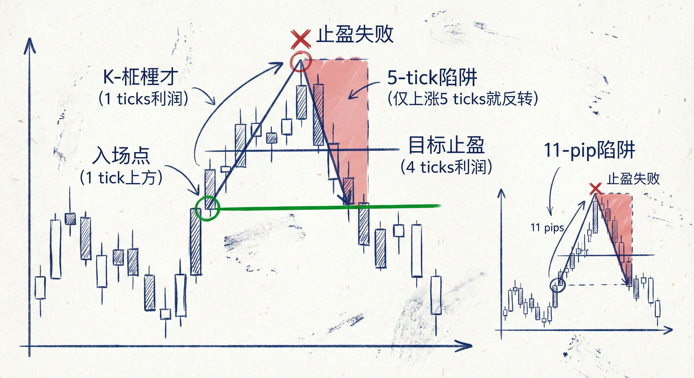
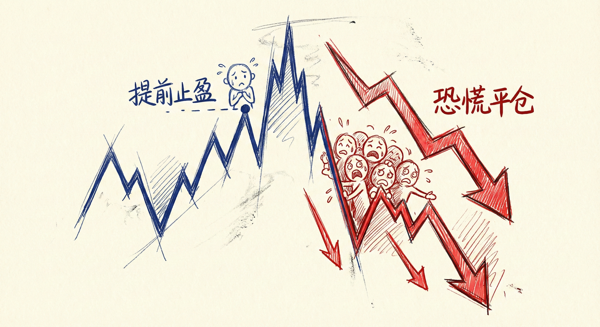
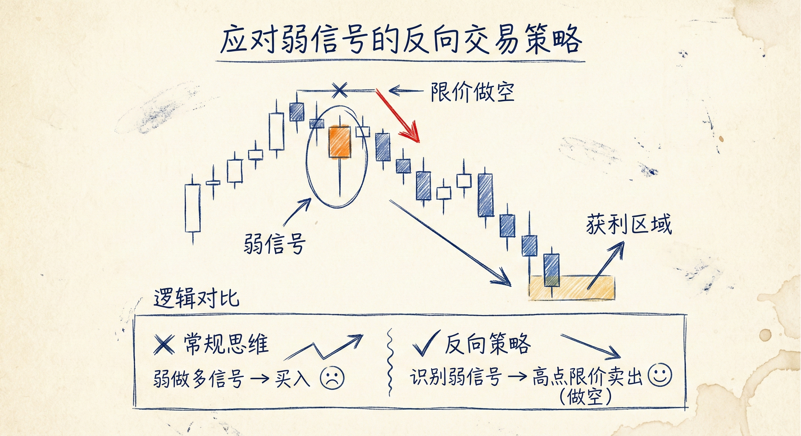
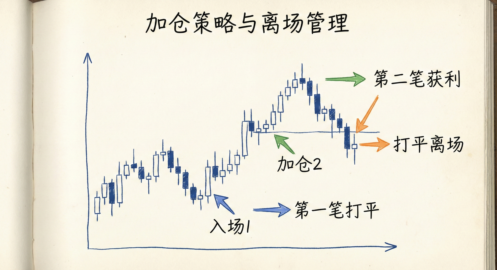

# 突破交易中的陷阱与反向策略（第七部分）

## 5-tick 陷阱与 11-pip 陷阱

### 定义与计算逻辑
-   **基本概念**：市场在距离剥头皮交易者的止盈目标仅差微小距离（1个tick或1个pip）时发生反转，导致交易者被困。
-   **ES (标普500期货) 的 5-tick 陷阱**：
    -   **目标**：剥头皮交易者通常追求 1个点（4 ticks）的利润。
    -   **成交机制**：使用 Stop 单入场（K线上方1 tick），Limit 单止盈。为了确保赚到 4 ticks，市场通常需要上涨 6 ticks（1 tick 入场 + 4 ticks 利润 + 1 tick 确保成交）。
    -   **陷阱形成**：如果市场仅上涨 5 ticks 就反转，多头的限价卖单无法成交，从而被困。
-   **Forex (外汇) 的 11-pip 陷阱**：
    -   **目标**：外汇剥头皮通常追求 10 pips 的利润。
    -   **成交机制**：为了赚到 10 pips，市场通常需要移动 12 pips（考虑点差和确保成交）。
    -   **陷阱形成**：如果市场仅移动 11 pips 就反转，交易者无法止盈，形成陷阱。

### 市场心理与行为
-   **提前止盈 (Front-running)**：
    -   交易者担心无法完美达到目标（如4个点），会选择提前 1 tick 或 1 pip 止盈（例如只赚 3 ticks）。
    -   这种行为导致在理论目标位的前方形成了强大的支撑或阻力。
-   **被困者的恐慌**：
    -   当市场差一点点触及止盈位并开始反转时，被困的交易者（如多头）会恐慌并平仓（卖出），这进一步推动了市场的反向运动。
-   **反向剥头皮者**：
    -   聪明的交易者知道大众的止盈目标在哪里，他们会在这些目标位附近挂反向单，押注突破者无法获利。

## 应对弱信号的反向交易 (Fading Weak Setups)

### 识别弱交易机会
-   **背景**：强趋势后的第一次反向尝试，或者信号K线形态糟糕（例如大阴线后出现的弱势做多信号K线）。
-   **逻辑**：弱信号通常难以引发趋势反转，更容易演变成震荡区间或陷阱。

### 交易策略执行
-   **限价单入场**：
    -   不使用突破单顺势入场，而是使用限价单在弱信号K线的高点（做空）或低点（做多）反向入场。
    -   **例子**：看到一个弱的做多信号K线，在它的高点挂限价卖单做空。
-   **加仓 (Scaling In)**：
    -   如果市场继续向不利方向移动，在更远的位置加仓。
    -   **ES**：在上方 1个点或 2个点加仓卖出。
    -   **Forex**：在下方 10 pips 加仓买入。
-   **离场管理**：
    -   **目标**：当价格回到第一笔仓位的入场价时全部离场。
    -   **结果**：第一笔仓位保本（打平），第二笔（加仓的）仓位获利。

### 为什么这种策略有效？
-   **利用被困者**：弱信号吸引的顺势交易者（如在弱信号高点买入的多头）一旦发现市场反转，会急于在保本位逃跑。
-   **双重压力**：反向交易者的获利平仓单与被困者的止损/保本单方向一致，推动价格回归。
-   **风险提示**：这种策略涉及加仓，风险较高，通常只适合有经验的交易者，且必须设定合理的止损（如趋势起点的另一端）。

