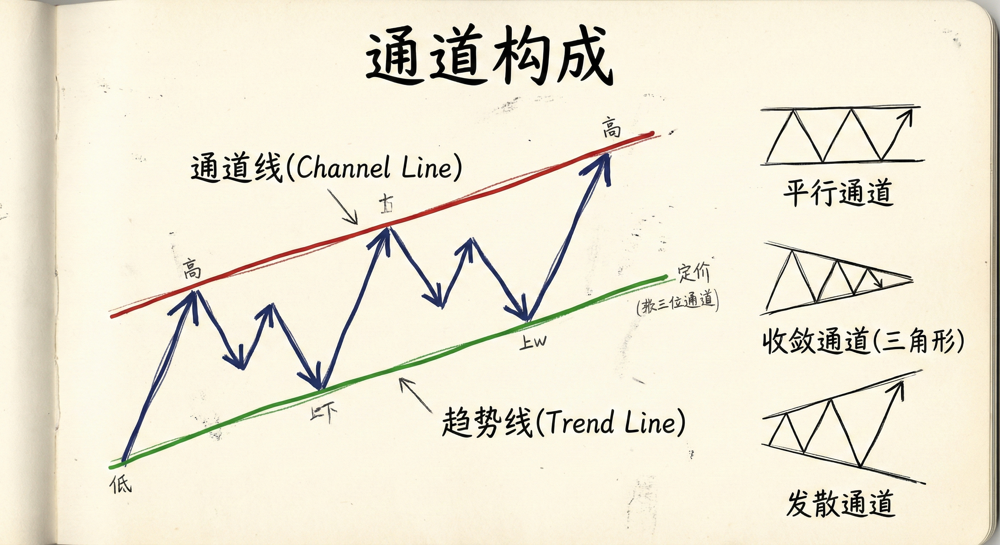
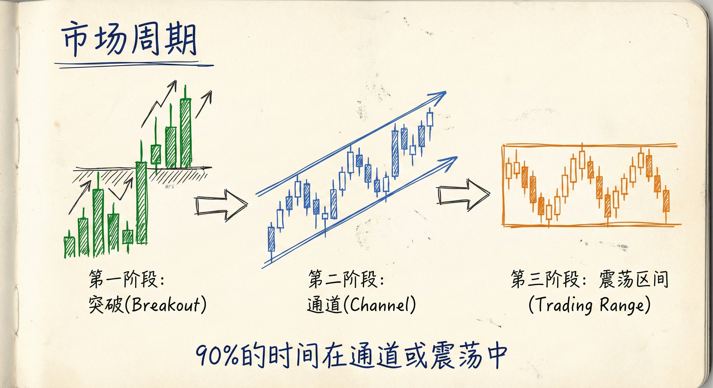
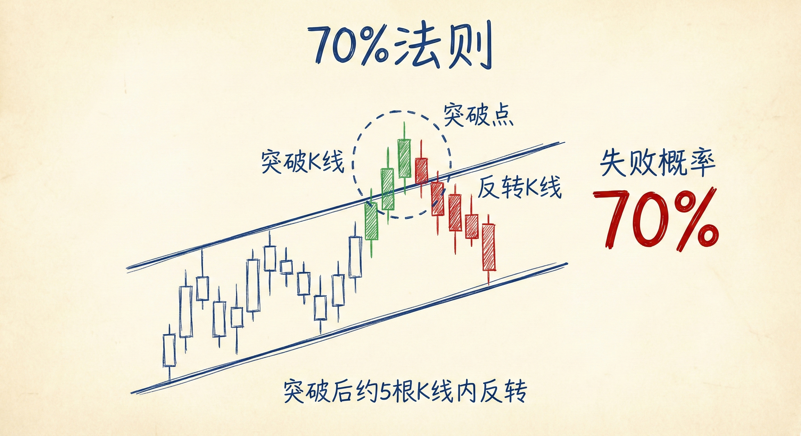
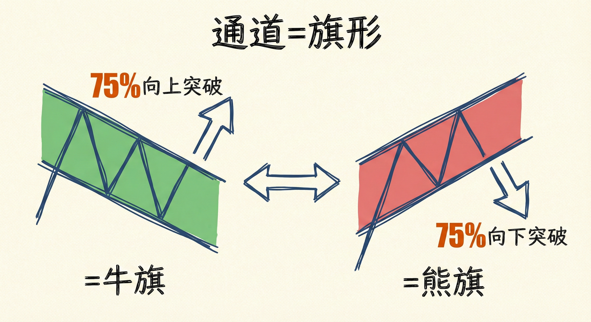

# 通道基础与绘制（第一部分）

## 通道的定义与构成

### 基本概念
-   **定义**：价格在两条线之间运行的结构。
-   **绘制原则**：两点确定一条直线。
-   **线的分类**：
    -   **趋势线 (Trend Line)**：上涨趋势中连接低点的线（下方），下降趋势中连接高点的线（上方）。
    -   **通道线 (Channel Line)**：上涨趋势中连接高点的线（上方），下降趋势中连接低点的线（下方）。
-   **形态变体**：
    -   **平行通道**：最常见的形态。
    -   **收敛通道**：即三角形 (Triangles)。
    -   **发散通道**：即扩张三角形 (Broadening Formations/Expanding Triangles)。
    -   **震荡区间**：本质上是水平的通道。

## 市场周期与多周期特性

### 市场演变
-   **周期顺序**：突破 (Breakout) -> 通道 (Channel) -> 震荡区间 (Trading Range)。
-   **K线分布**：任何图表上，只有5%-10%处于强烈突破阶段，90%处于通道或震荡区间。

### 多周期视角 (Fractal Nature)
-   **嵌套结构**：大通道内包含小通道，小通道内包含更小的通道。
-   **趋势相对性**：小周期的上涨趋势（通道）可能是大周期的熊旗（反弹）。例如，5分钟图上的强上涨通道，在日线图上可能只是强下降趋势中的小反弹。

## 画线技巧与计算机算法

### 绘制细节
-   **平行原则**：计算机程序偏好平行通道，平行线通常更可靠，作为支撑/阻力更有效。
-   **处理凸刺 (Overshoot)**：当需要在“凸刺”（价格短暂突破线）和“短缺”（价格未触及线）之间选择时，通常选择允许“凸刺”的画法，以突显价格结构。
-   **动态调整**：随着新K线产生（如新的高低点），需要不断重画趋势线和通道线以适应最新信息。

### 算法识别
-   **对称性**：点1-2与点2-3之间的时间跨度需具备对称性。如果点2到点3的距离过远，计算机会忽略该通道结构。
-   **重要高低点**：计算机倾向于使用重要的高点和低点（Major Highs/Lows）来构建通道。

## 70% 规则 (The 70% Rule)

### 规则详解
-   **内容**：通道被突破（无论向上或向下）后，约70%的概率该突破会失败，并在约5根K线内反转。
-   **目标**：反转后，价格通常会测试通道的另一边。
-   **例外**：约30%的概率突破会成功，开启新的市场周期（突破->通道->震荡）。

### 时间周期的关键限制
-   **适用范围**：该规则仅适用于能画出该通道的**最大时间周期**。
-   **案例说明**：如果在1分钟图上看到一个持续200根K线的通道突破，不能直接套用"5根K线反转"规则。需要切换到更大的周期（如30分钟图），若在该周期上该突破仅显示为5-6根K线，则70%反转规则适用。

## 交易含义与策略

### 通道的本质
-   **牛旗与熊旗**：
    -   **下降通道**：通常看作牛旗，75%概率最终被向上突破。
    -   **上涨通道**：通常看作熊旗，75%概率最终被向下跌破。

### 交易策略
-   **顺势与逆势**：
    -   在强趋势通道中，顺势交易（如上涨通道下沿买入）更容易获利。
    -   在通道边界，交易者常寻找反转机会（如在上涨通道上沿做空，下降通道下沿做多）。
-   **利用70%规则**：由于大部分通道突破会失败，交易者常在通道突破时进行逆势交易（Fade the breakout），除非突破极为强劲并伴随良好跟随。
-   **限价单交易**：机构和算法常在通道延伸线附近使用限价单进行逆势加仓（Scaling in）。

## 总结原则
-   **通道无处不在**：无论市场处于何种状态，本质上都在某种形式的通道中运行。
-   **概率思维**：记住75%的通道最终演变为震荡区间，70%的通道突破会在最大可见周期的5根K线内失败。
-   **画线灵活**：画线是为了看清市场行为，不必完美，需随市场走势不断调整，重点关注市场对线条的反应。
