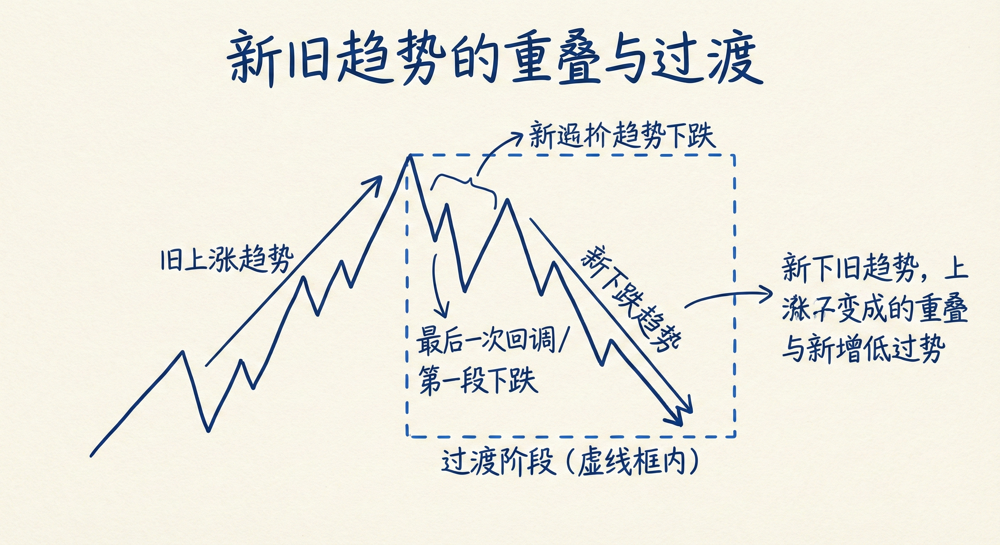
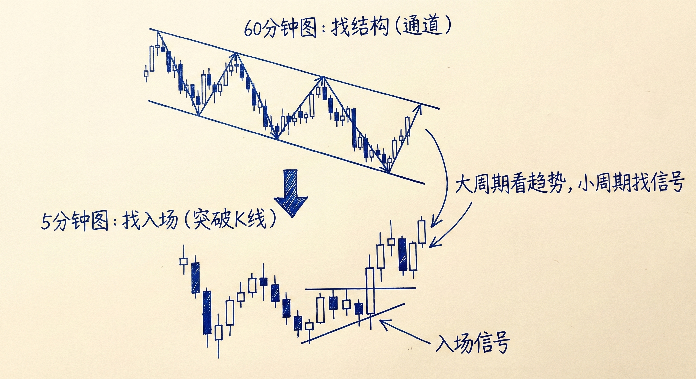
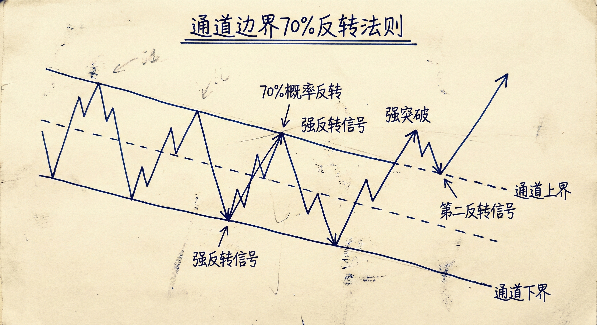
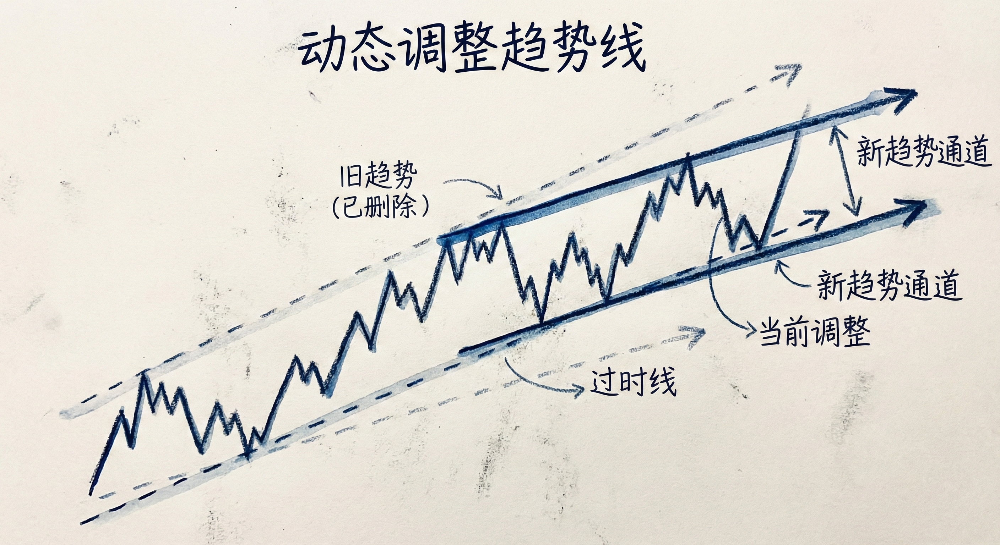

# 通道（第三部分）：趋势过渡与多周期分析

## 新旧趋势的重叠与过渡 (Trend Transitions)

### 定义与识别
-   **核心概念**：新趋势往往在旧趋势被正式反转之前就已经开始。市场存在一个“过渡阶段”，此时的价格运动同时属于两个趋势。
-   **计算机算法视角**：虽然人类交易者可能还在看旧趋势，但算法可能已经将某次回调视为新趋势的起点。

### 具体表现形式
-   **上涨转下跌**：
    -   上涨趋势中的最后一次回调（通常表现为楔形牛旗），实际上往往是下跌趋势的第一段下跌。
    -   即便随后创出新高，这个新高也只是下跌趋势中的更低的高点（Lower High）或双顶。
-   **下跌转上涨**：
    -   下跌趋势中的最后一次反弹（通常表现为楔形熊旗），实际上往往是上涨趋势的第一段上涨。
    -   **末端旗形**：趋势后期出现买压/卖压很大的旗形，常演变为末端旗形，预示着大反转的到来。

## 多周期分析与交易策略 (Multi-Timeframe Analysis)

### 大周期结构的意义
-   **结构识别**：在60分钟或日线图等大周期上，趋势线和通道结构出现的频率较低，但重要性极高。
-   **图表压缩**：在小周期（如5分钟图）上通过压缩K线，可以看到与大周期完全相同的通道结构和形态（如扩张三角形、连续顶部）。

### "大图找结构，小图找入场"
-   **策略逻辑**：
    1.  **大周期**：在60分钟图上确认关键的通道线、楔形顶/底或连续顶部结构。
    2.  **小周期**：切换到5分钟图，在关键位置寻找具体的反转信号K线入场。
-   **优势**：
    -   **降低风险**：小周期的信号K线止损幅度更小。
    -   **优化入场**：相比直接在大周期等待信号闭合，小周期入场通常能提前3-4个点（Ticks），显著提高盈亏比。

## 反转、突破与画线原则 (Reversals, Breakouts & Lines)

### 70% 反转法则
-   **通道边界**：无论上涨还是下降通道，当价格触及通道上沿或下沿时，有 **70% 的概率** 会发生反转。
-   **应对强突破**：
    -   即使突破看起来非常强劲（大阳线/大阴线），如果背景是宽通道或震荡区间，这往往是陷阱。
    -   **操作建议**：不要在强力突破后立即逆势操作，应等待 **第二反转信号 (Second Entry)**，例如双顶/双底结构出现后再入场。

### 动态调整趋势线
-   **不断重画**：当突破失败、反转发生或形成新高/低点时，必须擦除旧线，重新连接新的极点。
-   **演变规律**：随着趋势发展，通道通常会变得 **更平坦（斜率变小）** 和 **更宽**，最终演变为震荡区间。
-   **目标位**：当通道上沿被测试后，价格通常会回落测试通道下沿（反之亦然）。

### 历史大崩盘的启示
-   **技术面支撑**：回顾1987年和2009年的崩盘（月线图），看似世界末日般的下跌，最终都在长期的 **趋势线** 处获得支撑并反转。
-   **画线的重要性**：无论抛售多猛烈，市场往往会在触及某条长期趋势线后见底，这证明了算法对趋势线的尊重。

## 总结原则
-   **趋势早于确认**：要意识到新趋势可能始于旧趋势的最后一次回调/反弹中，保持思维的灵活性。
-   **利用多周期优势**：结合大周期的结构可靠性和小周期的入场精细度来提高交易胜率。
-   **尊重通道边界与重画线**：在通道线附近寻找反转，警惕强力突破陷阱，并随市场变化不断调整趋势线以适应新的市场节奏。
