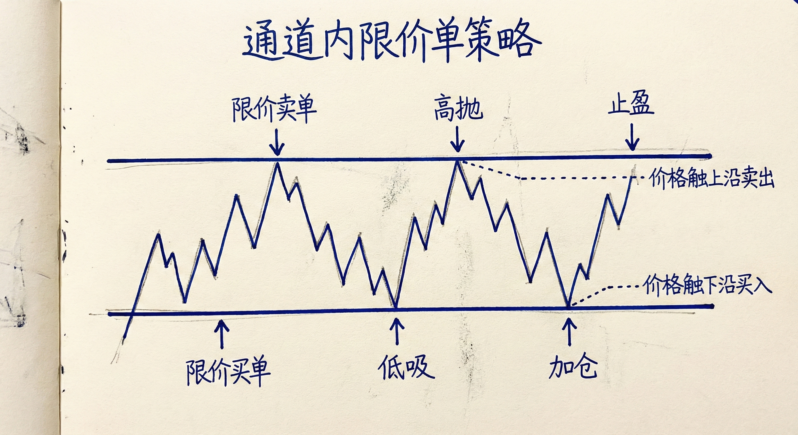
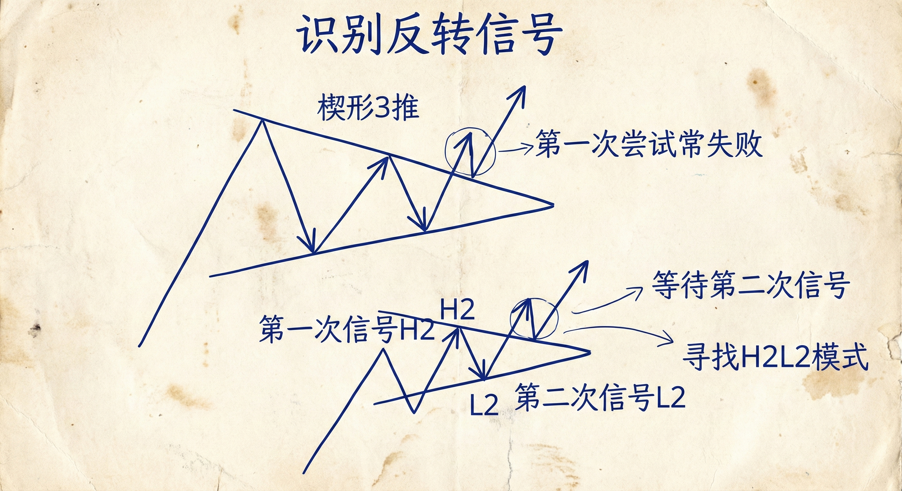
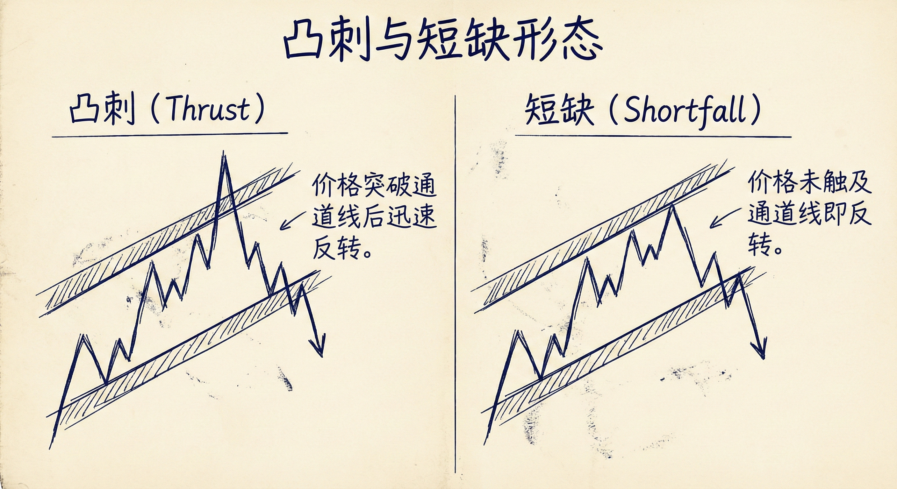
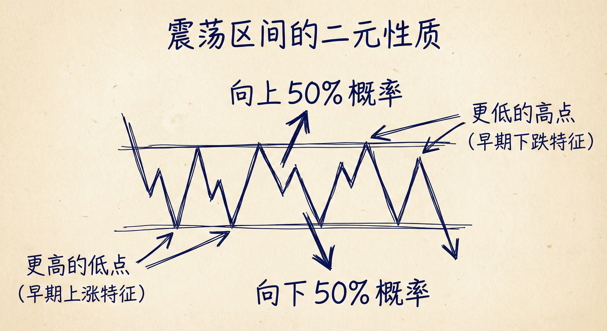

# 通道交易策略与震荡区间 (Channel Trading Strategies & Trading Ranges)

## 通道内的交易策略 (Trading in Channels)

### 限价单的应用
-   **高抛低吸**：在通道上沿挂限价卖单，在通道下沿挂限价买单。
-   **加仓策略 (Scaling In)**：
    -   **逻辑**：有经验的交易者愿意在价格对这一笔交易不利时（如买入后继续下跌）在更低的位置加仓。
    -   **条件**：需要使用较宽的止损，并确信背景支持反转（如通道下沿的支撑）。
    -   **目标**：反弹至第一笔入场价时，加仓部分获利（剥头皮），初始仓位打平离场。
-   **入场形态**：关注 **ii**（连续孕线）或 **ioii**（内-外-内-内）等形态，作为市场犹豫和潜在反转的信号。

### 突破与趋势
-   **趋势起源**：大多数趋势始于突破，尽管有些突破并不明显。
-   **突破失败概率**：通道突破（无论是向上还是向下）有 **75%** 的概率失败，并回归通道内或演变为震荡区间。
-   **放弃 K 线 (Give-up Bar)**：
    -   **定义**：在趋势中出现反向的巨大强力K线（如上涨趋势中出现巨大阴线）。
    -   **含义**：意味着原趋势方（如多头）放弃抵抗，市场大概率进入震荡或反转，短期内不会立即恢复原趋势。

## 反转与目标位 (Reversals & Targets)

### 识别反转信号
-   **楔形 (Wedge)**：三次推动形成的收敛通道（如楔形顶/底），通常预示反转。
-   **双重入场 (Second Entry)**：
    -   **重要性**：在弱趋势或震荡中，第一次反转尝试（H1/L1）常失败。
    -   **策略**：等待第二次反转信号（H2/L2），胜率更高。例如，双顶熊旗后的低2卖点。
-   **跟随性 (Follow-through)**：突破K线后是否有良好的跟随K线，是判断突破是否成功的关键。

### 价格行为特征
-   **凸刺 (Overshoot)**：价格略微突破通道线后迅速反转，是常见的反转形态。
-   **短缺 (Undershoot)**：价格未触及通道线即反转，可能暗示趋势强弱的变化。
-   **反转目标**：
    -   **熊市通道反转**：若向上突破熊市通道，最低目标是测试通道的起点（上沿）。
    -   **牛市通道反转**：若向下跌破牛市通道，最低目标是测试通道的起点（下沿）。

## 宽通道与震荡区间 (Wide Channels vs. Trading Ranges)

### 模糊的界限
-   **难以区分**：宽通道和震荡区间经常难以区分，且经常共存。
-   **交易一致性**：无论定义为宽通道还是震荡区间，交易方法一致——**高抛低吸，剥头皮 (Scalp)**。不要期待长线波段，因为市场缺乏强劲动能。

### 震荡区间的二元性
-   **双重特征**：每个震荡区间都同时包含 **早期上涨趋势**（更高的低点）和 **早期下降趋势**（更低的高点）的特征。
-   **突破模式**：
    -   震荡区间处于突破模式，多空双方都有理由认为自己处于趋势的早期。
    -   **概率**：最终向上或向下突破的概率各为 **50%**。
    -   **陷阱**：看似完美的波段交易信号（如高2或低2），在震荡区间内只有约 40% 的概率发展成真正的波段趋势。

## 总结原则
-   **顺势与逆势**：强趋势中顺势交易；弱通道和震荡区间中，利用限价单在边缘逆势交易（高抛低吸）。
-   **缺口性质**：趋势末端的巨大突破往往是 **竭尽型缺口 (Exhaustion Gap)**，而非测量型缺口，预示着回调或反转。
-   **等待确认**：在震荡区间内，除非看到极强的突破和跟随，否则假定市场会继续震荡。
