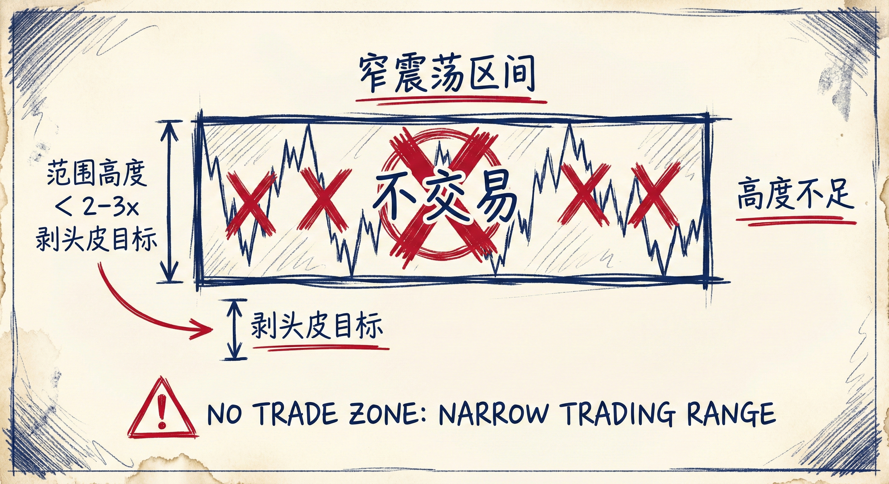
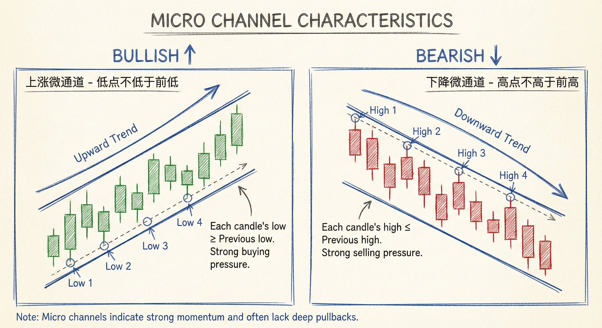
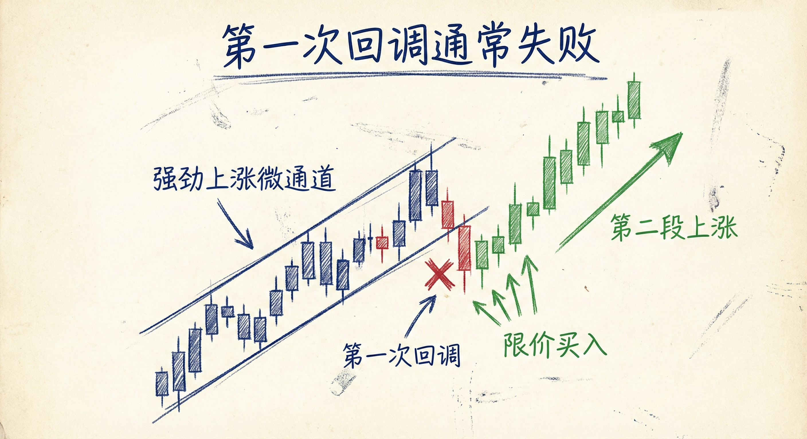
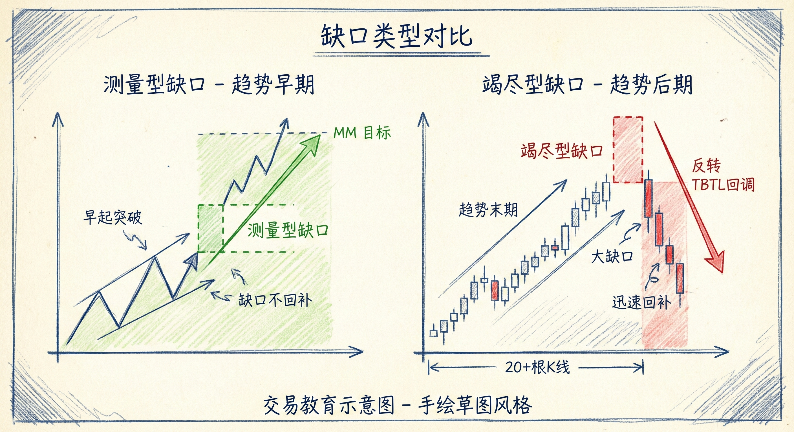

# 窄通道与微通道（第二部分）

## 窄震荡区间 (Narrow Trading Ranges)

### 定义与识别
-   **概念**：市场处于横盘整理状态，但波动幅度极小，K线平均高度很低。
-   **特征**：
    -   **高度不足**：区间高度不足以支持盈利性的剥头皮交易。
    -   **K线形态**：K线体积小，重叠度高。

### 交易规则
-   **"不交易"法则**：如果区间高度小于剥头皮最小盈利目标的2~3倍，或者小于K线平均大小的2~3倍，**绝对不要交易**。
    -   **ES 举例**：剥头皮目标为1点（4 ticks），则区间高度至少需要2~3点（8-12 ticks）。
    -   **外汇举例**：剥头皮目标为10 pips，则区间高度至少需要20-30 pips。
-   **风险**：在过窄的区间内，即使使用限价单高抛低吸也难以获利，且容易遭遇大亏小赚。

## 微通道 (Micro Channels)

### 定义与识别
-   **概念**：一种极度强势的趋势形态，表现为连续多根K线没有发生逆势超越。
-   **特征**：
    -   **上涨微通道**：每一根K线的低点都不低于前一根K线的低点。
    -   **下降微通道**：每一根K线的高点都不高于前一根K线的高点。
    -   **持续时间**：可短至2根K线，长至50根以上。
    -   **本质**：微通道本身就是一种突破，代表极强的动能。

### 交易含义
-   **第一次回调通常失败**：
    -   **做多**：在强劲的上涨微通道后，第一次跌破前一根K线低点时，多头会逢低买入（Limit Buy），预期会有第二段上涨。
    -   **做空**：在强劲的下降微通道后，第一次突破前一根K线高点时，空头会逢高卖出（Limit Sell），预期会有第二段下跌。
-   **多周期视角**：
    -   5分钟图上的微通道，在1分钟图上可能是一个清晰的趋势。
    -   激进交易者可利用小周期（如1分钟图）寻找更早的入场点（例如在1分钟微通道被打破时入场），但这对新手风险较大。

## 突破：测量型缺口 vs. 竭尽型缺口

### 缺口 (Gaps) 的意义
-   **定义**：突破K线的收盘价与前期K线的极值（高点或低点）之间的空隙。
-   **未回补缺口**：代表趋势强势，价格可能继续向测量目标位（MM）运动。
-   **缺口回补**：如果价格回调并填补了缺口，往往预示趋势力量减弱或进入震荡。

### 趋势阶段的重要性
-   **趋势早期 (Measuring Gap)**：
    -   如果在趋势开始阶段出现强势突破和缺口，通常是**测量型缺口**。
    -   **策略**：预期趋势延续，目标是突破幅度的翻倍（MM目标）。
-   **趋势后期 (Exhaustion Gap)**：
    -   **识别**：当趋势已经持续很长时间（如超过20根K线），再次出现极度强势的突破（大阳线/大阴线）。
    -   **含义**：这通常是**竭尽型缺口**（高潮），而非新趋势的开始。
    -   **后果**：市场往往会进入调整，通常表现为"10根K线，2段式回调"（TBTL），或者转为震荡区间，而非直接反转。

## 总结原则
-   **避免窄幅震荡**：区间高度不足剥头皮目标2-3倍时，保持空仓。
-   **尊重微通道**：微通道意味着强趋势，不要在第一次逆势信号出现时就赌反转，第一次回调大概率失败。
-   **判断突破性质**：同样的强势K线，出现在趋势早期是机会（测量型），出现在趋势晚期（20+ K线后）则是陷阱（竭尽型/高潮）。
