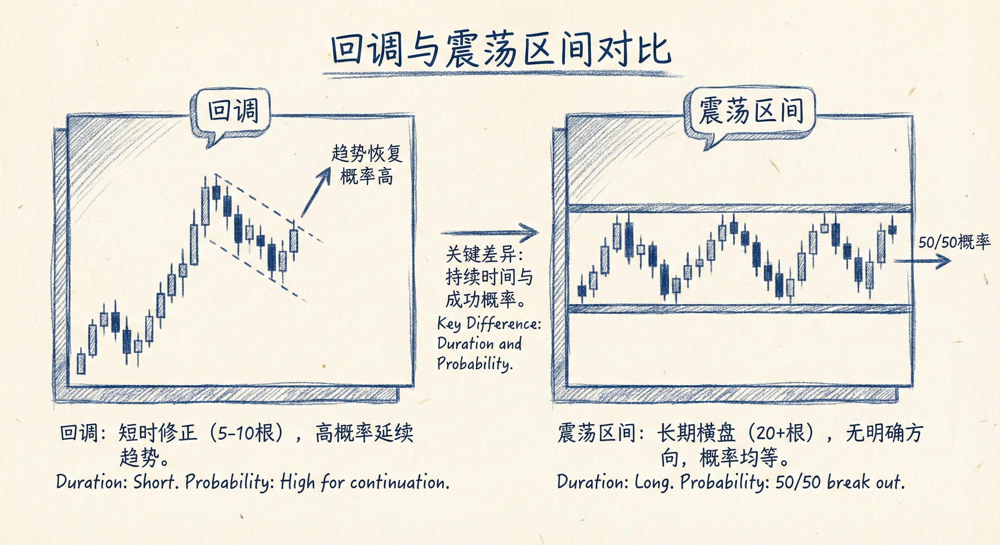
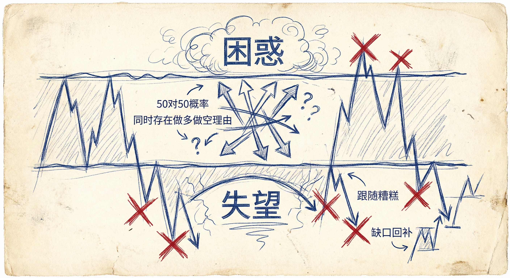
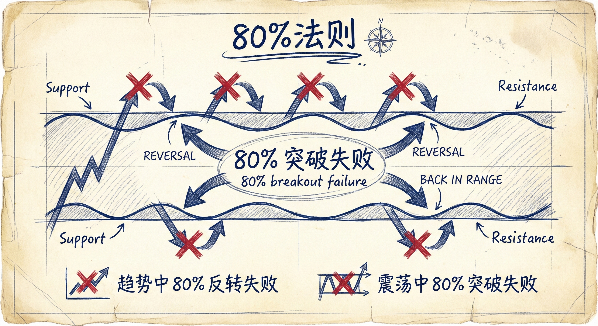
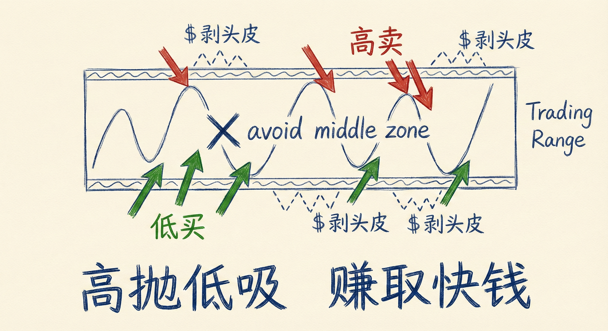

# 震荡区间与回调的区别 (Trading Ranges vs Pullbacks)

## 回调与震荡区间的定义

### 核心区别
-   **回调 (Pullback)**：
    -   **本质**：是一个小型的震荡区间。
    -   **概率**：趋势恢复（延续原方向）的概率大于反转的概率。
    -   **心态**：只要交易者相信趋势会恢复，就称之为回调。
-   **震荡区间 (Trading Range)**：
    -   **演变**：当回调持续时间过长（通常超过20根K线），导致趋势恢复与反转的概率变得模糊（接近50/50）。
    -   **特征**：之前的趋势距离太远，失去了对当前价格的影响力。
    -   **判断标准**：当不再明确趋势是否会恢复时，应使用“震荡区间”一词。

### 市场机制
-   **市场目的**：寻找买卖双方达成一致的"公平价格"区域，以便最大化交易量。
-   **成交量变化**：随着市场找到公平价格，愿意在低位卖出或高位买入的人减少，成交量通常会萎缩（尽管不建议过度关注成交量）。
-   **K线分布**：任何图表上，90%的K线处于震荡区间或通道（通道也是震荡区间的开始）中，只有5-10%处于强势突破中。

## 震荡区间的两大特征

### 1. 困惑 (Confusion)
-   **表现**：市场大涨大跌，方向不明。
-   **多空平衡**：同时存在合理的做多和做空理由（如多头看到双底，空头看到头肩顶）。
-   **概率中性**：向上突破和向下突破的概率几乎相等（50对50）。

### 2. 失望 (Disappointment)
-   **跟随糟糕**：强势的趋势K线或突破后，往往没有良好的跟随K线，导致顺势交易者失望。
-   **缺口回补**：突破产生的缺口（Gap）和实体缺口通常很快被填补。
-   **反转频繁**：看起来胜率很高的机会（如60%）在震荡区间中会降至50%；看起来糟糕的信号反而可能成功。

## 交易策略与原则

### 80% 法则
-   **逆势特性**：在震荡区间中，80% 的突破尝试（试图形成趋势）都会失败，价格会回到区间内。
-   **对比趋势**：趋势中80%的反转尝试会失败；震荡区间中80%的突破尝试会失败。

### 陷阱与形态
-   **第2段陷阱 (2nd Leg Trap)**：市场走出第1段和回调，看似要展开第2段趋势运动，但随即反转。
-   **最小要求**：震荡区间通常至少包含20根K线和3个波段（Legs）。
-   **重要低点/高点**：跌破次要低点不代表趋势结束，只有跌破产生新高的强力突破点（重要低点），才标志着趋势可能转为震荡或反转。

### 交易执行
-   **操作模式**：高抛低吸，剥头皮（Scalping），赚取快钱。
-   **多周期视角**：
    -   小周期的震荡区间往往是大周期的回调（例如5分钟图的震荡区间是60分钟图的牛旗）。
    -   **建议**：主要依据当前交易的时间周期进行决策，避免因多周期分析导致瘫痪。
-   **离场观望**：当区间非常窄或极度困惑时，最好的策略是不交易。

