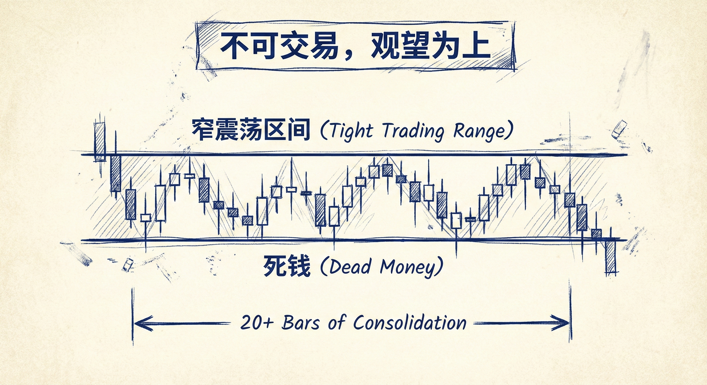
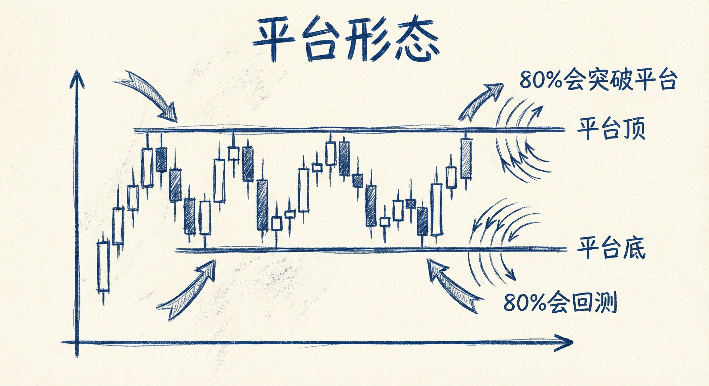
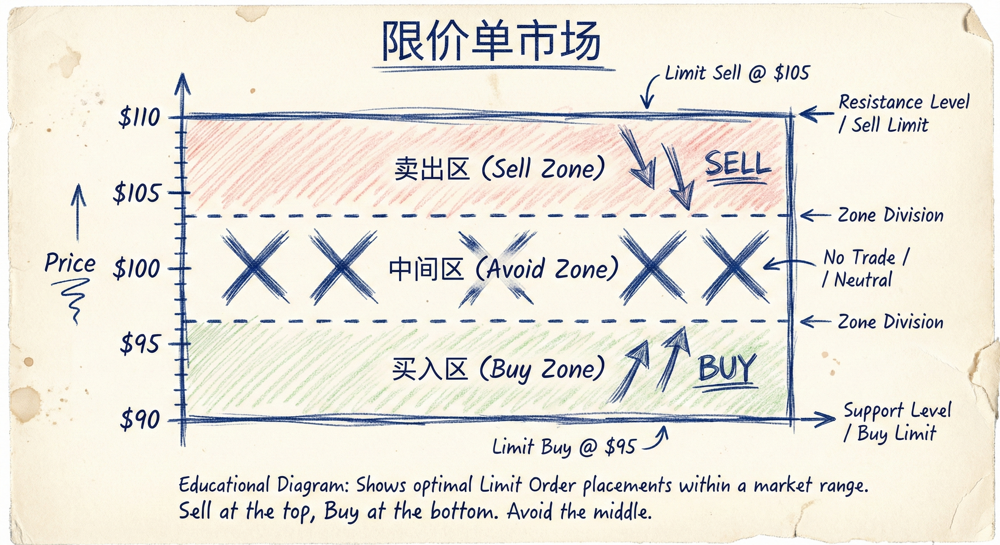
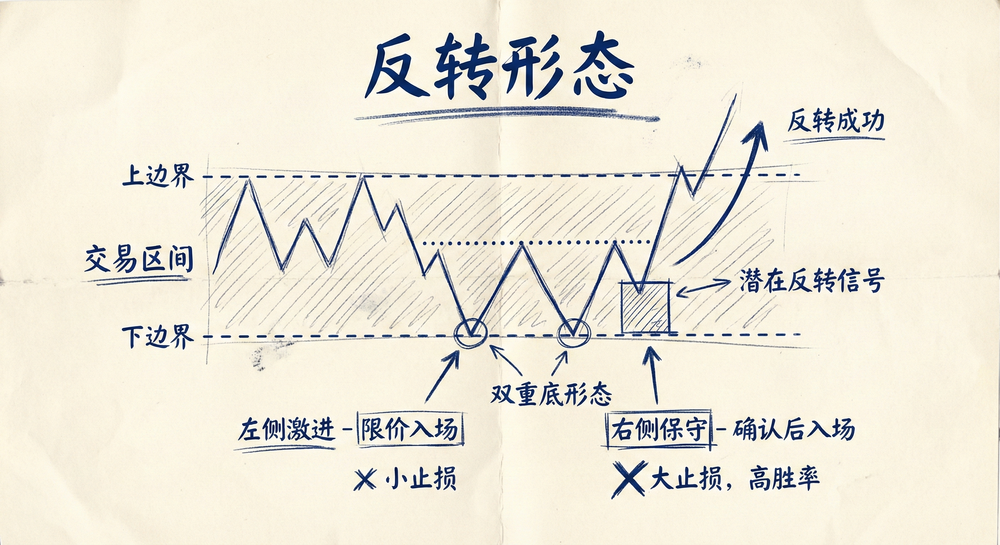

# 窄震荡区间与平台 (第四部分)

## 窄震荡区间 (Tight Trading Ranges)

### 定义与识别
-   **概念**：市场横盘整理，K线高度重叠，区间高度相对于剥头皮交易的目标非常小。
-   **“死钱” (Dead Money)**：
    -   通常指日线图上大趋势后的长时间横盘（20-30根K线以上）。
    -   在此期间交易很难获利，投资回报率极低。
    -   **特征**：大量十字星、影线明显、实体小。
-   **识别方法**：
    -   **突破单失效**：如果无法通过高买低卖（突破单）获利，即为窄震荡区间。
    -   **持续时间**：如果横盘超过20根K线，建议去寻找其他交易机会。

### 交易含义
-   **概率平衡**：在窄震荡区间中，多头突破和空头突破的概率各为50%。
-   **避免顺势入场**：不要在区间顶部买入或底部卖出（追涨杀跌），因为市场缺乏延续性。
-   **观望为上**：对于大多数交易者，遇到此类行情应停止交易，等待明确突破。

## 平台 (Platforms)

### 定义与特征
-   **形态**：3根或更多（通常5-10根）K线具有**完全相同**的高点（平台顶）或低点（平台底）。
-   **磁铁效应**：平台是一个重要的价格磁铁，价格会被吸过去。
-   **市场差异**：在ES（标普500期货）和股票中常见；在外汇中较少见（因分数点导致价格精度过高，很难完全相同）。

### 80% 规则
-   **突破概率**：当出现平台时，市场有80%的概率会最终突破该平台（向上或向下）。
-   **回归概率**：一旦市场突破了平台，又有80%的概率会反转并至少回调到平台区域的另一侧（例如跌破平台底后，80%概率会反弹回平台底上方）。

## 限价单市场 (Limit Order Markets)

### 定义
-   **可交易的窄区间**：虽然是窄震荡区间，但其高度足以进行剥头皮交易。
-   **高度要求**：区间总高度通常至少是剥头皮最小获利目标（如1个点）的3倍。
-   **K线要求**：K线平均大小至少满足剥头皮的最小跳动单位（ticks）。

### 交易策略
-   **逆势操作**：
    -   **只用限价单**：在区间下沿挂限价买单（Buy Low），在区间上沿挂限价卖单（Sell High）。
    -   **做突破单的对手盘**：在突破交易者止损或入场失败的地方进场。
-   **区域划分**：
    -   **买入区**：区间下部的1/3。
    -   **卖出区**：区间上部的1/3。
-   **资金管理**：
    -   **宽止损与加仓**：交易者通常使用较宽的止损，并愿意在价格不利时加仓（Scale in），押注市场会继续横盘。
    -   **获利了结**：只赚取剥头皮的微薄利润，见好就收。

## 窄区间中的反转形态
-   **双顶/双底大反转**：即使在窄震荡区间，也可能出现大级别的双顶或双底反转。
-   **风险与胜率**：
    -   **左侧交易（激进）**：在形态形成初期（如双顶的第二个高点）限价入场。风险极小，盈亏比极高，但胜率较低。
    -   **右侧交易（保守）**：等待明确的强力突破和跟随K线后入场。胜率提高，但止损距离变大，风险增加。

## 总结原则
-   **识别环境**：区分“死钱”区间（不可交易）与“限价单市场”（仅限经验丰富的交易者）。
-   **关注平台**：利用平台的磁铁效应和80%回归规则来辅助判断目标位和反转点。
-   **工具选择**：在窄震荡区间中，严禁使用突破单（Stop Orders），应使用限价单（Limit Orders）进行高抛低吸。
