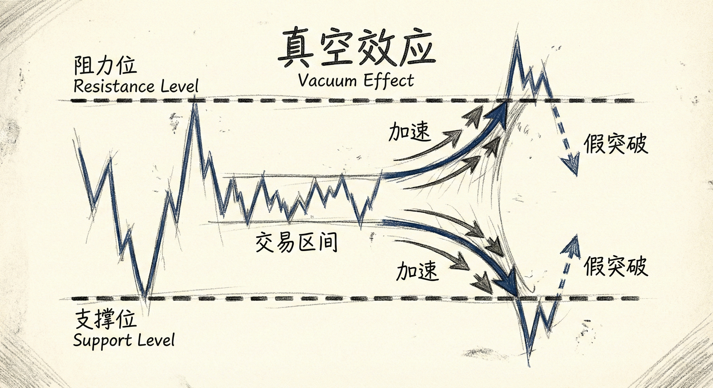
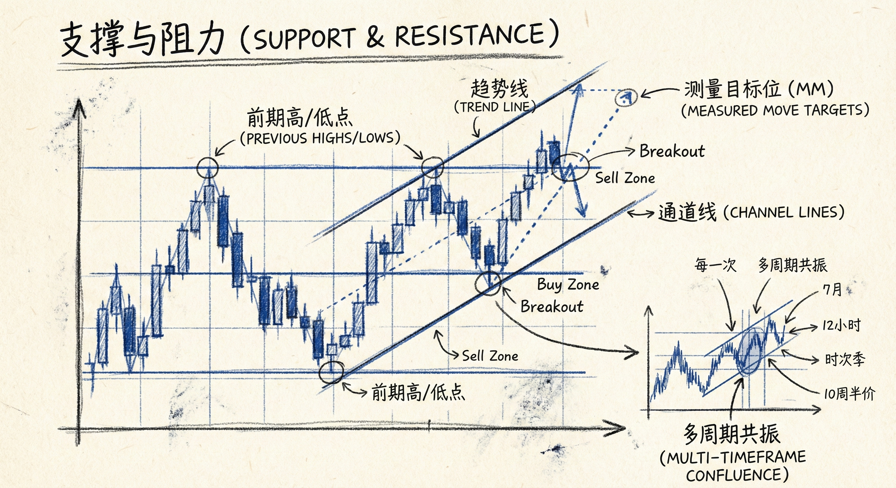
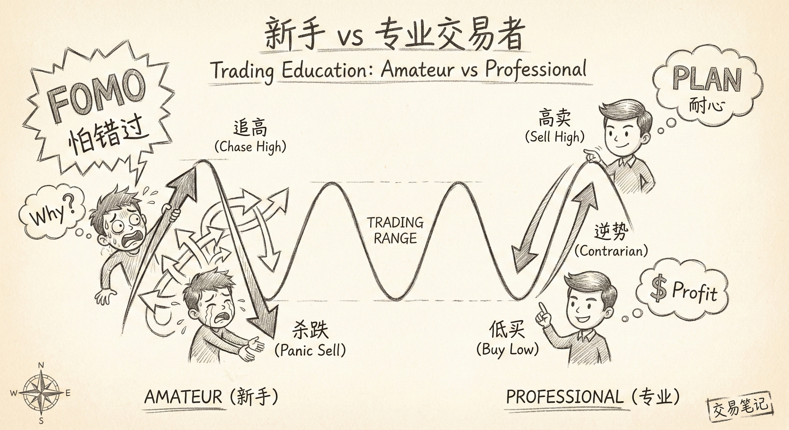
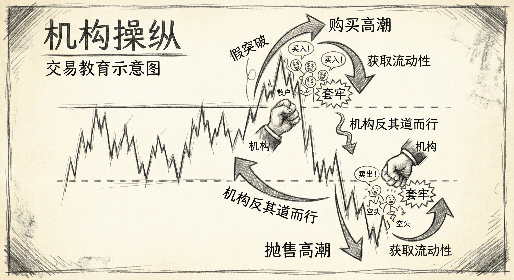

# 震荡区间交易（第五部分）

## 真空效应 (Vacuum Effect)

### 定义与机制
-   **概念**：市场在接近支撑位或阻力位（磁铁）时，价格移动速度往往会加快，仿佛被“吸”过去一样。
-   **成因（供需失衡）**：
    -   **接近支撑位时**：空头停止做空（等待跌破或反弹后再卖），多头停止买入（等待跌至支撑位再买）。缺乏买卖盘导致价格必须快速下跌以寻找买家。
    -   **接近阻力位时**：多头停止买入（等待突破或回调），空头停止卖出（等待涨至阻力位）。缺乏阻力导致价格快速上涨以寻找卖家。
-   **结果**：通常会导致价格形成强力的大K线（看似突破），经常会略微刺破（Overshoot）支撑或阻力位，随后发生反转。

### 交易含义
-   **假突破的温床**：真空效应导致的大K线常被新手误认为是强劲趋势的开始，但实际上往往是震荡区间边缘的力竭表现。
-   **反转信号**：一旦价格触及磁铁（支撑/阻力）并消除引力，多空双方会同时反向操作（多头止盈/空头做空，或反之），引发剧烈反转。

## 支撑与阻力 (Support and Resistance)

### 市场本质
-   **寻找公平价格**：市场不断上下波动是为了寻找交易量最大化的“公平价格”。
-   **新闻是噪音**：反转通常由价格行为（测试支撑/阻力）决定，而非新闻事件。新闻只是市场寻找价格的背景变量之一。
-   **矫枉过正**：市场往往需要“走过头”（Overshoot）才能确认支撑或阻力的有效性。

### 常见类型
-   **前期高点/低点**：最直观的支撑阻力。
-   **趋势线与通道线**：动态的支撑阻力。
-   **测量目标位 (MM Targets)**：基于缺口或区间高度的预测目标。
-   **多周期共振**：即使在日内图表交易，月线或周线的支撑阻力依然有效。

## 震荡区间中的陷阱与博弈

### 80% 规则
-   **突破失败概率**：在震荡区间中，80% 的突破尝试最终都会失败并反转。
-   **第2段陷阱 (Second Leg Trap)**：震荡区间中常出现非常强势的第2段上涨或下跌，诱导交易者误以为趋势开始，但随后迅速反转。

### 新手 vs 专业交易者
-   **新手行为**：
    -   **追涨杀跌**：看到真空效应产生的大K线后，因害怕踏空（FOMO）而在高位买入或低位卖出。
    -   **止损反向**：在底部止损多单并反手做空，正好卖在最低点；在顶部止损空单并反手做多，正好买在最高点。
-   **专业交易者行为**：
    -   **逆势操作**：在震荡区间下沿买入，在上沿卖出。
    -   **利用陷阱**：在新手止损的位置建立仓位（即在新手卖出止损时买入）。

## 机构的"反其道而行之" (Doing the Opposite)

### 操纵逻辑
-   **制造高潮**：机构（尤其是算法交易）有时会故意推动价格向反方向运行，以制造极端的情绪高潮。
    -   **区间上沿**：做空机构可能先买入，制造购买高潮（Buy Climax），诱导多头追高，随后大量抛售。
    -   **区间下沿**：做多机构可能先卖出，制造抛售高潮（Sell Climax），诱导空头追空，随后大量买入。
-   **目的**：
    -   **套牢对手**：让追涨杀跌的交易者被套牢，迫使他们在反转开始时止损，从而助推反转趋势。
    -   **获取流动性**：在极端价格获得更好的入场点和足够的对手盘。

### 交易启示
-   **警惕极端K线**：在区间边缘出现的极强K线，往往是机构制造的高潮陷阱，而非趋势的开始。
-   **等待反转确认**：不要在强力突破时立即跟进，应观察后续是否有跟随K线，或是否出现反转信号。

## 总结原则
-   **理解真空效应**：急速运动往往意味着接近目标，而非趋势爆发。
-   **坚持区间策略**：在震荡区间内，高抛低吸，押注突破失败。
-   **识破机构意图**：理解市场边缘的“反常”运动可能是为了制造更好的反转机会。
