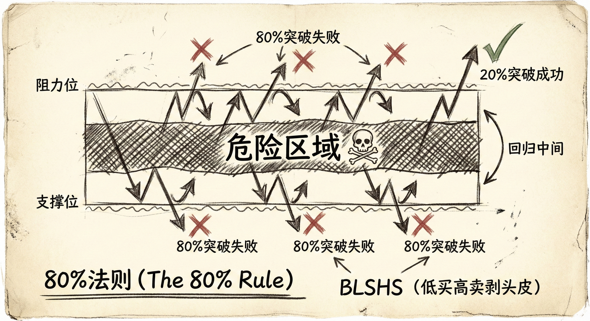
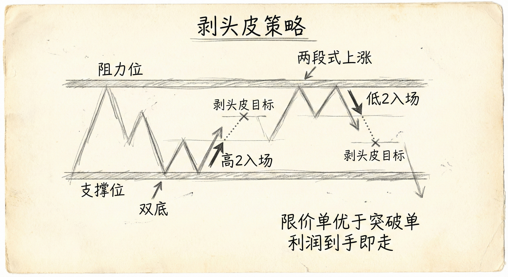
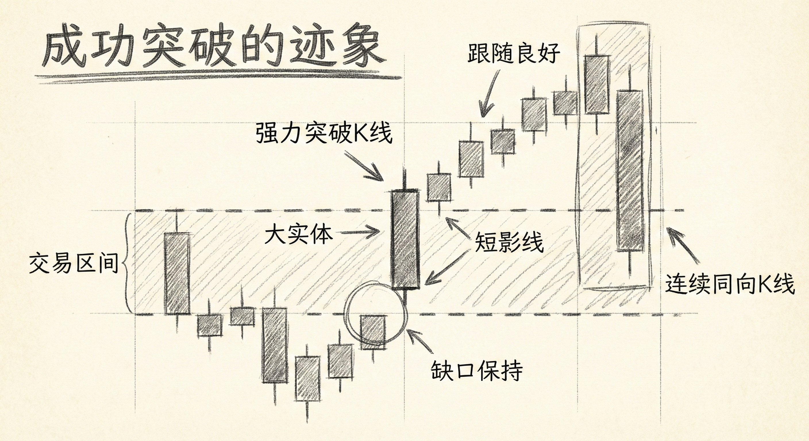
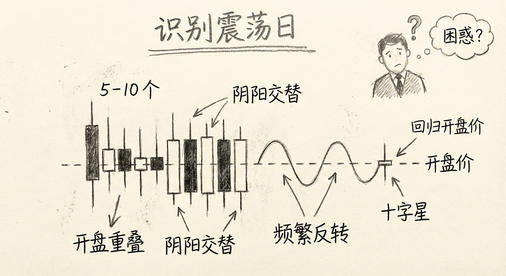

# 震荡区间交易策略与突破识别（第六部分）

## 震荡区间的核心法则 (The 80% Rule)

### 定义与识别
-   **80% 法则**：当市场处于震荡区间时，80% 的突破尝试都会失败。
-   **市场行为特征**：
    -   **回归特性**：价格倾向于不断反转回到区间的中间三分之一区域。
    -   **中间区域陷阱**：大部分交易发生在中间，但那是糟糕的开仓点，因为价格来回拉锯。
    -   **磁力效应**：如果你在中间入场且不及时止盈，市场往往会回到你的入场价，导致利润回吐甚至亏损。

### 交易含义
-   **逆势操作 (Fading)**：
    -   **策略**：不要押注突破成功，而应押注突破失败。
    -   **BLSHS 原则**：低买（Buy Low）、高卖（Sell High）、剥头皮（Scalp）。
    -   **具体操作**：在区间下沿买入（押注空头突破失败），在区间上沿卖出（押注多头突破失败）。
-   **订单类型选择**：
    -   **限价单优于突破单**：在震荡区间，使用限价单（Limit Orders）高抛低吸比使用止损单（Stop Orders）追涨杀跌更容易获利。
    -   **反向操作**：看到多头突破时卖出，看到空头突破时买入。

## 剥头皮的重要性 (Importance of Scalping)

### 为何要剥头皮？
-   **利润保护**：震荡区间缺乏持续性，如果不及时止盈，市场大概率会回到入场价格。
-   **高胜率策略**：利用市场的反转特性，赚取短线利润（Scalp）比期待波段大行情更现实。
-   **入场逻辑**：
    -   **下沿买入**：寻找小双底、两段式下跌后的反转（高2）。
    -   **上沿卖出**：寻找两段式上涨后的反转（低2）、极端高潮后的反转。

## 震荡区间向趋势的转化 (Transition to Trend)

### 必然性与概率
-   **最终突破**：所有震荡区间最终都会成功突破并演变为趋势；所有趋势最终也会演变为震荡区间。
-   **突破模式**：当回调或震荡持续时间过长（如超过20根K线），市场进入“突破模式”，向上或向下突破的概率各为50%。

### 成功突破的迹象
-   **强力突破K线**：大实体阳线/阴线，收盘价远高于/低于过去几十根K线的高点/低点，且影线很短。
-   **良好的跟随 (Follow-through)**：突破K线后紧接着出现连续的同向强力K线。
-   **缺口**：突破后不再回测突破点，形成缺口。
-   **弱势转化**：有时没有强力突破K线，而是通过连续的小K线逐渐“弯曲”成一个通道，最终形成趋势。

### 预判突破方向
-   **压力累积**：观察多空双方谁拥有更多的连续K线。例如，如果出现连续5-6根阴线而阳线只有2根，说明空头压力在累积。
-   **结构暗示**：
    -   **更低的低点/高点**：暗示空头力量增强。
    -   **更高的低点/高点**：暗示多头力量增强。
-   **早期迹象**：在突破发生前，市场往往会通过K线的重叠、连续性展示出一方力量的失衡。

## 识别震荡日 (Identifying Trading Range Days)

### 开盘早期的迹象
-   **K线形态**：前5-10根K线出现大量重叠、长影线、频繁反转（阴阳交替）。
-   **缺乏缺口**：外汇市场通常没有开盘缺口；如果开盘后价格围绕开盘价上下震荡，预示当天可能是震荡日。
-   **心理感受**：如果你看着图表感到困惑、焦虑，不明白为什么频繁反转，这通常是市场处于震荡区间的信号。

### 尾盘行为
-   **回归开盘价**：如果一天大部分时间都在震荡，且开盘价位于当天区间的中间三分之一，收盘价往往会回到开盘价附近（日线形成十字星）。
-   **尾盘突破陷阱**：尾盘尝试的突破往往缺乏动能，容易失败并回调。

## 总结原则
-   **坚守80%法则**：在震荡区间内，默认突破会失败，坚持高抛低吸。
-   **及时止盈**：震荡区间是剥头皮的市场，不要贪婪，利润到手即走。
-   **观察力量失衡**：通过计算连续K线数量和观察价格结构（高低点变化），提前预判最终的突破方向。
-   **识别环境**：开盘阶段的重叠和反转是震荡日的早期预警，一旦识别，立即切换至震荡交易思维（使用限价单，避免追单）。
