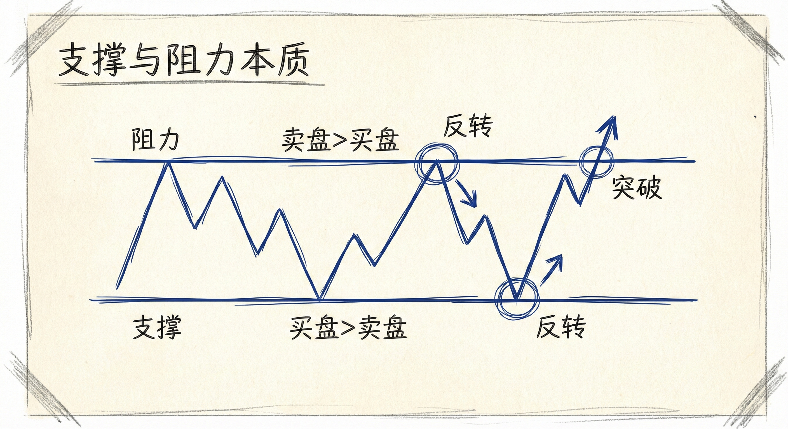
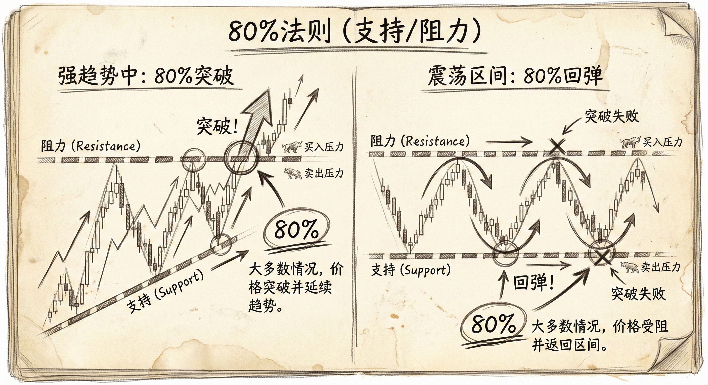
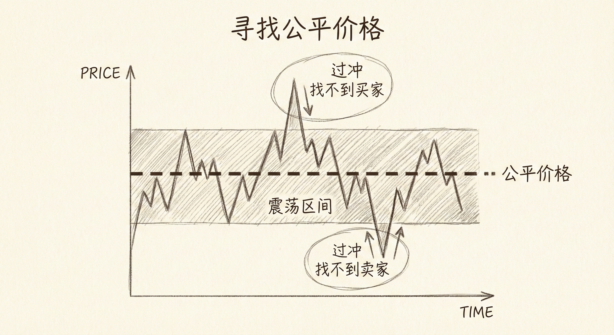
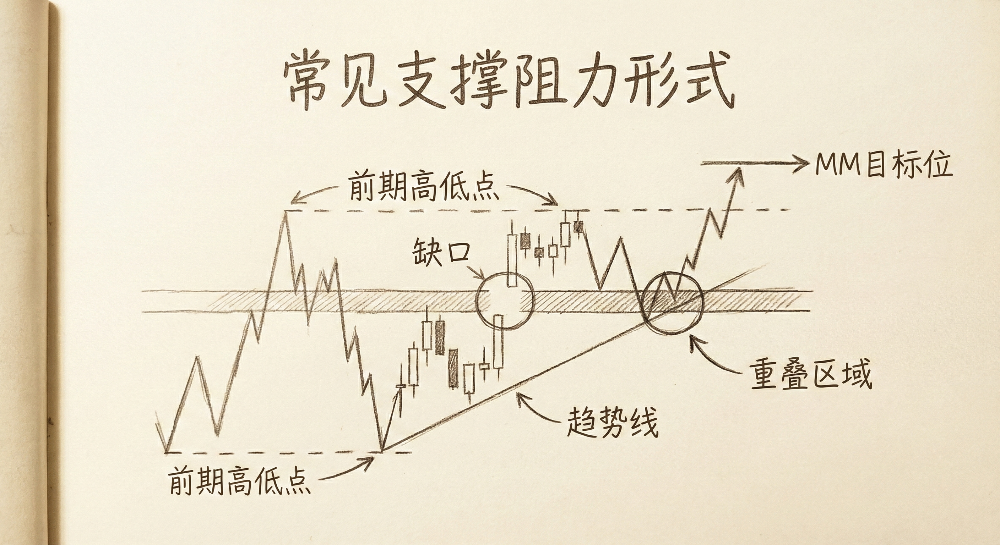

# 支撑与阻力基础（第一部分）

## 支撑与阻力的本质 (Nature of Support and Resistance)

### 定义与识别
-   **基本概念**：
    -   **支撑 (Support)**：低于当前价格的区域，买盘强于卖盘，阻止价格进一步下跌。交易者假设多头会在此处再次买入。
    -   **阻力 (Resistance)**：高于当前价格的区域，卖盘强于买盘，阻止价格进一步上涨。交易者假设空头会在此处再次卖出。
-   **转折点 (Turning Points)**：支撑和阻力位是市场做出决定的区域，价格在此处要么**反转**，要么**突破**。
-   **精确性**：由于计算机程序（算法交易）主导市场，支撑和阻力位通常非常精确（尤其在ES等流动性大的市场），目标价位往往在1个tick以内。

### 价格控制因素
-   **技术面主导**：价格受支撑和阻力的控制，而非新闻。
-   **新闻的角色**：新闻往往只是价格波动的催化剂或巧合。市场通过波动来测试支撑和阻力，寻找公平价格区间，这与具体的新闻事件无关。
-   **图表优先**：无论基本面如何，短期波动（几周到几个月）主要由技术面的支撑阻力测试驱动。

## 80% 法则 (The 80% Rule)

### 趋势中的表现
-   **强趋势具有惯性**：市场倾向于继续之前的行为。
-   **突破概率**：在强趋势中，80%的情况下，价格不会在支撑/阻力位停止，而是会**突破**并延续趋势。
-   **逆势操作风险**：在强下降趋势中，不要在前期低点（支撑）挂单买入，因为支撑很可能会失效；反之亦然。
-   **反转失败**：强趋势中的反转尝试通常会失败，并演变为旗形（如熊旗），随后趋势恢复。

### 震荡区间中的表现
-   **回归特性**：在震荡区间中，80%的突破尝试会失败。
-   **逆势操作机会**：
    -   **高抛低吸**：交易者预期突破失败，因此在区间下沿买入（支撑有效），在区间上沿卖出（阻力有效）。
    -   **剥头皮**：由于预期波动幅度有限，交易者倾向于赚快钱（Scalping）。

## 市场机制：寻找公平价格 (Finding Fair Price)

### 价格探索过程
-   **双向拍卖**：市场存在的目的是为了最大化交易量。买家需要卖家，卖家需要买家。
-   **不断变化**：公平价格是动态的，随着新变量进入市场而不断变化。
-   **过冲 (Overshoot)**：市场通常需要“走过头”才能确定边界。
    -   必须跌得过低，找不到卖家，才能确定价格太低（支撑）。
    -   必须涨得过高，找不到买家，才能确定价格太高（阻力）。
-   **震荡区间**：大多数时候市场处于震荡区间，这是买卖双方都认可的“公平价格区域”。

## 常见的支撑与阻力形式

### 结构性位点
-   **前期高点与低点**：最基础的支撑/阻力位。
-   **趋势线与通道线**：连接高点或低点形成的动态边界。
-   **缺口 (Gaps)**：尤其是测量型缺口。
-   **测量目标位 (Measured Moves - MM)**：
    -   基于突破幅度或缺口进行的等距测算。
    -   常作为止盈点或反转点。
    -   计算机算法常利用MM目标位进行精确的入场和离场。

### 形态暗示
-   **楔形 (Wedge)**：楔形底/顶通常预示着反转。例如，下降楔形通道有75%的概率向上突破。
-   **双顶/双底**：经典的测试失败形态。

## 交易策略启示

### 时间周期原则
-   **各司其职**：根据你交易的图表周期设置止损和目标。
    -   如果你交易月线图，就忽略5分钟图的波动，按月线设止损。
    -   如果你做日内交易（5分钟图），就忽略月线图的信号。
-   **大周期影响**：小周期图表上的大波动或突然反转，往往是由大周期的支撑/阻力位引起的。

### 实际操作
-   **寻找重叠 (Confluence)**：当多个支撑/阻力因素（如趋势线、MM目标位、前期高点）重合在同一价格时，该位置的有效性更强。
-   **止盈与入场**：利用支撑阻力位作为止盈点（顺势交易者离场）或逆势入场点（如果市场结构支持）。

## 总结原则
-   **价格由支撑阻力控制**：忽略新闻噪音，专注于图表上的关键位。
-   **区分环境**：在强趋势中预期支撑/阻力被突破，在震荡区间中预期支撑/阻力有效（80%法则）。
-   **数学精确性**：利用测量目标位（MM）和几何结构寻找精确的转折点。
