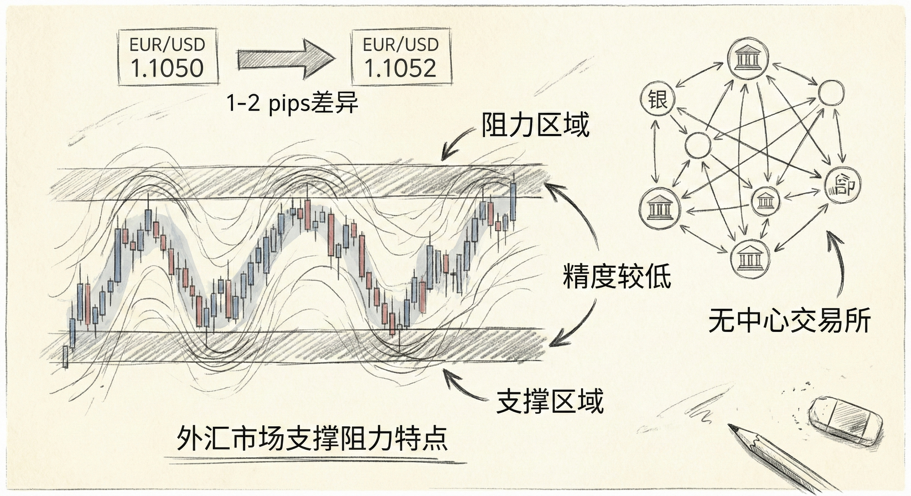
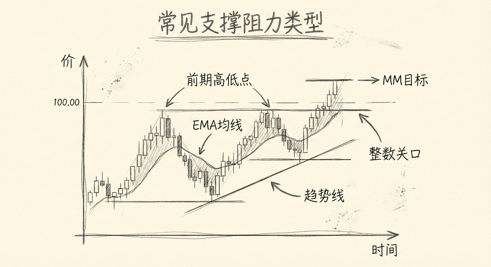
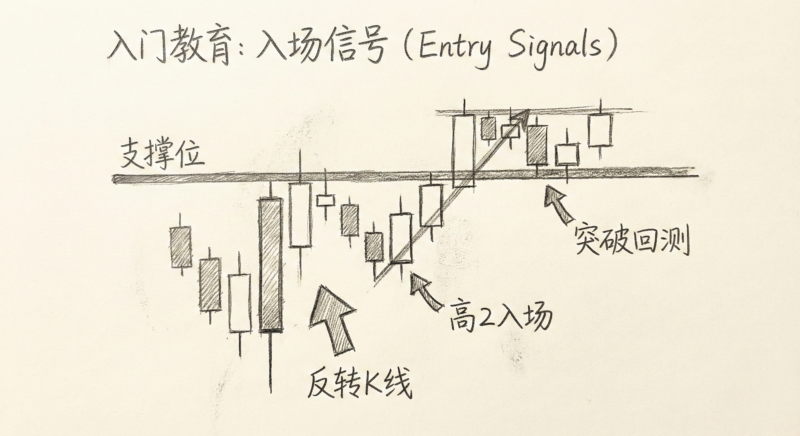
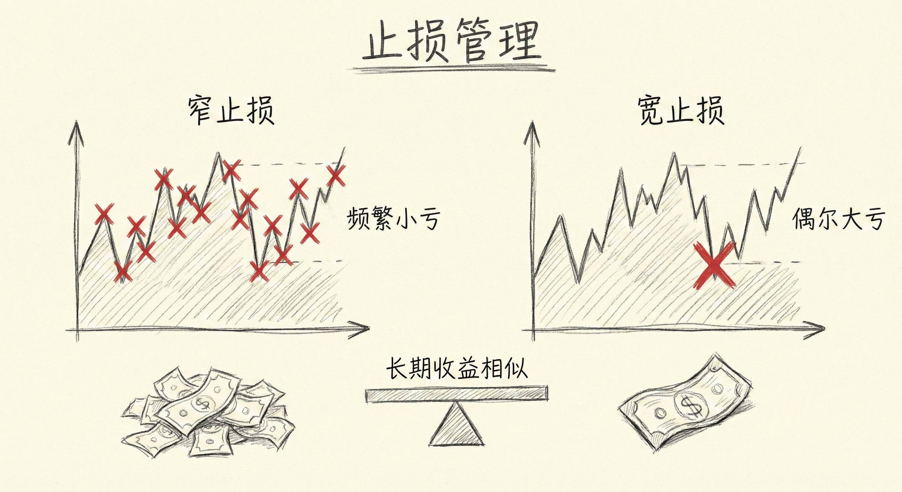

# 支撑与阻力（第二部分）

## 外汇市场的特殊性 (Uniqueness of Forex Support/Resistance)

### 定义与精度
-   **无中心交易所**：外汇市场没有单一的中心交易所来统计所有交易，不同银行和平台（如IB, TradeStation）的价格数据略有差异。
-   **精度较低**：相比股指期货或股票，外汇市场的支撑和阻力位不那么精确。
-   **套利机制**：机构的高频交易套利使得各平台价格趋于一致（通常相差1-2个pips），但极少完全相同。
-   **无“最后一笔”价格**：由于分散交易，不存在全市场统一的收盘价。

### 图表与数据
-   **图表类型无关性**：无论是使用基于时间的K线图（如5分钟图）还是基于成交量的K线图（如200 ticks图），价格行为的结构和逻辑是一致的。
-   **未来趋势**：随着算法交易和基金参与度的增加，外汇市场的数学模型将变得更加重要，支撑阻力的精度可能会随时间提高。

## 常见的支撑与阻力类型 (Common Types)

### 主要形式
-   **移动平均线 (EMA)**：价格常在均线处获得支撑或阻力，尤其在趋势中。
-   **趋势线与通道**：连接高点或低点形成的线。由于外汇的不精确性，价格常短暂穿越趋势线。
-   **前期高低点**：前期的高点被突破后常转化为支撑（突破回测），前期低点跌破后转化为阻力。
-   **测量目标位 (Measured Moves)**：基于震荡区间高度或趋势段幅度的翻倍目标，常作为潜在的反转点或止盈点。
-   **整数关口**：大的整数位（如1.1400）常具有心理支撑/阻力作用。

### 识别原则
-   **背景至上**：哪种支撑/阻力最有效完全取决于当前的市场背景。
-   **动态调整**：交易者需要不断重画趋势线，寻找市场当前最尊重、最有效的线条（Best Fit）。
-   **不完美的形态**：在外汇中，双顶/双底、楔形等形态很少是教科书般完美的，允许有一定的价格穿越或未触及。

## 交易策略与执行 (Trading Strategies)

### 入场信号
-   **寻找反转K线**：在支撑/阻力位寻找强有力的反转K线（如收盘在最低的阴线做空，收盘在最高的阳线做多）。
-   **二次尝试 (H2/L2)**：高2 (H2) 和 低2 (L2) 是高胜率的顺势入场点，尤其是在形态（如双底/双顶）配合下。
-   **突破回测 (Breakout Tests)**：密切关注突破后的回调测试。例如，多头突破后回调测试突破点并反转向上，是买入良机。

### 止损管理
-   **宽止损 vs 窄止损**：
    -   **窄止损**：亏损频率高，但单次亏损金额小。
    -   **宽止损**：亏损频率低，但单次亏损金额大（如放在更远的波段高低点外）。
    -   **结论**：只要止损位置逻辑合理，长期来看两者的总利润相差不大。

## 总结原则
-   **接受不精确性**：在外汇交易中，不要追求精确的点位，而应关注区域和整体结构。
-   **灵活画线**：如果一条趋势线不再有效，删除它并寻找新的连接点。
-   **结构通用性**：无论何种图表周期或类型，支撑阻力的基本原理和价格行为结构是不变的。
