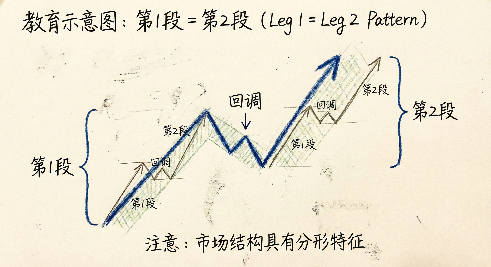
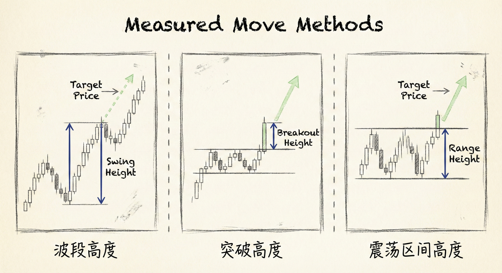
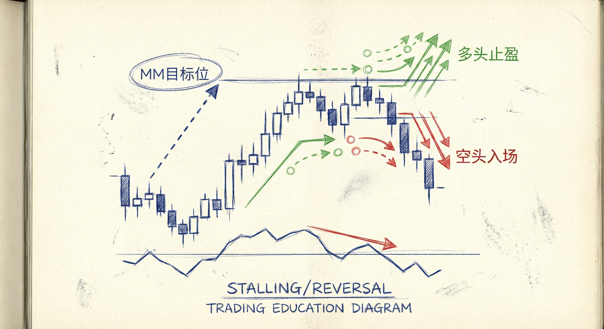
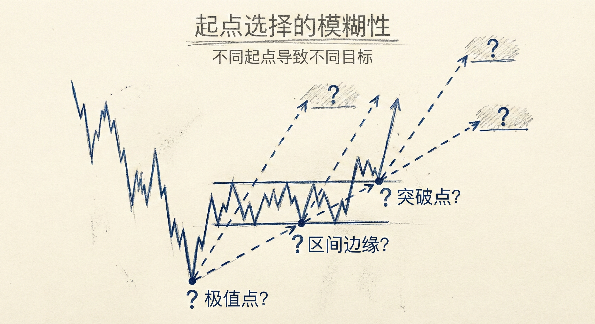

# 移动测量目标位（第一部分）

## 第1段 = 第2段 (Leg 1 = Leg 2)

### 定义与基本形态
-   **概念**：市场移动了一段距离（第1段），经历暂停或回调后，再次移动大致相同的距离（第2段）。
-   **基本结构**：
    -   **第1段 (Leg 1)**：初始的趋势运动或突破。
    -   **回调 (Pullback)**：中间的暂停、震荡或反向运动。
    -   **第2段 (Leg 2)**：趋势恢复，其高度通常与第1段相等。
-   **嵌套结构**：
    -   **分形性质**：大的第1段=第2段结构中，往往包含更小周期的第1段=第2段结构。
    -   **多重目标**：小结构的完成可能汇聚成大结构的目标位。

### 常见的测量方式
-   **基于波段高度**：测量第1段趋势的高度，从回调结束处（或第2段突破处）向上/向下投射等距离。
-   **基于突破高度 (Gap)**：
    -   **测量方法**：从突破K线（或突破序列）的开盘价到收盘价的高度，向上翻一倍。
    -   **应用场景**：在趋势早期的强势突破中，这常是第一止盈目标。
-   **基于震荡区间**：如果第1段是震荡区间后的突破，目标位常基于震荡区间的高度进行测量。

## 目标位的市场行为

### 交易者心理与操作
-   **止盈与反向交易**：
    -   **顺势交易者**：在达到 MM (Measured Move) 目标位时获利了结（多头卖出，空头买入）。
    -   **逆势交易者**：激进的交易者会在目标位尝试反向剥头皮（Scalping）。
-   **阻力/支撑作用**：由于上述买卖力量的汇聚，MM 目标位通常会成为市场的阻力（上涨中）或支撑（下跌中），导致价格横盘或反转。

### 趋势强度判断
-   **急速变通道 (Spike and Channel)**：第1段=第2段常以"急速（第1段）- 回调 - 通道（第2段）"的形式出现。
-   **忽略目标位**：
    -   如果市场强势突破了一个明显的 MM 目标位而没有停顿，表明趋势极强。
    -   **应对**：交易者应寻找更远的下一个目标位（基于更大的结构或不同的起点）。

## 确定起涨/起跌点 (Identifying Start Points)

### 模糊性与多解性
-   **起点选择难题**：第1段的起点是波段的最低/最高点？还是突破形态的起点？还是震荡区间的边缘？
-   **算法差异**：不同的计算机程序（Algos）会基于不同的算法选择不同的起点（如极值点 vs 突破点）。
-   **第2段起点**：同样存在是从回调的极值点算起，还是从突破回调结构的点算起的问题。

### 应对策略
-   **优先近端目标**：首先参考最近、最明显的结构（如突破点）作为起点计算目标。
-   **观察市场反应**：
    -   如果价格在某个计算出的目标位停顿或反转，说明市场认可该算法。
    -   如果价格直接穿越，则调整参考点，寻找基于更低起点（或更大结构）计算出的更远目标。
-   **汇聚区域**：当不同的测量方法（如波段高度 vs 突破高度）指向同一个价格区域时，该阻力/支撑更为有效。

## 总结原则
-   **寻找对称性**：市场倾向于以对称的方式运动，第1段=第2段是最基础的测量目标。
-   **灵活调整**：没有绝对正确的唯一起点，需根据价格对潜在目标位的实际反应来验证和调整。
-   **止盈参考**：将 MM 目标位作为顺势仓位的合理止盈点，或逆势剥头皮的参考点，但需警惕强趋势对阻力的突破。
