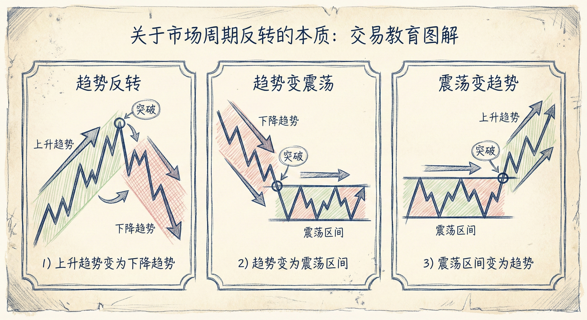
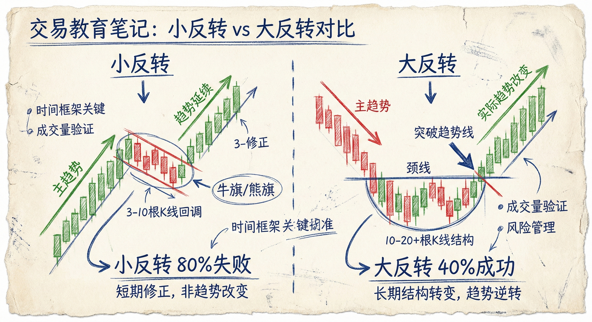
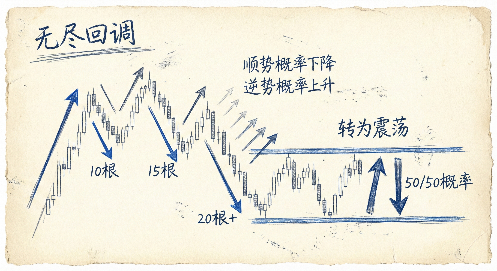
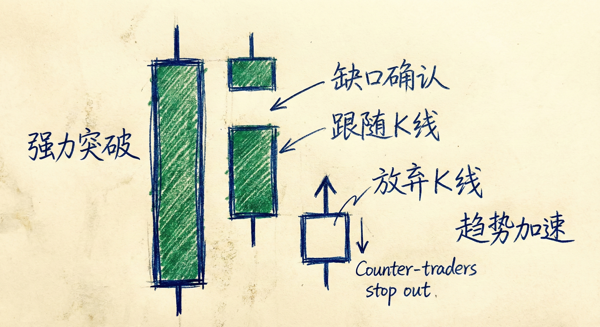

# 反转的定义与分类 (Reversals: Definition and Classification)

## 反转的本质 (Nature of Reversals)

### 定义与识别
-   **市场周期变化**：反转是指市场周期的改变。不仅指上涨趋势变为下降趋势（或反之），也包括趋势变为震荡区间，或震荡区间变为趋势。
-   **始于突破**：几乎所有的反转都始于某种形式的突破（Breakout）。
    -   **强弱不一**：突破可能很微弱，也可能是一根强力的大趋势K线。
    -   **分形特征**：任何价格方向的改变本质上都是反转。哪怕是1个tick的波动或K线的影线，在更小的时间周期（如1 tick图）上也是一次完整的反转。

### 市场逻辑
-   **不存在"噪音"**：阿尔·布鲁克斯强调市场中没有随机的"噪音"。
    -   **逻辑驱动**：每一个微小的波动都是由计算机算法基于逻辑交易产生的。
    -   **忽略与否**：交易者口中的"噪音"实际上是指**小反转**，因为波幅太小而被波段交易者忽略，但对剥头皮交易者仍有意义。

## 小反转 vs 大反转 (Minor vs. Major Reversals)

### 小反转 (Minor Reversals)
-   **结果**：通常导致**震荡区间**或**旗形**（如牛旗、熊旗），随后原趋势大概率恢复。
-   **特征**：
    -   持续时间短（通常3-10根K线）。
    -   通道狭窄，反向动能不足。
-   **交易含义**：在强趋势中，应将反向运动视为小反转，预期其会失败并成为顺势入场的旗形。

### 大反转 (Major Reversals)
-   **结果**：导致**相反方向的趋势**（Trend Reversal）。
-   **特征**：
    -   **持续时间长**：通常需要10根甚至20根以上的K线。
    -   **结构破坏**：强力突破原有的趋势线或通道。
    -   **形态验证**：常伴随低点抬高（上涨反转）或高点降低（下跌反转）的测试。
-   **概率**：当出现大反转结构时，成功反转为新趋势的概率约为**40%**，而60%的概率是进入震荡或恢复原趋势。

## 关键交易形态与策略

### 无尽的回调 (Endless Pullbacks)
-   **定义**：原本是趋势中的回调，但持续时间过长（达到或超过20根K线）。
-   **概率质变**：
    -   **50/50 概率**：随着K线数量增加，顺势突破的概率下降，逆势反转的概率上升，最终多空双方概率趋近于50%，市场实质上已转变为震荡区间。
    -   **双向突破**：此时多头突破和空头突破的可能性变得相同。

### 突破与跟随 (Breakout & Follow-through)
-   **确认反转**：单根K线有时足以构成反转（如巨大的吞没形态），但通常需要**跟随K线**确认。
    -   **强力突破**：大实体K线，收盘价接近极值。
    -   **良好跟随**：突破后的下一根K线继续顺势收盘，且开盘价有跳空缺口（显示急切的市价单）。
-   **放弃K线 (Give-up Bar)**：
    -   **心理博弈**：当逆势交易者意识到大势已去（如熊旗被向上突破），他们会止损或反手，导致价格加速。
    -   **预期目标**：出现放弃K线后，通常预示着至少还有第二段推动浪（Leg 2）或达到测量目标位（Measured Move）。

### 总结原则
-   **区分大小**：交易的核心在于区分当前是小反转（做顺势旗形）还是大反转（准备逆势交易）。
-   **结构为王**：大反转需要足够的时间和K线数量来构建结构。
-   **顺势思维**：在看到强力的大反转证据之前，假设所有的反向运动都只是小反转。
