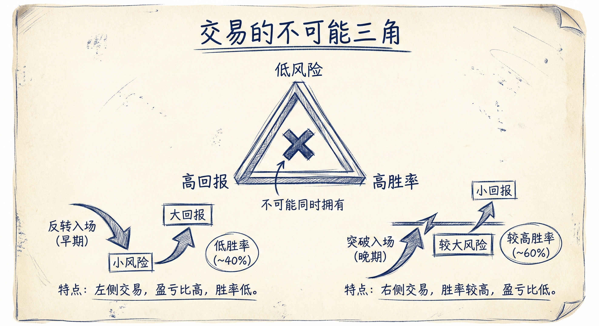
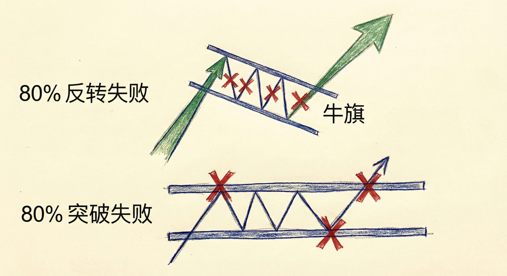
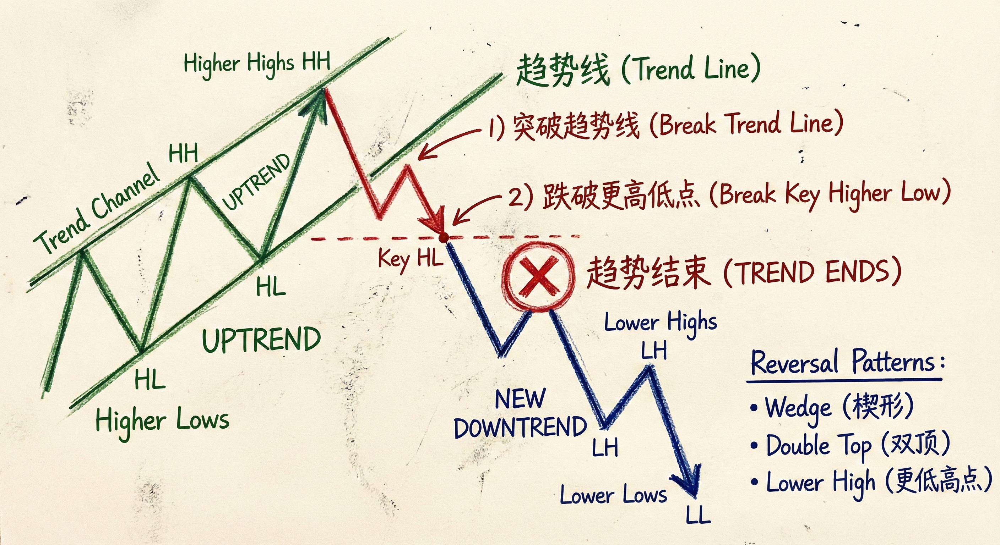
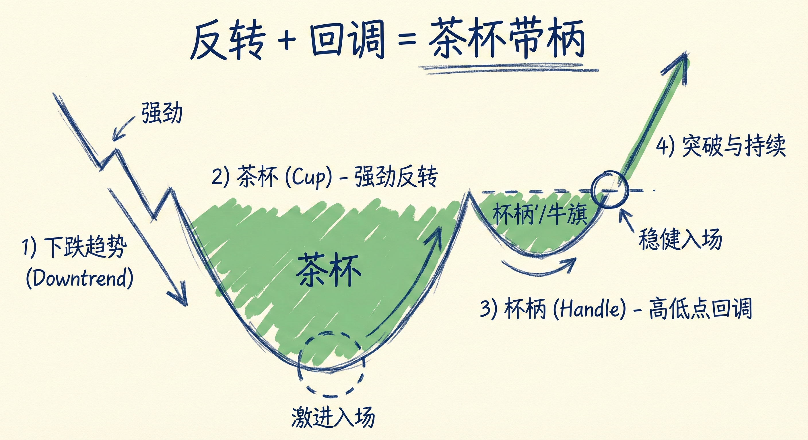

# 反转交易进阶 (Reversals Part 2)

## 反转交易的性质与权衡 (Nature of Reversals)

### 定义与特征
-   **概念**：反转是进入新趋势的最早机会（例如在上涨趋势底部买入，或下降趋势顶部做空）。
-   **不可能三角**：不存在低风险、高回报且高胜率的完美交易。
    -   **反转入场（早）**：风险小（止损近），回报大（捕捉整个趋势），但**胜率低**（约40%）。
    -   **突破入场（晚）**：胜率高（约60%或更高），但**风险大**（止损远），回报相对较小。
-   **数学期望**：反转交易虽然胜率低，但极佳的盈亏比（Reward/Risk）弥补了概率的劣势，使其成为正期望值的交易。

### 市场惯性与 80% 法则
-   **惯性原理**：趋势倾向于延续。强上涨趋势往往会无视阻力，强下降趋势往往会无视支撑。
-   **80% 法则**：
    -   **趋势中**：80% 的反转尝试会失败，并演变为原趋势的旗形（回调）。
    -   **震荡区间中**：80% 的突破尝试会失败。
-   **逆势交易警示**：在强趋势中，逆势反转通常只能做剥头皮（Scalping），因为大部分反转会失败。

## 趋势的结束与确认

### 趋势反转的条件
-   **打破通道**：价格必须突破当前的趋势线（通道线）。
-   **打破关键点位**：
    -   **上涨趋势结束**：需跌破前期重要的**更高低点 (Higher Low)**。
    -   **下降趋势结束**：需突破前期重要的**更低高点 (Lower High)**。
-   **状态转换**：一旦关键点位被突破，市场转为震荡区间或反转趋势，原趋势不再有效。

### 常见反转形态
-   **楔形 (Wedge)**：包含3次推动的形态（楔形顶/楔形底），通常伴随超买/超卖。
-   **双顶/双底 (Double Top/Bottom)**：对前高或前低的测试与拒绝。
-   **高点降低/低点抬高的大反转**：即头肩顶/头肩底形态。

## 茶杯带柄形态 (Cup and Handle)

### 结构解析
-   **定义**：一种经典的反转结构，本质是“大反转 + 回调”。
    -   **茶杯 (Cup)**：市场发生的强势反转运动。
    -   **杯柄 (Handle)**：反转后的回调（牛旗或熊旗）。
-   **分形本质**：
    -   所有周期都存在此结构。大周期的“茶杯带柄”在小周期上就是一个完整的趋势反转加回调过程。
    -   **做多**：下降趋势 -> 强势上涨（杯） -> 低点抬高的回调（柄/牛旗） -> 趋势恢复。
    -   **做空**：上涨趋势 -> 强势下跌（倒杯） -> 高点降低的反弹（柄/熊旗） -> 趋势恢复。

### 交易含义
-   **入场点选择**：
    1.  **激进**：在"茶杯"底部（反转点）入场，风险小但胜率低。
    2.  **稳健**：在"杯柄"（回调/高2/低2）形成并突破时入场，确认趋势反转，胜率较高。

## 总结原则
-   **接受不确定性**：反转交易胜率通常较低，必须依赖高盈亏比获利。
-   **尊重趋势惯性**：不要在强趋势中过早押注反转，等待明确的结构破坏（趋势线+关键点位）。
-   **理解分形结构**：识别“茶杯带柄”即为“反转+回调”，利用回调（杯柄）作为高概率的顺势入场点。
