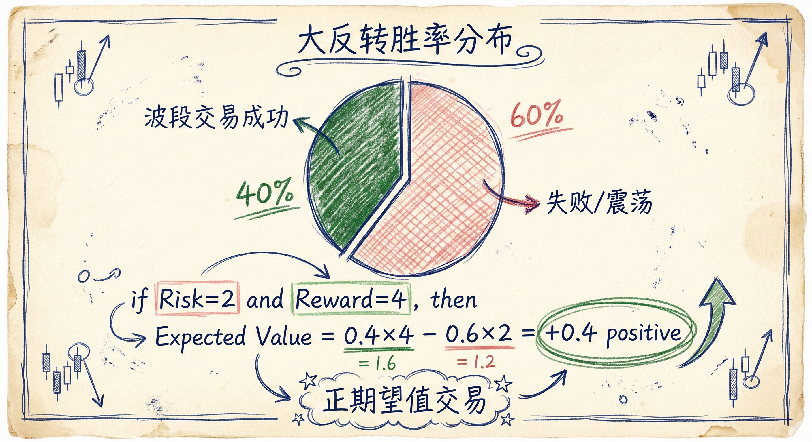
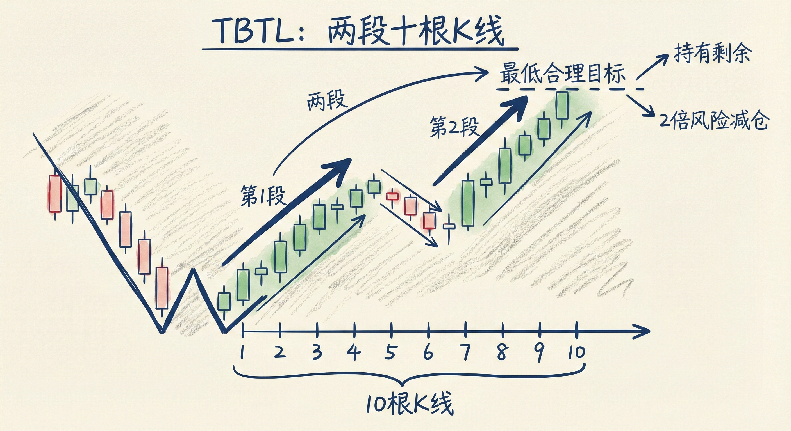
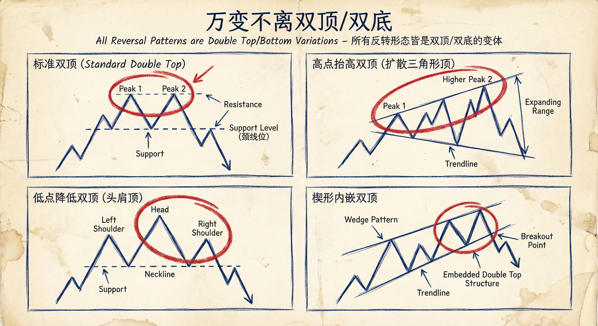
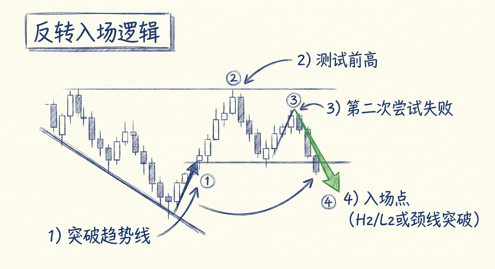

# 反转交易（第四部分）：大反转的概率与结构

## 大反转的胜率与数学期望 (Probability & Expectation)

### 胜率分布
-   **40% 概率**：大反转成功演变为波段交易或新趋势。
-   **60% 概率**：反转失败，演变为震荡区间或原趋势延续。
    -   **结果**：在这60%的情况中，交易通常以小赚或小亏结束，盈亏基本相互抵消。

### 交易含义
-   **盈亏比要求**：由于胜率仅为40%，回报（Reward）必须至少是风险（Risk）的 **2倍**。
    -   **数学期望**：假设10笔交易，4笔盈利（每笔4点），6笔亏损（每笔2点），净利润为正（16 - 12 = 4点）。
    -   **实际情况**：失败的交易往往不会触及满额止损，而是小赚小亏；成功的交易往往能带来远超2倍风险的利润（如外汇中赚取90 pips对20 pips风险）。
-   **策略核心**：依靠40%的高盈亏比交易来弥补60%的磨损，并实现最终盈利。

## 最低获利目标：两段10K (TBTL)

### 定义与识别
-   **TBTL (Two Legs, Ten Bars)**：所有大反转或大幅移动的**最低**合理目标。
    -   **两段 (Two Legs)**：价格至少出现两段向反转方向的推进（如：第一段上涨 -> 回调 -> 第二段上涨）。
    -   **10根K线 (Ten Bars)**：反转后的趋势运动至少持续10根K线。
-   **止盈策略**：
    -   在达到2倍初始风险处减仓（止盈一半）。
    -   剩余仓位持有至趋势明确结束或反向信号出现。

### 多周期分析原则
-   **寻找最高周期**：观察反转结构存在的**最大时间周期**。
-   **目标设定**：
    -   如果在1分钟图上看到反转，但该结构在5分钟或60分钟图上同样清晰可见，应以**大周期**（如60分钟）的“两段10K”为目标。
    -   **优势**：大周期的两段10K意味着更大的利润空间（例如赚取100 pips而非15 pips）。

## 反转的结构本质 (Structure Essence)

### 万变不离双顶/双底
-   **核心观点**：大多数反转结构（包括楔形、扩张三角形、头肩顶/底）本质上都包含**双顶 (Double Top)** 或 **双底 (Double Bottom)**。
    -   **原因**：反转通常涉及对前期极值（高点或低点）的测试。
-   **常见变体**：
    -   **高点抬高的大反转 (Higher High Major Reversal)**：通常是扩张三角形顶，本质是高点抬高的双顶。
    -   **高点降低的大反转 (Lower High Major Reversal)**：标准的双顶结构，常发生在趋势线被突破后的第二次测试。
    -   **楔形 (Wedge)**：包含三次推进，其中通常包含一个较小的双顶或双底结构。
    -   **末端旗形 (Final Flag)**：通常演变为双顶或双底。

### 结构识别与入场
-   **入场逻辑**：
    -   **趋势线突破**：首先需要看到原趋势通道线或趋势线被突破（如强力跌破EMA20）。
    -   **测试极值**：等待价格测试前期高点（做空）或低点（做多）。
    -   **第二入场点**：逆势交易者通常在第二次尝试恢复趋势失败后放弃，因此高2/低2（H2/L2）或双顶/双底的颈线突破是高胜率入场点。

## 总结原则
-   **接受胜率现实**：大反转只有40%的概率成为波段，必须追求高盈亏比（至少2:1）。
-   **坚持 TBTL 目标**：利用“两段10K”作为持仓的最低标准，避免过早离场。
-   **大周期视角**：在结构显现的最高时间周期上设定盈利目标，以获取最大利润。
-   **透视结构本质**：无论形态名称为何（楔形、头肩等），尝试将其识别为双顶或双底的变体，以把握测试与反转的逻辑。
