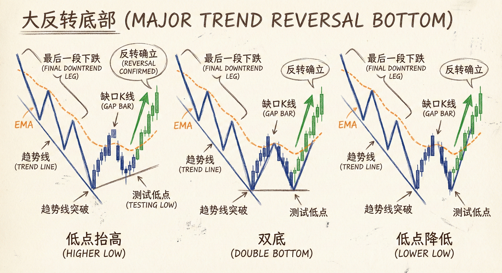
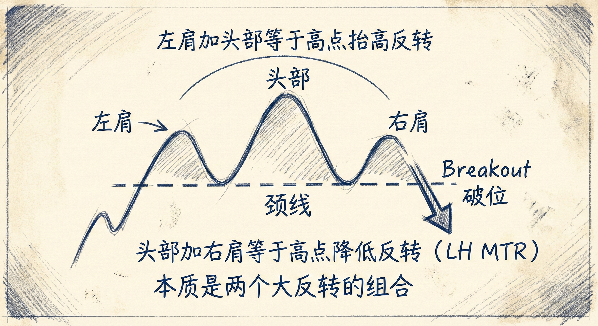
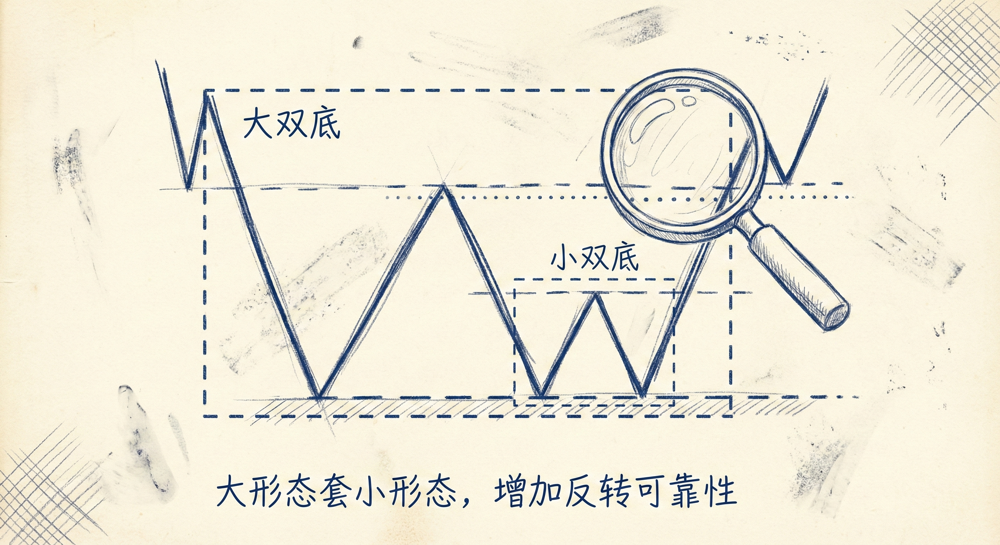
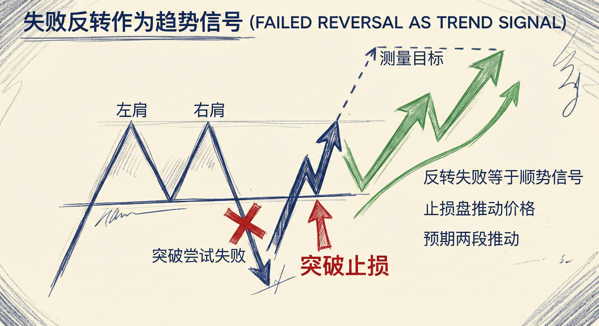

# 大反转（第四部分）

## 大反转底部 (Major Trend Reversal Bottoms)

### 识别与形成过程
-   **趋势线突破**：首先需要看到下降趋势线被突破，且突破表现强势（如5-10根K线反弹至均线）。
-   **均线缺口K线 (Gap Bar)**：
    -   **定义**：一根完全位于均线上方的K线（在下降趋势反转中）。
    -   **含义**：标志着多头力量足够强大，通常意味着随后的下跌是原趋势的最后一段（Final Flag）。
-   **趋势恢复与测试**：突破后，空头尝试恢复下降趋势，测试前期低点。
-   **形态分类**：
    -   **低点抬高的大反转 (Higher Low MTR)**：回调低点高于前期低点。
    -   **双底大反转 (Double Bottom MTR)**：回调低点与前期低点持平。
    -   **低点降低的大反转 (Lower Low MTR)**：回调低点低于前期低点（通常需要更强的验证）。

### 交易策略
-   **第2做多入场点**：在两根大阴线后的弱势反弹中不要急于买入，等待第2次尝试恢复趋势失败（即形成双底结构）。
-   **入场信号**：寻找强阳线或突破K线作为信号K线。
-   **胜率与盈亏比**：
    -   **概率**：大反转只有 **40%** 的概率发展为波段交易或新趋势。
    -   **结果分布**：60%的情况是小赚或小亏（互相抵消），盈利主要依靠那40%的波段交易。
    -   **目标**：最低目标是两段上涨（TBTL）和10根K线。

## 头肩形态 (Head and Shoulders)

### 结构本质
-   **头肩顶 = 高点降低的大反转 (LH MTR)**：
    -   左肩+头：通常构成高点抬高的大反转（趋势延续）。
    -   头+右肩：构成高点降低的大反转（趋势反转）。
-   **头肩底 = 低点抬高的大反转 (HL MTR)**：
    -   左肩+头：通常构成低点降低的大反转。
    -   头+右肩：构成低点抬高的大反转。
-   **嵌套结构 (Nested Patterns)**：大的头肩形态中，左肩、头或右肩内部常包含更小周期的头肩或双顶/底结构。

### 窄震荡区间中的形态
-   **特征**：趋势后期出现的持续20-30根K线的窄震荡区间。
-   **交易机会**：在窄区间内寻找双顶（顶部反转）或双底（底部反转）结构。
-   **警示**：强趋势后的窄区间往往演变为大反转模式。

## 失败的反转 (Failed Reversals)

### 识别与应对
-   **失败定义**：反转形态形成后，价格突破了止损位（如头肩顶的右肩高点被突破）。
-   **顺势交易机会**：
    -   **止损盘推动**：逆势交易者（反转尝试者）止损离场，顺势交易者入场，双重力量推动价格延续原趋势。
    -   **预期目标**：一旦反转失败，预期原趋势将至少延续两段（Two Legs）或达到测量目标位（Measured Move）。
-   **测量目标位 (MM)**：通常基于失败形态的高度或前一个波段的高度进行测算。

### 重置反转过程
-   **重新等待**：如果一次大反转尝试失败，不要立即再次尝试反转。
-   **流程重置**：必须等待新的趋势线被突破、均线被测试、新的缺口K线出现，才能再次寻找大反转机会。

## 总结原则
-   **均线缺口是关键信号**：它是趋势力量转移的重要标志，预示着随后的顺势运动可能是最后一段。
-   **理解概率游戏**：接受大反转60%的失败率，依靠40%成功率中的高盈亏比获利。
-   **形态的本质互通**：头肩顶/底本质上就是大反转形态，不要纠结于名称，而要关注高低点的变化结构。
-   **失败即信号**：反转形态的失败往往提供高胜率的顺势入场机会。
