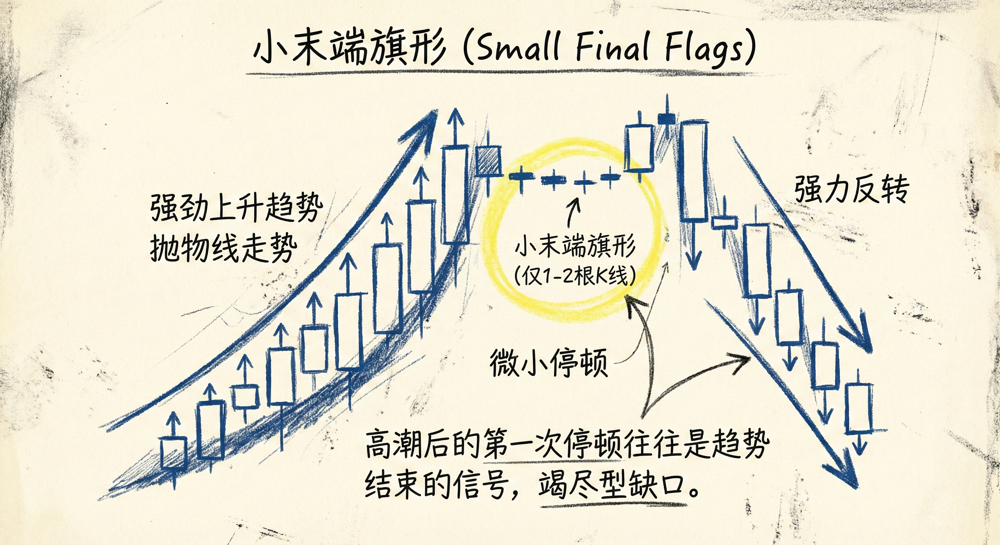
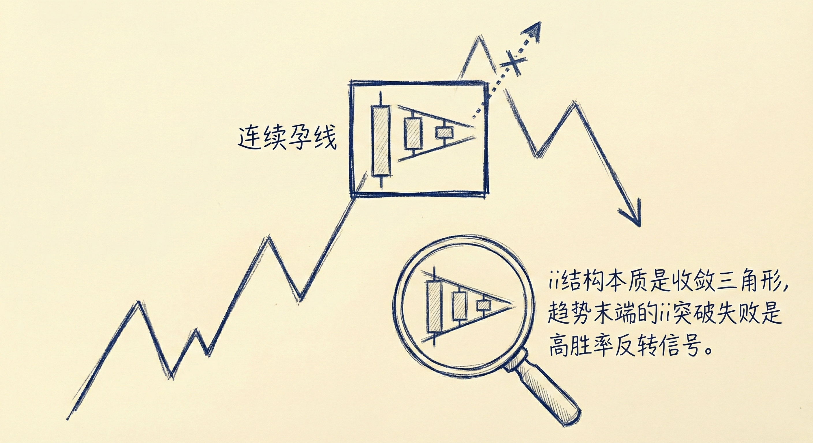
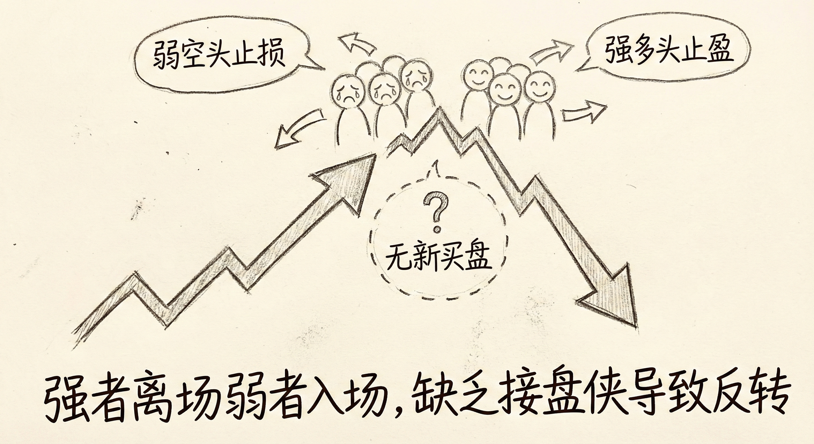
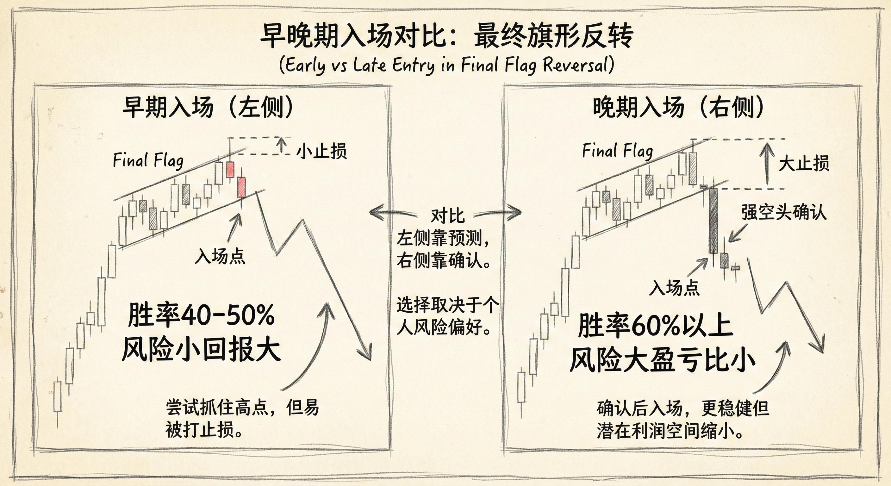

# 末端旗形（第二部分）

## 小的末端旗形 (Small Final Flags)

### 定义与识别
-   **极简结构**：末端旗形可以非常小，有时仅由 **1到2根K线** 组成（如单根十字星或小的双顶/双底）。
-   **发生背景**：通常出现在趋势的后期，即趋势已经持续了 **20根K线以上**，或者在一系列连续的高潮（Climax）之后。
-   **特征**：
    -   **形态微小**：在强劲趋势中，回调非常微弱，看似只是短暂的停顿。
    -   **诱多/诱空**：在上涨趋势末端，小的牛旗往往诱使多头最后一次入场，随后突破失败并反转；下跌趋势同理。

### 交易含义
-   **趋势衰竭信号**：当市场经历抛物线式上涨（或下跌）并出现连续的大阳线（或大阴线）后，随后的微小旗形往往是 **竭尽型缺口** 的前兆，而非测量型缺口。
-   **反转预期**：
    -   **小反转 vs 大反转**：窄通道中的反转通常先演变为震荡区间（小反转），但在极度高潮后，可能直接引发大反转（趋势反转）。
    -   **目标位**：反转的目标通常是最近一个高潮的起点，或者是末端旗形的底部。

## ii 结构作为末端旗形 (ii Final Flags)

### 定义与微观结构
-   **形态描述**：连续两根孕线（Inside-Inside），即第二根K线在第一根内部，第三根在第二根内部。
-   **微观本质**：在更小的时间周期上，ii 结构就是一个 **收敛三角形**。
-   **突破模式**：三角形代表突破模式，理论上向上或向下的概率各为50%。

### 交易逻辑
-   **趋势末端的陷阱**：
    -   在趋势后期（如大涨之后）出现的 ii 结构，虽然是牛旗，但往往是 **最后一个牛旗**。
    -   **失败的突破**：如果市场尝试顺势突破 ii 结构但失败（例如向上突破后迅速跌回），这是一个高胜率的反转信号。
-   **入场策略**：
    -   **逆势交易**：在趋势末端，利用 ii 结构的假突破进行逆势交易（如在多头突破失败并收阴时做空）。
    -   **止损设置**：止损通常设在信号K线的高点/低点之外，风险相对较小。

## 市场心理与筹码交换

### 强弱手的博弈
-   **弱势持有者**：在连续高潮（如连续大阳线）后，弱势空头（在上涨中）最终因亏损巨大而止损离场（买入），这往往构成了趋势的最后一段推升。
-   **强势交易者**：
    -   **获利了结**：聪明的顺势交易者（强多头）会利用最后的爆发（高潮）进行止盈，而不是加仓。
    -   **等待回调**：离场后，他们通常会等待 **10-20根K线** 或更深的结构（如TBTL）才会考虑重新入场。
-   **缺乏接盘侠**：当强多头止盈、弱空头止损后，市场缺乏新的买盘，导致价格在微小的末端旗形后迅速反转。

### 风险与回报 (Risk & Reward)
-   **早期入场（左侧/激进）**：
    -   **时机**：在末端旗形反转的第一时间（如高潮后的反转K线）入场。
    -   **特征**：**胜率较低**（约40-50%），但 **风险小、回报巨大**（止损窄，目标远）。
-   **晚期入场（右侧/稳健）**：
    -   **时机**：等待强有力的反转突破（如大阴线）确认后再入场。
    -   **特征**：**胜率高**（60%以上），但 **风险增加**（止损距离远），盈亏比相对降低。

## 总结原则
-   **关注背景**：K线数量少不是问题，关键在于它是否出现在 **趋势后期** 或 **连续高潮** 之后。
-   **警惕 ii 结构**：趋势末端的 ii 结构往往是反转的催化剂，尤其是当顺势突破失败时。
-   **理解高潮后的停顿**：极速行情的第一次停顿（小旗形）往往意味着动能的耗尽，而非中继，应随时准备应对反转。
