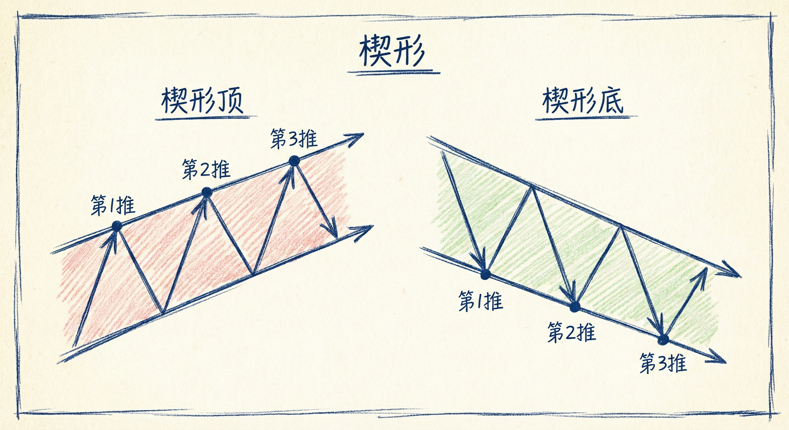
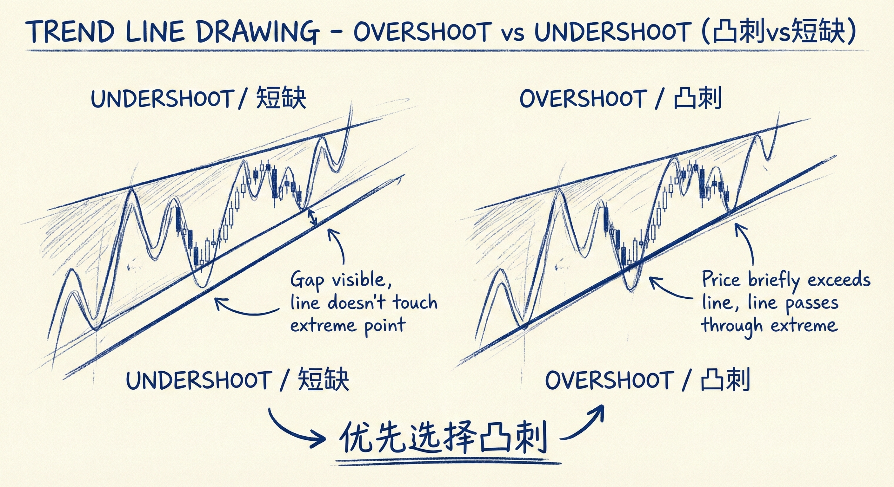
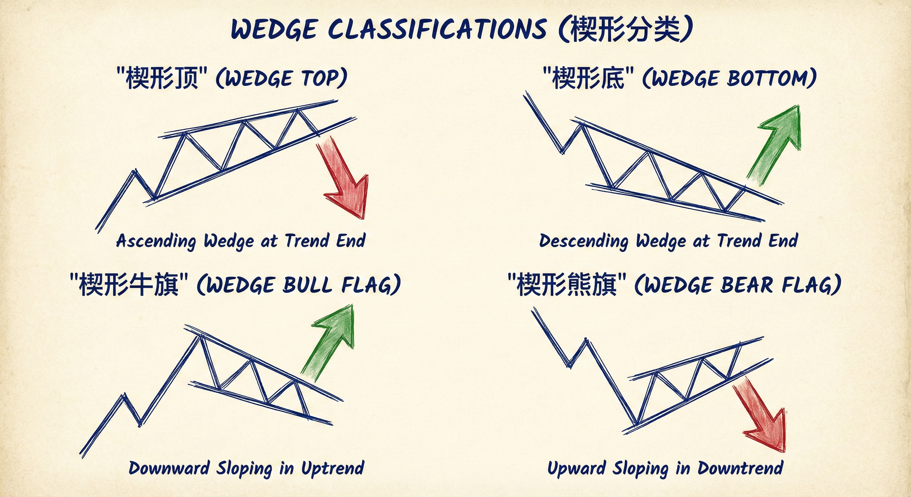
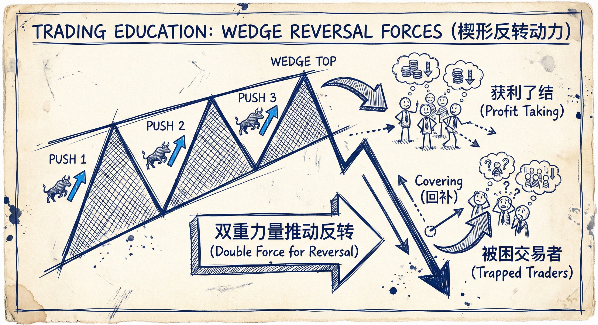

# 楔形反转（第一部分）

## 楔形的定义与识别 (Definition & Identification)

### 基本概念
-   **结构定义**：楔形是一个在一个方向上有 **3次或更多次推动** 的结构。总共包含5段（3段主趋势方向，2段回调）。
-   **形态特征**：
    -   **倾斜三角形**：本质上是一个向上或向下倾斜的收敛三角形。
    -   **收敛性**：趋势线和通道线通常逐渐靠拢（收敛）。
    -   **重叠**：K线之间通常存在重叠，表明震荡区间的特征。

### 楔形的分类
-   **反转形态**：如楔形顶（Wedge Top）或楔形底（Wedge Bottom），通常出现在趋势末端，预示大反转。
-   **中继形态（旗形）**：
    -   **楔形熊旗**：下降趋势中的小幅3推反弹（向上倾斜），预示下跌继续。
    -   **楔形牛旗**：上涨趋势中的小幅3推回调（向下倾斜），预示上涨继续。
    -   **概率**：上涨通道（楔形）有75%概率向下突破；下降通道（楔形）有75%概率向上突破。

## 绘制趋势线的原则 (Drawing Trend Lines)

### 画线的选择
-   **主观性**：趋势线并不完美，不同的交易者或算法可能选择不同的高低点（如1-2或1-3）来画线。
-   **凸刺 vs. 短缺 (Overshoot vs. Undershoot)**：
    -   **短缺**：线条没有触及某个极值点（留有缝隙）。
    -   **凸刺**：线条穿过某个极值点（价格短暂超出线条）。
    -   **选择原则**：在两者之间，**优先选择有“凸刺”的线**。
    -   **原因**：凸刺更能突出市场的极端行为（过冲）和潜在的陷阱，有助于更好地理解市场正在做什么。

### 识别推动 (Counting Pushes)
-   **灵活性**：数浪（1-2-3推）有多种方式，可以是明显的波段，也可以是窄通道中的微小尝试。
-   **核心逻辑**：关键不在于画线的完美，而在于识别市场 **连续3次尝试做某事（如突破）但失败** 的行为模式。

## 市场心理与机制 (Market Psychology & Mechanics)

### 形成原因
-   **高潮模式**：楔形通常由一系列买入/卖出高潮组成。
-   **FOMO (害怕错过)**：趋势末端的楔形往往由FOMO情绪驱动，交易者因动能而非基本面入场，导致交易拥挤。
-   **痛苦交易 (Pain Trade)**：低概率事件持续发生（如弱势通道不断延伸），让逆势交易者遭受痛苦并止损，直到最后一次反转。

### 反转动力
-   **双重力量**：
    -   **获利了结**：顺势交易者在第3推后意识到动能衰竭，开始离场。
    -   **被困交易者**：逆势交易者（被困在场外想入场，或被困在场内想解套）在回调时积极行动，推动反转。

## 交易含义与目标 (Trading Implications & Targets)

### 信号与确认
-   **嵌套结构**：大楔形内部包含小楔形（嵌套），反转概率更高。
-   **入场信号**：寻找第3推之后的强力反转K线（如十字星或反向趋势K线）。

### 获利目标
-   **最小目标**：通常至少有 **两段式回调 (Two Legs)** 和 **10根K线 (Ten Bars)** 的持续时间。
-   **终极目标**：测试楔形通道的 **起点**。
-   **预期管理**：如果楔形作为旗形失败（反向突破），则演变为反转；如果作为反转形态成功，则预期至少两段修正。
