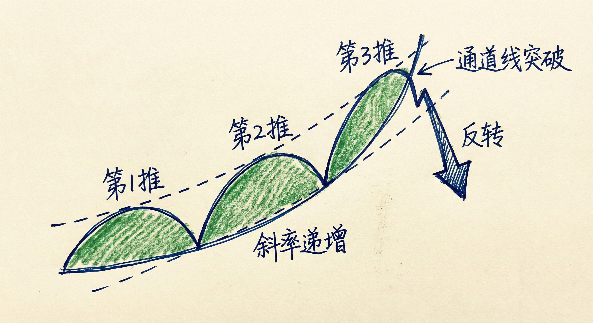
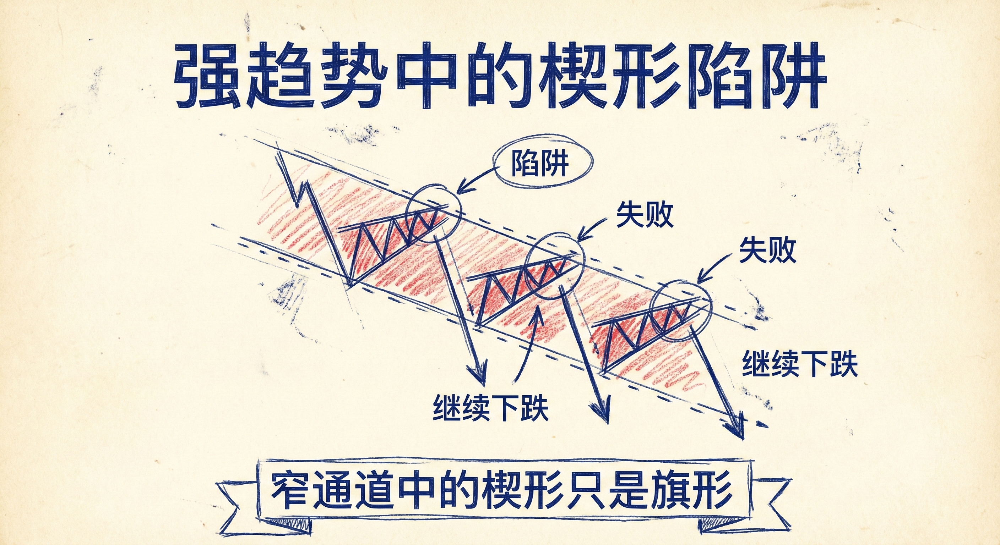

# 楔形（第四部分）：抛物线楔形与强趋势陷阱

## 抛物线楔形 (Parabolic Wedges)

### 定义与识别
-   **概念**：一种斜率不断增加（越来越陡峭）的趋势结构，本质上是连续的抢购高潮（Buy Climax）或抛售高潮（Sell Climax）。
-   **特征**：
    -   **形态**：往往没有标准的楔形形状，表现为非常窄的通道，但具有清晰的 **3推 (3-Push)** 结构。
    -   **缺口**：波段之间通常没有重叠，回调极浅，显示极强的动能。
    -   **加速**：第3推通常会加速突破通道线，随后往往伴随反转。
    -   **嵌套**：大的抛物线楔形中可能包含小的嵌套楔形。

### 交易含义
-   **不可持续性**：抛物线运动代表市场走得太快、太远，是动能衰竭的信号。
-   **入场策略权衡**：
    -   **激进逆势**：在第3推高潮处直接逆势入场（如在阳线下方做空）。**特点**：止损近（风险小），盈亏比好，但胜率低。
    -   **保守确认**：等待强力的反向突破（如大阴线）及跟随K线（Follow-through）后再入场。**特点**：胜率高，但止损远，初始风险大。
-   **开盘反转**：如果抛物线楔形发生在交易时段的开盘（Open），反转的概率更高。

## 强趋势中的楔形陷阱 (Wedges in Strong Trends)

### 窄通道的本质
-   **现象**：在极强的趋势中（如窄通道或微通道），交易者会不断看到“楔形”形态。
-   **陷阱**：这些所谓的“楔形底/顶”在强趋势中通常只是**旗形 (Flags)**，而不是反转形态。
-   **缺乏反向压力**：如果下降趋势中没有连续的大阳线，或者上涨趋势中没有连续的大阴线，不要轻易尝试反转。

### 80% 法则
-   **规则**：在强趋势（窄通道）中，**80% 的反转尝试都会失败**，趋势将继续。
-   **交易策略**：
    -   **避免逆势**：不要在窄通道中寻找楔形反转机会，这通常是低胜率交易。
    -   **顺势而为**：将这些微小的反弹/回调视为顺势加仓的机会（如将下降趋势中的小反弹视为熊旗做空）。

## 概率原则与结构 (Probability & Structure)

### 75% / 25% 法则
-   **通道属性**：楔形本质上是通道。上涨楔形视为熊旗，下降楔形视为牛旗。
-   **突破概率**：
    -   **75% 概率**：向通道倾斜的**反方向**突破（即反转或演变为震荡区间）。
    -   **25% 概率**：向通道倾斜的**同方向**加速突破（即趋势延续或形成最后的高潮）。
-   **失败的突破**：如果那 25% 的加速突破尝试失败（如突破后迅速拉回），往往会导致大幅度的反转。

### 测量目标 (Measured Moves)
-   **目标位设定**：
    -   **缺口**：趋势中的缺口往往是测量型缺口。
    -   **结构高度**：双顶/双底或震荡区间的高度翻倍。
    -   **阻力位**：前期趋势的高点或低点是重要的止盈目标。

## 总结原则
-   **背景重于信号**：在极窄的通道中，即使出现完美的信号K线，也不要逆势交易；必须等待通道线被打破且有强力反向K线确认。
-   **识别高潮**：连续的阳线/阴线且收盘价在极值，往往是高潮而非趋势的开始，需警惕反转。
-   **耐心等待**：对于抛物线楔形，等待多头/空头放弃的迹象（如连续反向K线）再入场，能显著提高胜率。
