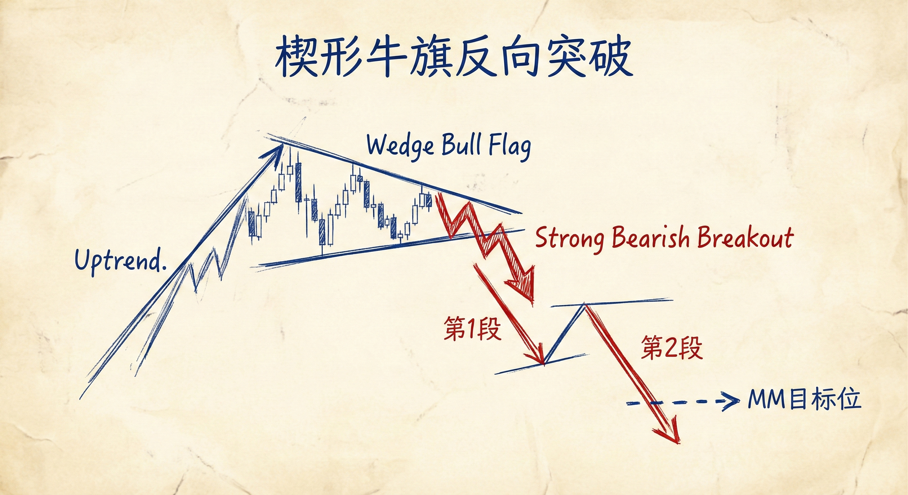
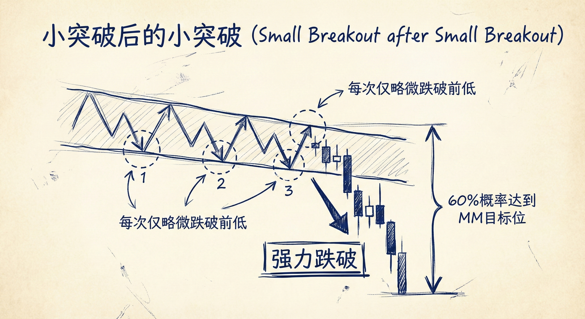
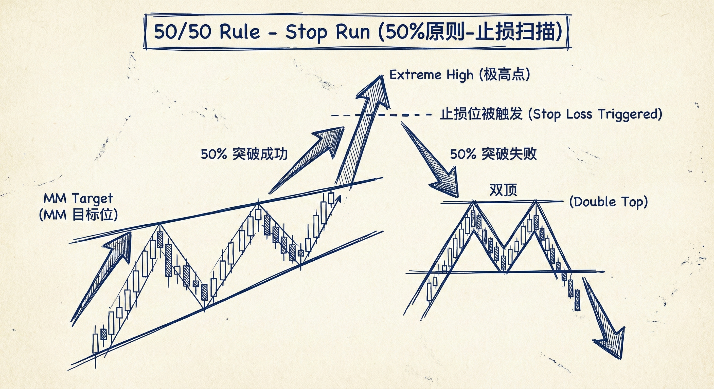
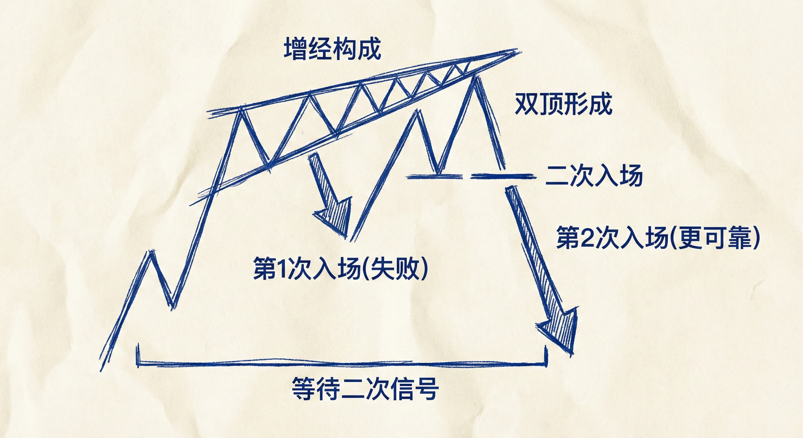

# 楔形（第五部分）

## 反转失败的楔形 (Failed Wedges)

### 楔形旗形的反向突破
-   **定义**：楔形通常作为持续形态（旗形），但有时会发生反向突破（例如楔形牛旗被向下突破，或楔形熊旗被向上突破）。
-   **特征与应对**：
    -   **意外性**：市场做出了小概率行为，通常意味着趋势加速。
    -   **强力突破**：如果突破K线强劲（大阴线/大阳线），预期会有**两段式**的运动（1-回调-2）。
    -   **测量目标 (MM)**：目标位通常基于楔形通道的高度（从楔形顶部到底部）。
    -   **止盈行为**：当价格到达 MM 目标位时，顺势方止盈，逆势方尝试反转，常导致反弹或震荡。

### 特殊形态：小突破后的小突破 (Small Breakout after Small Breakout)
-   **形态描述**：一种特殊的楔形牛旗，表现为近乎水平的震荡。
    -   3次向下的推动（1, 2, 3），但每次仅略微跌破前一次的低点。
    -   多头多次尝试恢复趋势失败。
-   **概率优势**：
    -   当这种“水平楔形”被强势向下跌破时，下跌至 MM 目标位的概率**增加至 60%**。
    -   这比普通楔形失败的概率更高，通常伴随两段下跌。

### 楔形顶/底的突破与止损 (Stop Runs)
-   **现象**：价格突破了楔形的极点（楔形顶的最高点或楔形底的最低点），触发了明显的止损单。
-   **50/50 概率原则**：
    -   当明显的止损位被触及后：
        -   **50% 概率**：突破成功，价格继续运行至 MM 目标位。
        -   **50% 概率**：突破失败，市场进行第二次反转尝试（形成双顶/双底）。
-   **交易含义**：
    -   **多头/空头陷阱**：突破楔形极点可能是假突破。
    -   **二次尝试**：如果突破失败，市场往往会形成**双顶**（针对楔形顶）或**双底**（针对楔形底），这是更可靠的入场点。
    -   **止损管理**：部分交易者会使用宽止损（如放在 MM 目标位之外）以应对 50% 的反转可能，并在反转确认时加仓。

## 总结原则
-   **关注 MM 目标位**：无论是楔形旗形失败还是极点突破，楔形高度翻倍（MM）是关键的止盈和反转观察点。
-   **两段式预期**：强力的反向突破通常带来两段式的趋势运动。
-   **等待二次信号**：在楔形极点被突破后，不要急于追单，留意 50% 的反转概率，寻找双顶/双底等二次入场结构。
