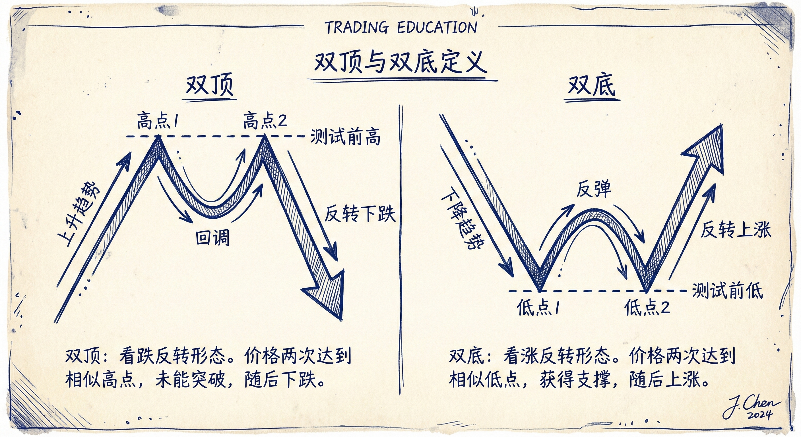
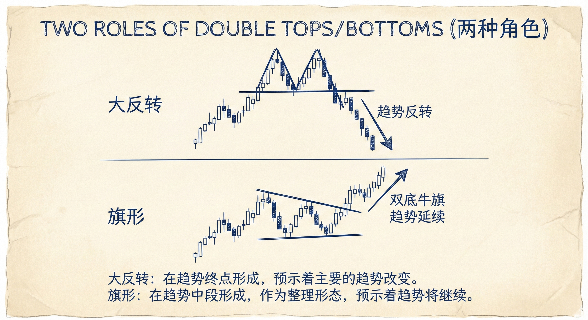
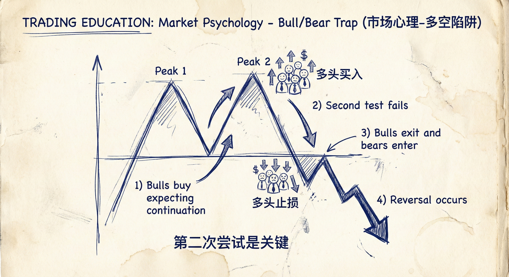
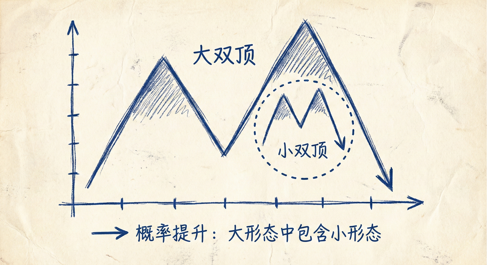

# 双顶与双底（第一部分）

## 定义与识别 (Definition & Identification)

### 概念与灵活性
-   **宽泛定义**：双顶/双底不必完美，两个高点或低点的高度不需要完全一致。
-   **本质**：是对前期高点或低点的**测试**。
    -   **双顶**：上涨 -> 回调 -> 再次上涨测试前高 -> 失败并反转。
    -   **双底**：下跌 -> 反弹 -> 再次下跌测试前低 -> 失败并反转。
-   **计算机算法**：不同的算法对形态的识别标准不同（如高点抬高或降低均可被视为双顶），交易者需保持灵活。

### 两种主要角色
1.  **大反转 (Major Reversal)**：
    -   发生在趋势末端，逆转原有趋势（如上涨趋势变为下降趋势）。
    -   通常结构较大，涉及更多K线。
2.  **旗形 (Flags)**：
    -   发生在趋势中途，是趋势的**延续形态**。
    -   **双底牛旗**：上涨趋势中的回调。
    -   **双顶熊旗**：下降趋势中的反弹。

## 市场心理与机制 (Market Psychology & Mechanics)

### 为什么会导致反转？
-   **多头/空头陷阱**：
    -   **双顶案例**：多头在第一次回调后买入（预期是牛旗），但在第二次测试高点失败时，多头失望并卖出离场（止损或获利了结），同时空头积极做空。
    -   **双底案例**：空头在第一次反弹后卖出（预期是熊旗），但在第二次测试低点失败时，空头放弃并回补（买入），多头同时进场。
-   **第二次尝试是关键**：市场通常需要两次尝试做某事。如果两次尝试恢复原趋势都失败（形成双顶/双底），交易者会放弃原方向，导致反转。

### 嵌套结构 (Nested Patterns)
-   **概率提升**：大形态中包含小形态（如大双顶的第二个高点本身是一个小双顶），会显著增加反转成功的概率。
-   **确认信号**：小双顶/双底是对阻力/支撑的再次确认。

## 交易含义与形态分类

### 小双顶/小双底 (Small DT/DB)
-   **特征**：通常由 2-5 根 K 线组成。
-   **交易策略**：
    -   单独出现时，往往只是旗形或震荡区间的一部分，直接引发大反转的概率较低。
    -   应更多将其视为**顺势交易**的入场点（如作为牛旗的一部分）。

### 双底牛旗与双顶熊旗 (Flags)
-   **高胜率入场**：
    -   **双底牛旗**：本质是 **H2 (High 2)** 买点。空头两次尝试下跌失败，放弃抵抗，多头入场。
    -   **双顶熊旗**：本质是 **L2 (Low 2)** 卖点。多头两次尝试反弹失败，放弃抵抗，空头入场。
-   **识别**：通常发生在强趋势的回调中，K线数量较少（&lt;20根）。

### 震荡区间与三角形
-   **包含关系**：所有的震荡区间和三角形内部都包含双顶和双底结构。
-   **突破模式 (Breakout Mode)**：
    -   当旗形或回调持续时间过长（通常**超过20根K线**），市场进入突破模式。
    -   此时多空双方优势不再明显，向上或向下突破的概率接近 **50/50**。

## 总结原则
-   **情境至上**：区分双顶/双底是趋势的中继（旗形）还是反转（大反转）至关重要。
-   **时间因素**：关注回调持续的K线数量。少于20根通常是旗形（顺势）；超过20根则演变为震荡区间（中性）。
-   **利用失败心理**：双顶/双底的有效性源于一方交易者（多头或空头）在两次尝试失败后的“放弃”行为。