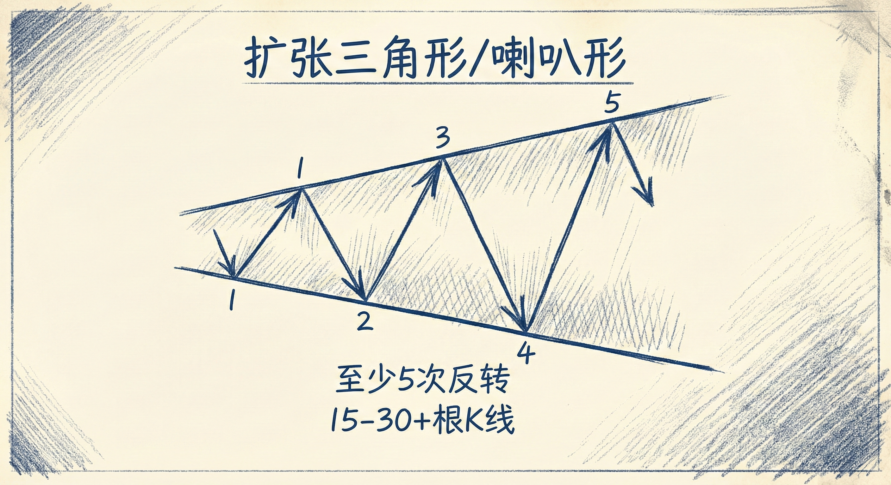
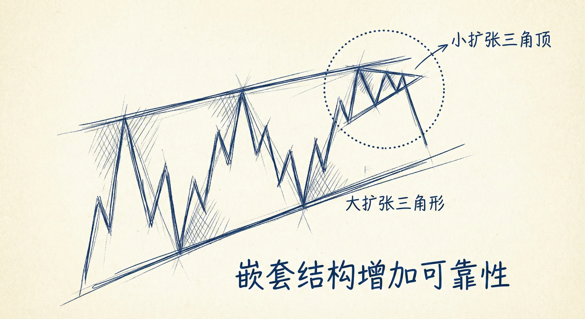
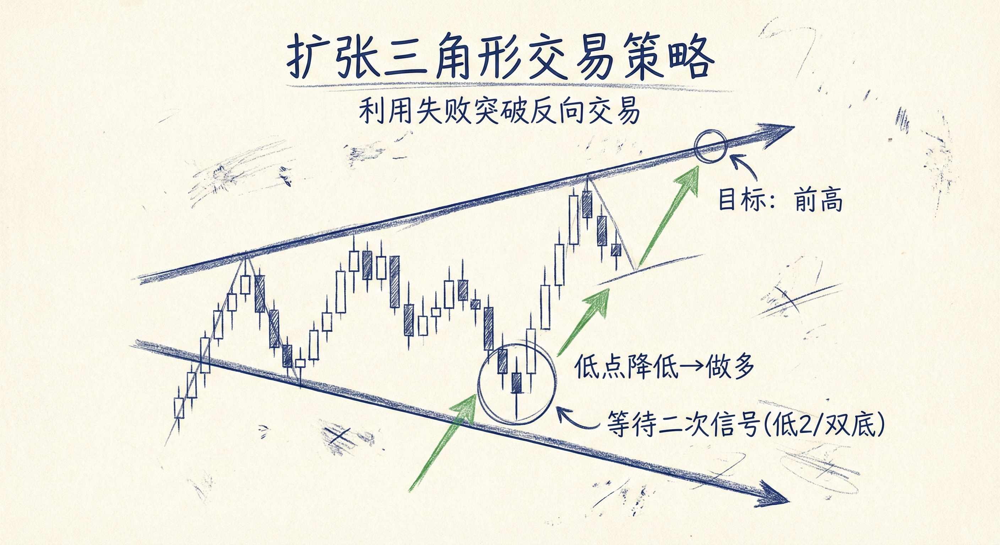

# 三角形（第二部分）

## 扩张三角形 (Expanding Triangles)

### 定义与识别
-   **概念**：通道线向外扩张（变远）而非收敛，形态上类似“喇叭” (Megaphone)。
-   **结构特征**：
    -   **反转次数**：至少包含5次波段（Swings），即上下共5次反转。
    -   **K线数量**：有效的扩张三角形通常包含15、20甚至30根以上的K线。
    -   **形态本质**：它本质上是一个震荡区间，处于突破模式（Breakout Mode）。
-   **大反转结构**：
    -   **扩张三角底**：常表现为**低点降低的大反转 (LLMTR)**。即下降趋势后，跌破前低但反转向上。
    -   **扩张三角顶**：常表现为高点抬高的大反转，随后反转向下。

### 交易含义
-   **突破模式概率**：由于是震荡区间，向上或向下突破的概率各为50%。
-   **80% 失败法则**：在震荡区间内，80% 的突破尝试都会失败。因此，每当价格突破前高或跌破前低时，大概率会反转回到区间内。
-   **后续演变**：
    -   扩张三角底反转成功后，通常演变为扩张三角牛旗。
    -   扩张三角顶反转成功后，通常演变为扩张三角熊旗。
    -   最终形态会结束，演变为新的震荡区间或趋势。

### 嵌套结构与可靠性
-   **嵌套 (Nested) 结构**：大周期结构中包含小周期的相似结构（例如：大扩张三角形的上沿出现了一个小的扩张三角顶）。
    -   **作用**：增加了反转成功的概率和结构的可靠性。
-   **形态标准性**：
    -   **对称性**：标准的、对称的结构胜率更高。
    -   **糟糕的形态**：如果波段之间极度不对称（如第2段2根K线，第4段50根K线），电脑算法会将其视为**趋势中的旗形**（如熊旗）而非反转形态，导致反转交易失败。
    -   **原则**：结构越难看，越不可靠，应避免交易。

### 交易策略
-   **逆势操作思路**：
    -   **做多**：在价格跌破前期低点并出现反转信号时买入（押注低点降低的大反转）。
    -   **做空**：在价格突破前期高点并出现反转信号时卖出。
-   **入场信号**：
    -   **二次信号**：等待第二次反转尝试（如高2/低2，或双顶/双底）能提高胜率。
    -   **强K线**：寻找强阳线或强阴线作为信号K线。
-   **止盈目标**：
    -   三角形的另一边（前期高点或低点）。
    -   测量运动（Measured Move）目标位。

## 总结原则
-   **规模决定性质**：只有包含足够多K线（如20根以上）的扩张三角形才可能导致大反转；过小的结构通常只是小反转或中继形态。
-   **利用失败突破**：在扩张三角形中，利用市场创新高/新低后的失败进行反向交易是核心策略。
-   **识别“丑陋”形态**：学会过滤不对称、不标准的形态，因为算法会忽略它们，导致缺乏后续力量。
