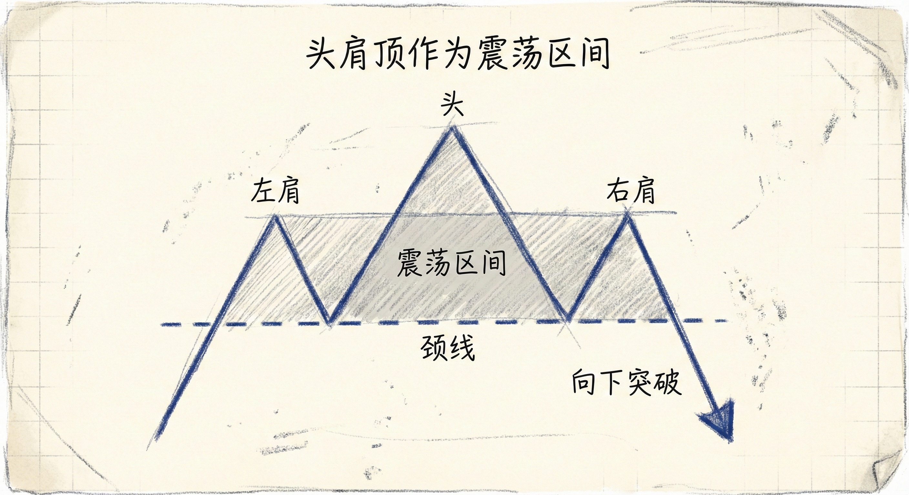
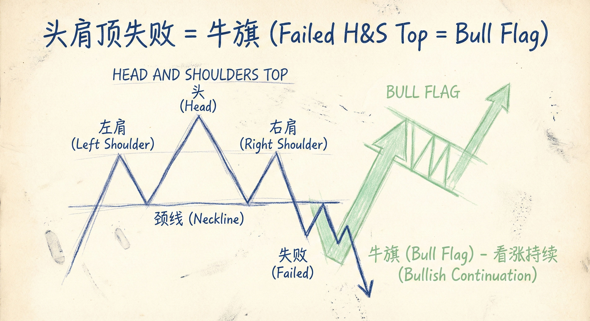
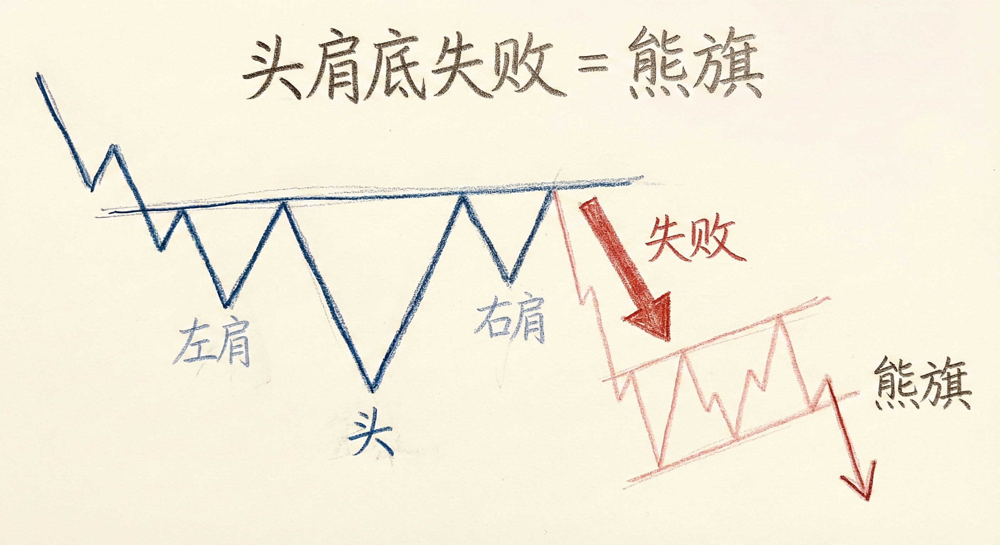

# 头肩结构与市场惯性（第二部分）

## 市场抗拒变化与头肩形态本质

### 定义与识别
-   **市场惯性**：市场抗拒变化。震荡区间倾向于继续震荡（突破常失败），趋势倾向于延续（反转常失败）。
-   **头肩形态的本质**：
    -   **震荡区间/三角形**：大多数反转结构（包括头肩顶/底）本质上是震荡区间或三角形。
    -   **过渡阶段**：趋势反转通常需要过渡。上涨趋势 -> 震荡区间 -> 下降趋势。
    -   **三推结构**：头肩顶包含三次下跌尝试（左肩、头、右肩），类似于三角形或楔形。
-   **颈线的画法**：连接左肩和头的低点。可以是水平的、上倾或下倾的。具体画法不重要，重要的是理解其作为震荡区间下沿的意义。

### 交易含义
-   **胜率与赔率**：
    -   **40% 概率**：头肩顶反转成功并形成波段下跌。
    -   **60% 概率**：市场继续横盘或恢复原趋势。
    -   **盈亏比**：虽然胜率较低（40%），但潜在回报远大于风险，数学期望为正。
-   **入场策略**：
    -   **避免追空颈线突破**：在跌破颈线时做空是低胜率操作，因为大多数震荡区间突破都会失败。
    -   **优选右肩入场**：在右肩形成更低的高点（LH）并出现反转信号时做空，胜率和盈亏比优于追突破。

## 止损触发后的博弈 (Stop Runs)

### 50/50 法则
-   **定义**：当一个合理的保护性止损被触发（例如跌破重要低点或突破重要高点）时。
-   **概率分布**：
    -   **50% 概率**：突破成功，形成反向波段（原趋势被破坏）。
    -   **50% 概率**：突破失败，市场反转回原方向（止损猎杀/陷阱）。

### 概率偏移的条件
-   **强力突破**：如果止损被触发时伴随着强力的大阳线/大阴线，且有良好的**跟随K线**（Follow-through），突破成功的概率提升至60%以上（如达到MM目标位）。
-   **缺乏跟随**：如果突破K线后缺乏跟随，或者立即出现反向K线，则突破失败的概率增大。

## 形态的失败与转化

### 头肩顶失败 = 牛旗
-   **转化逻辑**：当头肩顶的看跌预期失败（例如跌破颈线后迅速拉回），该结构通常转化为**牛旗**。
-   **常见形态**：
    -   **楔形牛旗**：三次向下的推动（左肩、头、右肩后的下跌尝试）失败。
    -   **高2 (H2) 牛旗**：两段式回调。
    -   **双底牛旗**：颈线附近的双底支撑。
-   **交易机会**：多头会在空头止损离场（突破右肩高点）时积极买入，预期趋势恢复。

### 头肩底失败 = 熊旗
-   **转化逻辑**：下降趋势中的头肩底如果反转上涨失败，通常演变为**熊旗**（如低点降低的大反转结构）。
-   **末端熊旗**：下降趋势中的三角形（头肩底）往往是末端熊旗，向下突破后可能会出现最后的抛售，随后才迎来真正的反转。

## 总结原则
-   **尊重市场惯性**：趋势和区间都倾向于延续，不要轻易押注突破或反转，除非看到强力证据。
-   **止损后的二元博弈**：当关键止损位被打掉，不要盲目追涨杀跌，需观察后续K线的跟随情况来判断是真突破还是假突破（50/50原则）。
-   **灵活看待形态**：头肩顶失败就是牛旗，头肩底失败就是熊旗。利用失败的形态作为顺势交易的入场点（如在头肩顶失败后做多）。
