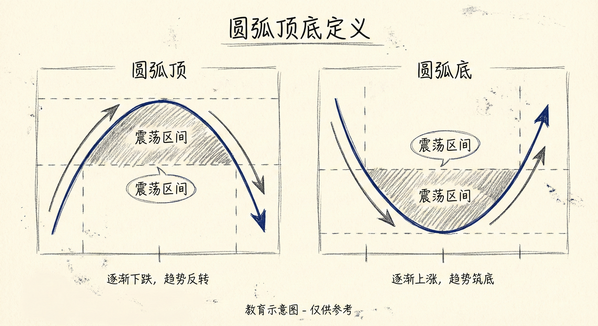
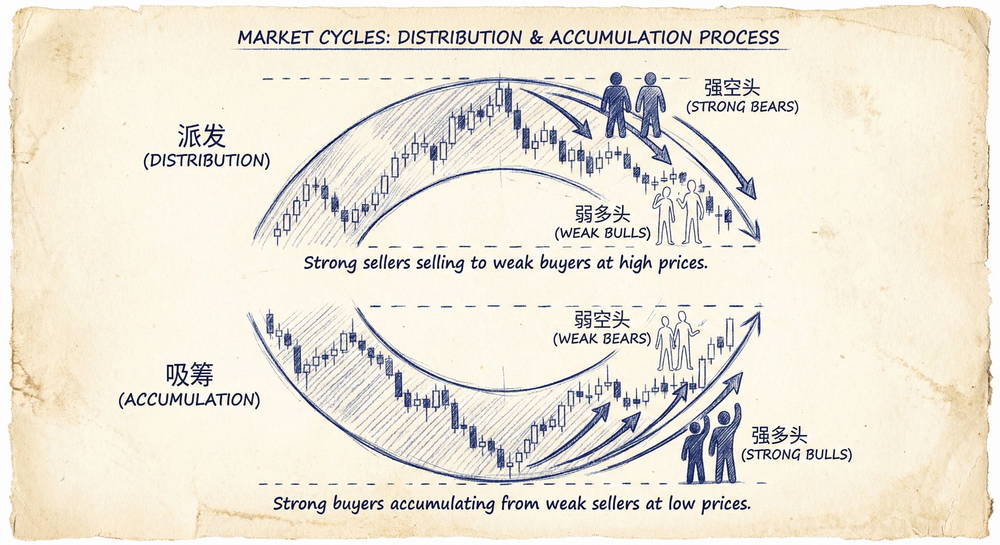
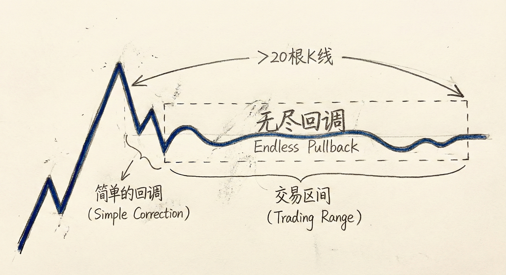
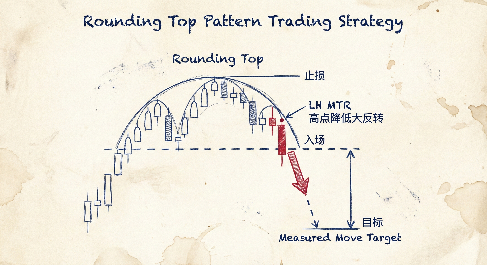

# 圆弧顶与圆弧底 (Rounding Tops and Bottoms)

## 本质与重新定义

### 定义与识别
-   **本质**：圆弧顶和圆弧底本质上是**震荡区间 (Trading Ranges)**。
-   **概率特征**：当趋势进入这种形态（震荡区间）时，市场处于突破模式，**50%的概率趋势延续，50%的概率反转**。
-   **术语转换**：Al Brooks 很少使用“圆弧”这一术语，而是将其分解为更具体的结构：
    -   **大反转 (Major Trend Reversal)**：高点降低的大反转 (Lower High MTR) 或低点抬高的大反转 (Higher Low MTR)。
    -   **其他形态**：三角形、头肩顶/底、双顶/底、无尽的回调。
-   **历史视角**：
    -   **派发 (Distribution)**：旧时（如威科夫理论）称圆弧顶为派发区域，即强多头将筹码卖给弱手。
    -   **吸筹 (Accumulation)**：旧时称圆弧底为吸筹区域，即机构在低位分批建立多头仓位。

### 结构特征
-   **圆弧顶**：
    -   通常由**抛物线楔形顶**开始，随后进入**无尽的回调**（横盘或窄通道）。
    -   随着回调时间延长（20根K线以上），多头信心减弱，演变为高点降低的大反转或头肩顶。
-   **圆弧底**：
    -   可能是下降趋势后的**无尽反弹**（极窄的上涨通道），最终演变为上涨趋势。
    -   或者是强力多头突破后，形成**低点抬高的大反转**（Higher Low MTR）。

## 市场微观结构与心理

### 供需失衡的过程
-   **圆弧顶 (派发)**：
    -   **强空头**：逢高做空，押注大阳线突破会失败。
    -   **强多头**：认为价格过高，停止追涨，等待更深的低位才买入。
    -   **弱多头**：在高位买入，最终在跌破支撑时放弃并止损，推动价格下跌。
-   **圆弧底 (吸筹)**：
    -   **强多头**：在K线下方挂单买入，利用每一次下跌建立仓位（吸筹）。
    -   **强空头**：虽然做空，但信心不足，倾向于剥头皮（Scalping），在新低处快速止盈，导致下跌缺乏跟随。
    -   **共识形成**：当出现连续强阳线时，空头最终放弃，多头信心确立，趋势反转。

### 无尽回调/反弹的角色
-   **时间因素**：当回调或反弹持续超过20根K线，它不再是单纯的回调，而变成了震荡区间。
-   **概率转变**：此时，原趋势恢复的概率下降，反转的概率上升至50%。

## 交易策略

### 交易原则
-   **忽略名称，关注结构**：不要纠结于是否“圆”，而应识别具体的反转结构（如高点降低、低点抬高、双顶/底）。
-   **等待突破确认**：
    -   在圆弧形态中，胜率最高的入场点通常是等待**连续的强趋势K线**突破。
    -   例如：等待连续两根大阴线收在低位后，做空圆弧顶。
-   **利用 MTR 信号**：寻找突破后的第二次尝试（高2/低2，或高点降低/低点抬高）作为入场点。

### 具体操作
-   **做空圆弧顶**：
    -   寻找高点降低的大反转 (LH MTR)。
    -   在跌破震荡区间底部的强阴线收盘价下方卖出。
    -   止损通常较宽（如震荡区间顶部），以换取高胜率。
-   **做多圆弧底**：
    -   寻找低点抬高的大反转 (HL MTR)。
    -   在连续强阳线突破下降趋势线或前高时买入。
    -   预期目标位通常为震荡区间高度的测量目标 (Measured Move)。

## 总结原则
-   **震荡区间视角**：将圆弧形态视为多空势均力敌的震荡区间，保持中性思维直至突破。
-   **寻找共识**：观察K线的大小和连续性，寻找一方放弃、另一方主导市场的时刻（如连续大实体K线）。
-   **高胜率入场**：相比于在震荡中猜测顶部或底部，等待突破后的跟随确认能提供更高的胜率。
