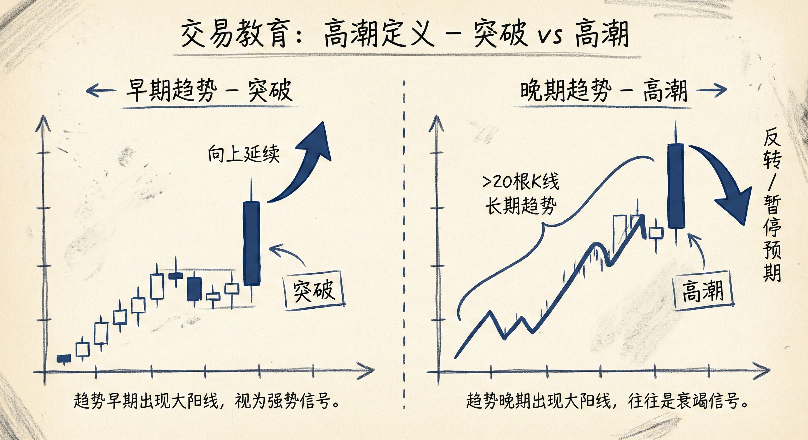
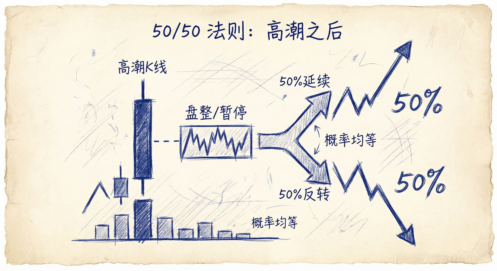
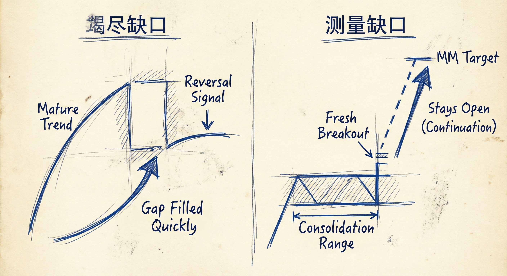
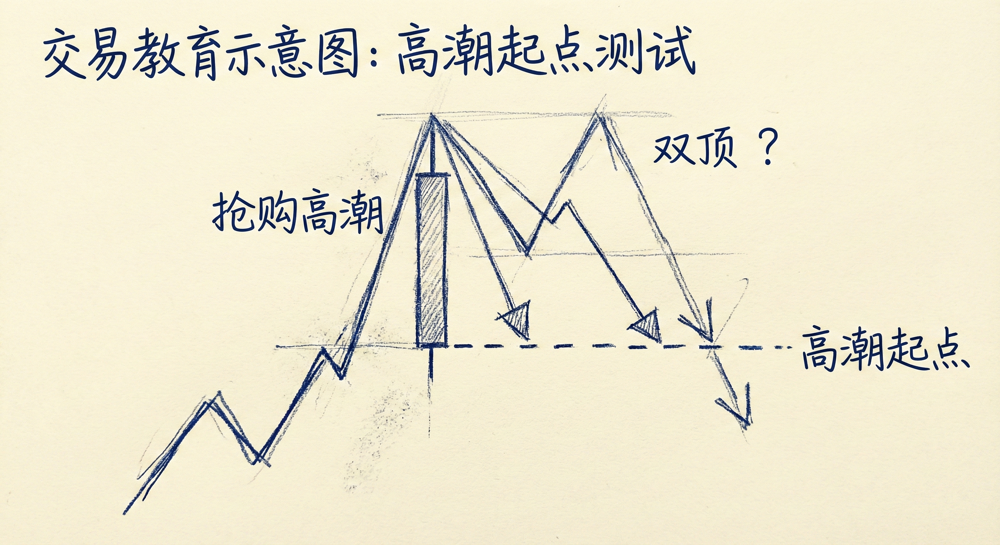

# 高潮（第一部分）

## 定义与识别 (Definition & Identification)

### 核心概念
-   **双重性质**：每一根趋势K线或一系列趋势K线，本质上既是**突破**也是**高潮**。
-   **时间背景区分**：
    -   **突破 (Breakout)**：如果出现在趋势的早期。
    -   **高潮 (Climax)**：如果出现在趋势的后期（通常趋势已持续超过20根K线）。
-   **形态特征**：
    -   **加速**：高潮代表趋势的加速（如大阳线/大阴线）。
    -   **持续性**：可以是单根巨大的K线，也可以是连续多根K线形成的微通道（Micro-channel）或窄通道。

### 市场含义
-   **不可持续性**：高潮通常是不可持续的极端移动，代表多头或空头的过度激进。
-   **意外行情**：高潮属于低概率事件（意外），市场在做不寻常的事情。
-   **趋势终结信号**：高潮往往标志着当前趋势阶段的结束，随后市场要么横盘震荡，要么反转。

## 市场后续走势 (Market Follow-through)

### 概率与结果
-   **50/50 法则**：高潮出现后，大约50%的概率会发生反转，另外50%的概率趋势会继续（但通常是在暂停或回调之后）。
-   **震荡区间**：大多数高潮之后，市场会进入5-10根K线的震荡区间，然后再决定方向。
-   **V形反转**：所谓的V形顶或底，本质上是高潮之后紧接着出现的剧烈反转。

### 交易心理
-   **恐慌与放弃**：
    -   **抢购高潮 (Buy Climax)**：空头放弃抵抗并回补，多头追高，导致价格剧烈上涨。
    -   **抛售高潮 (Sell Climax)**：多头止损离场，空头追空，导致价格剧烈下跌。
-   **获利了结**：在极端的垂直走势中，聪明的交易者倾向于获利了结，而非新开仓位。

## 缺口与目标位 (Gaps & Targets)

### 竭尽型缺口 (Exhaustion Gaps)
-   **识别**：趋势后期的突破产生的缺口（如收盘价与前期高点/低点之间的距离）。
-   **填补意味着衰竭**：如果缺口被快速填补（价格回到突破点），则该突破很可能是竭尽型缺口，预示趋势结束。
-   **测量型缺口 (Measuring Gaps)**：如果缺口保持开放，则可能测量至MM目标位（Measured Move），但在趋势后期概率较低。

### 回调目标
-   **首要目标**：高潮反转后的第一个目标位永远是**高潮的起点**（起涨点或起跌点）。
-   **双重顶/底结构**：
    -   当价格回调至高潮起点时，常形成双顶或双底。
    -   **若突破颈线**：可能走向反向的MM目标位。
    -   **若双顶/底成立**：趋势可能恢复或进入大区间震荡。

## 支撑阻力与连续高潮

### 真空测试 (Vacuum Tests)
-   **概念**：趋势末端的剧烈加速往往是对支撑位或阻力位的“真空测试”。
-   **原理**：价格被快速“吸”向重要的支撑/阻力区域（如通道线、前期高低点、MM目标位），一旦触及，常引发反转。

### 连续高潮
-   **累积效应**：连续出现2个、3个或更多的高潮（如连续的大K线组），市场会筋疲力尽。
-   **休息需求**：连续高潮后，市场通常需要长时间的横盘（10根甚至30-40根K线）来消化，随后才可能选择方向。

## 总结原则
-   **背景决定性质**：同样的K线形态，在趋势初期是突破，在趋势后期（>20 bars）则是高潮。
-   **高潮即反转风险**：看到趋势后期的加速移动，应警惕反转，而非盲目追单。
-   **关注起点测试**：高潮后的反转通常会测试高潮的起始位置，这是关键的止盈或反手参考点。
