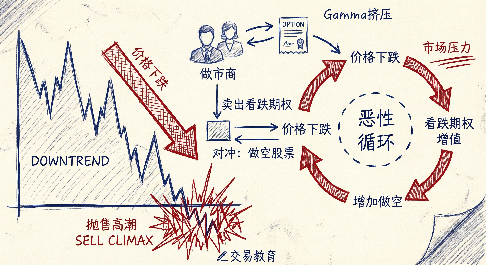
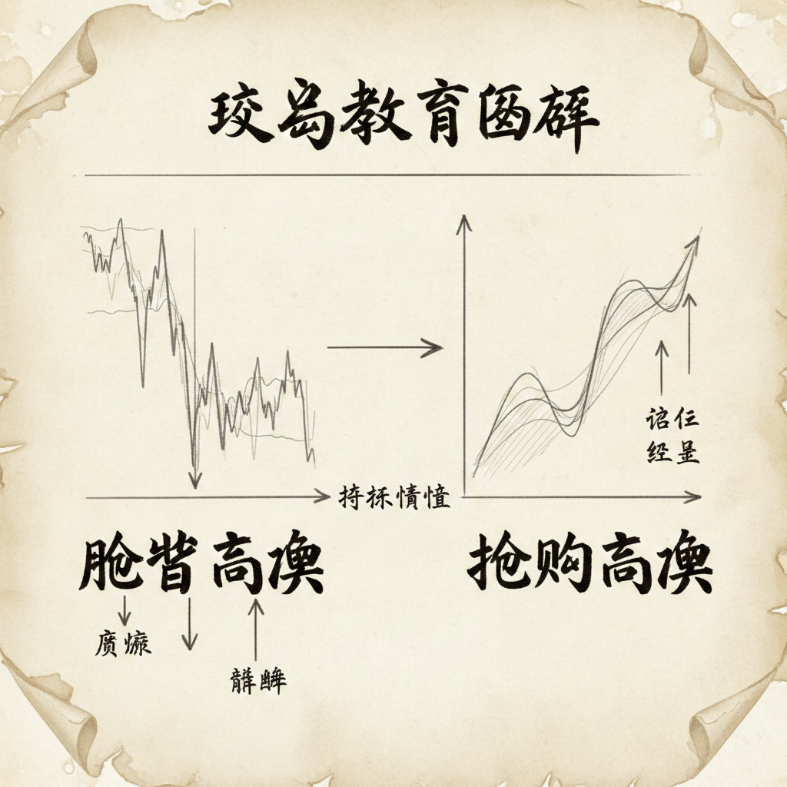

# 高潮（第五部分）：期权对冲与失败的连续高潮

## 期权对冲对高潮的影响 (Options Hedging & Climaxes)

### 机构行为与市场机制
-   **高潮的成因**：并不总是源于单纯的多头或空头情绪，很大程度上（可能高达50%）是由机构的期权对冲行为造成的。
-   **做市商的角色**：
    -   许多机构（做市商）专门卖出期权（看涨或看跌）以赚取权利金。
    -   他们通常是中性的，不在乎市场涨跌，只在乎对冲风险。
-   **对冲机制 (Gamma Squeeze)**：
    -   **下跌场景**：当市场下跌时，做市商卖出的看跌期权（Put）价值加速上涨（Gamma效应）。为了对冲亏损，做市商必须在标的资产（如股票或期货）上做空。
    -   **恶性循环**：市场越跌 $\rightarrow$ 期权亏损越大 $\rightarrow$ 做市商做空越多 $\rightarrow$ 导致市场进一步加速下跌（抛售高潮）。

### 交易含义
-   **非真实看空**：由于抛售高潮中包含大量被动对冲盘，这并不代表市场上有真实的、压倒性的看空信念。
-   **快速反转潜力**：一旦抛售停止，由于缺乏真实的空头意愿，且做市商不再需要对冲，市场往往会快速止跌甚至反转。

## 抛售高潮 vs. 抢购高潮 (Sell Climaxes vs. Buy Climaxes)

### 强度差异
-   **抛售高潮更剧烈**：通常情况下，抛售高潮比抢购高潮更为极端和剧烈。
-   **机构偏好**：
    -   大多数机构是天然的多头（持有股票），倾向于价值投资，喜欢在回调时买入。
    -   机构通常不愿意在强势突破（抢购高潮）时追涨。
-   **期权不对称**：看涨期权卖方的对冲压力通常小于看跌期权卖方，因此抢购高潮中的"助推"力量较弱。

## 失败的连续高潮 (Failed Consecutive Climaxes)

### 识别与形态
-   **楔形底/顶**：连续的抛售高潮（3次或更多推动）通常形成楔形形态。
-   **概率分布**：
    -   **75% 概率**：向下突破失败，市场反转向上或进入横盘。
    -   **25% 概率**：强势跌破楔形底，并有良好跟随，进入新的下跌波段（测量型缺口）。
-   **竭尽型缺口 (Exhaustion Gap)**：
    -   如果趋势已经持续超过20根K线，此时出现的巨大缺口或超大K线，大概率是竭尽缺口而非测量型缺口。
    -   这是对支撑/阻力位或测量目标位（MM）的**真空测试 (Vacuum Test)**。

### 交易策略与目标
-   **反转目标 (TBTL)**：
    -   一旦连续高潮结束并反转，最小目标通常是**两段式行情 (Two Legs)** 和 **10根K线 (Ten Bars)** 的反向运动或横盘。
    -   持续时间通常是原趋势的一半左右。
-   **多空心理**：
    -   **强多头**：看到极端的抛售高潮认为是“礼物”，开始买入。
    -   **强空头**：看到极端的延伸认为是不可持续的，开始获利平仓（买入）。
    -   **合力**：双方的买入行为导致了V型反转或长时间的震荡。

## 总结原则
-   **理解背后驱动力**：认识到高潮行情中包含大量的期权对冲行为，这意味着极端走势可能缺乏持续性。
-   **区分缺口性质**：在趋势后期（20+ K线）的大幅加速通常是衰竭信号，而非新的趋势开始。
-   **等待确认**：在连续高潮后，寻找强有力的反转K线或二次入场信号（H2/L2），目标锁定为两段式修正（TBTL）。
