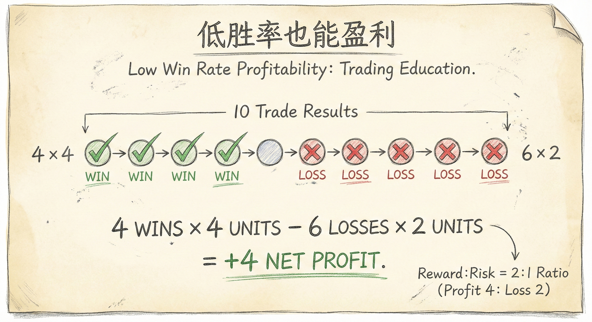
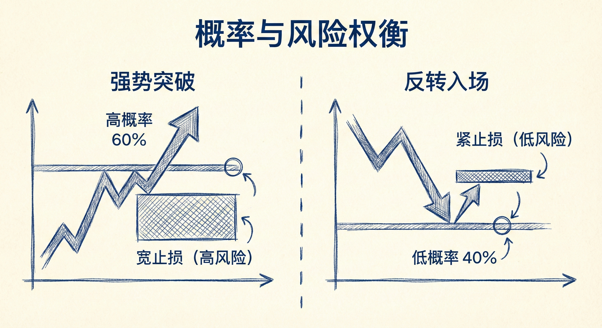

# 数学期望与概率（第一部分）

## 完美的交易不存在 (The Myth of Perfect Trades)

### 定义与现实
-   **概念**：交易者往往追求高胜率、高利润且低风险的“完美交易”，但这种机会在现实市场中是不存在的。
-   **特征**：
    -   **对手盘逻辑**：交易需要买卖双方。如果一笔交易对你而言是完美的（高胜率、高盈亏比、低风险），那么对机构对手盘而言就是糟糕透顶的，因此不会有人与你成交。
    -   **不可能三角**：你无法同时拥有高胜率、高利润和低风险。通常只能拥有其中一两个优势，必须在概率和盈亏比之间做出权衡。

### 交易含义
-   **优势的微弱性**：即使是优秀的交易者，其数学优势也是微弱且短暂的。
-   **一致性的重要性**：长期盈利不靠寻找完美机会，而靠持续执行具有微弱数学优势的策略。

## 交易者方程 (The Trader's Equation)

### 定义与计算
-   **核心公式**：**（赚钱的概率 × 潜在利润） > （亏钱的概率 × 潜在风险）**。
-   **正数学期望**：只有当上述公式的结果显著为正时，交易在数学上才是合理的。
-   **参数设定**：
    -   **已知量**：利润目标（止盈位）和风险（止损位）。
    -   **未知量**：概率（通常假设在40%到60%之间）。

### 为何低胜率也能盈利？
-   **波段交易逻辑**：只要盈亏比（Reward/Risk）足够好，即使胜率较低也能盈利。
-   **案例模型**：
    -   **设定**：10笔交易，胜率40%（4胜6负），盈亏比2:1（赚4点，亏2点）。
    -   **结果**：盈利 (4 × 4) - 亏损 (6 × 2) = 16 - 12 = +4点净利润。
    -   **实际情况**：实际表现往往优于模型，因为亏损交易不一定总是打满止损，而盈利交易可能通过持有获得更多利润。

## 概率与风险的权衡 (Balancing Probability and Risk)

### 市场环境与策略选择
-   **强趋势/突破 (High Probability)**：
    -   **特征**：胜率高（接近60%），如强力大阴线突破。
    -   **代价**：止损通常较远（风险大），导致盈亏比变差。
    -   **时机**：突破机会转瞬即逝，仅占K线图的5%-10%。
-   **震荡区间/弱趋势 (Good R/R)**：
    -   **特征**：胜率较低（约40%），形势不清晰。
    -   **优势**：止损较近（风险小），盈亏比通常较好。
    -   **策略**：适合低买高卖，利用限价单交易。

### 交易启示
-   **接受不确定性**：当看到"完美"的突破时，入场往往意味着更大的止损风险；当风险很小（止损近）时，往往胜率不高。
-   **机构行为**：高频交易（HFT）和机构会在震荡时剥头皮（高抛低吸），在趋势时做波段。散户应避免在窄通道中逆势操作。

## 总结原则
-   **建立数学优势**：不需要完美交易，只需确保交易者方程的期望值为正。
-   **理解权衡关系**：高胜率通常伴随高风险（宽止损）或低盈亏比；高盈亏比通常伴随低胜率。
-   **长期视角**：短期交易是零和博弈，但通过合理的结构化交易和资金管理，长期可以实现稳定盈利。
